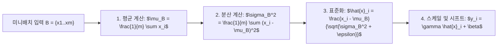

> [!abstract] 핵심 요약
> 신경망의 파라미터 수가 지나치게 많으면 학습 데이터에 과도하게 적응하여 훈련 손실은 0에 가까워지지만 검증 손실이 폭증하는 **과적합(Overfitting)**이 발생한다.
> 이를 극복하고 미지의 데이터에 대한 **일반화(Generalization)** 성능을 극대화하기 위해 가중치의 크기를 제한하는 **L1/L2 규제(Weight Decay)**, 노드를 무작위 비활성화하는 **드롭아웃(Dropout)**, 그리고 미니배치별 분포를 표준화하는 **배치 정규화(Batch Normalization)**를 정밀하게 적용해야 한다.

---

## 1. 정규화(Regularization) 3대 기법 수식 비교

### 1) L2 정규화 (Ridge / Weight Decay - 큰 가중치 억제)
$$\mathcal{L}_{\text{total}} = \mathcal{L}_0 + \frac{\lambda}{2} \sum_{i} w_i^2 \implies w \leftarrow (1 - \eta \lambda) w - \eta \frac{\partial \mathcal{L}_0}{\partial w}$$

### 2) L1 정규화 (Lasso - 희소성 Sparsity 유도)
$$\mathcal{L}_{\text{total}} = \mathcal{L}_0 + \lambda \sum_{i} |w_i| \implies w \leftarrow w - \eta \lambda \operatorname{sgn}(w) - \eta \frac{\partial \mathcal{L}_0}{\partial w}$$

### 3) 드롭아웃 (Dropout - 학습 시 p 확률로 뉴런 차단)
$$r_j \sim \operatorname{Bernoulli}(1 - p), \quad \tilde{\mathbf{a}} = \mathbf{r} \odot \mathbf{a}, \quad \text{Inference: } \mathbf{a}_{\text{test}} = (1 - p) \mathbf{a}$$

---

## 2. 배치 정규화(Batch Normalization) 알고리즘 단계



---

## 3. 실시간 L2 가중치 감쇠(Weight Decay) 규제 시뮬레이터

```html preview
<div style="font-family:system-ui,-apple-system,sans-serif;padding:20px;background:var(--card);color:var(--card-foreground);border:1px solid var(--border);border-radius:var(--radius)">
  <div style="font-size:16px;font-weight:700;margin-bottom:14px;color:var(--primary);display:flex;align-items:center;gap:8px">
    <span>🛡️ L2 규제(가중치 감쇠) 강도에 따른 과적합 방지 시뮬레이터</span>
  </div>

  <div style="margin-bottom:14px">
    <div style="display:flex;justify-content:space-between;font-size:11px;color:var(--muted-foreground);margin-bottom:4px">
      <span>규제 계수 lambda (Weight Decay):</span>
      <span id="lambdaValOut" style="font-weight:700;color:var(--primary)">0.010</span>
    </div>
    <input id="inLambda" type="range" min="0" max="0.1" step="0.005" value="0.01" style="width:100%" />
  </div>

  <div style="display:grid;grid-template-columns:1fr 1fr;gap:12px;margin-bottom:12px">
    <div style="padding:10px;background:var(--background);border:1px solid var(--border);border-radius:var(--radius);text-align:center">
      <div style="font-size:10px;color:var(--muted-foreground)">예상 훈련 손실 (Train Loss)</div>
      <div id="trainLossOut" style="font-family:monospace;font-size:16px;font-weight:800;color:var(--chart-1);margin-top:2px">0.05</div>
    </div>
    <div style="padding:10px;background:var(--background);border:1px solid var(--border);border-radius:var(--radius);text-align:center">
      <div style="font-size:10px;color:var(--muted-foreground)">예상 검증 손실 (Val Loss - 일반화)</div>
      <div id="valLossOut" style="font-family:monospace;font-size:16px;font-weight:800;color:var(--primary);margin-top:2px">0.12 (최적)</div>
    </div>
  </div>

  <div id="regStatusDesc" style="padding:10px;background:var(--background);border:1px solid var(--border);border-radius:var(--radius);font-size:11px">
    적절한 L2 규제가 적용되어 훈련 손실과 검증 손실이 균형을 이루며 최적의 일반화 성능을 달성합니다.
  </div>

  <script>
    document.getElementById('inLambda').oninput = function() {
      var lam = parseFloat(this.value);
      document.getElementById('lambdaValOut').textContent = lam.toFixed(3);

      var train = 0.01 + lam * 3.0;
      var val = 0.40 * Math.exp(-lam * 50) + 0.10 + lam * 4.0;

      document.getElementById('trainLossOut').textContent = train.toFixed(3);
      document.getElementById('valLossOut').textContent = val.toFixed(3);

      if (lam === 0) {
        document.getElementById('regStatusDesc').innerHTML = "<span style='color:var(--destructive,#ef4444);font-weight:700'>⚠️ [과적합 발생]</span> 규제가 전혀 없어 가중치가 무한정 커지며 훈련 손실은 0에 수렴하나 검증 손실이 0.50으로 폭증합니다.";
      } else if (lam > 0.05) {
        document.getElementById('regStatusDesc').innerHTML = "<span style='color:var(--chart-2);font-weight:700'>⚠️ [과소적합 위험]</span> 규제가 너무 강해 가중치가 지나치게 억제되어 모델의 학습 표현력이 부족해집니다.";
      } else {
        document.getElementById('regStatusDesc').innerHTML = "<span style='color:var(--primary);font-weight:700'>✅ [최적 일반화]</span> 편향과 분산의 최적 균형점에서 검증 손실이 최소화됩니다.";
      }
    };
  </script>
</div>
```
