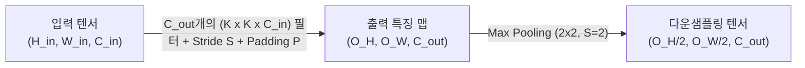

> [!abstract] 핵심 요약
> **합성곱 신경망(CNN, Convolutional Neural Network)**은 2차원/3차원 이미지 데이터의 공간적 격자 구조(Spatial Structure)를 보존하며 특징 맵(Feature Map)을 추출하는 딥러닝 아키텍처이다.
> 입력 영역 전체에 동일한 필터를 슬라이딩하는 **가중치 공유(Weight Sharing)**를 통해 파라미터 수를 획기적으로 줄이며, 커널 크기($K$), 패딩($P$), 스트라이드($S$)에 의해 결정되는 **출력 텐서 차원 계산 공식**을 정밀하게 다뤄야 한다.

---

## 1. Conv2D 출력 해상도 및 파라미터 수 계산 공식

### 1) 출력 특징 맵 공간 크기 공식
$$O_H = \left\lfloor \frac{H_{\text{in}} - K_H + 2P}{S} \right\rfloor + 1, \quad O_W = \left\lfloor \frac{W_{\text{in}} - K_W + 2P}{S} \right\rfloor + 1$$

### 2) Conv2D 계층 학습 파라미터 수 공식
$$\text{Params} = (K_H \times K_W \times C_{\text{in}} + 1) \times C_{\text{out}}$$



---

## 2. FC Layer vs CNN 파라미터 효율성 비교

| 특성 | 완전 연결 계층 (FC Layer) | 합성곱 계층 (Conv2D Layer) |
| :-- | :-- | :-- |
| **입력 형태** | 1차원 벡터로 평탄화 (공간 구조 파괴) | **3차원 텐서 (H, W, C) 공간 위상 유지** |
| **가중치 연결** | 모든 입력 뉴런과 모든 출력 뉴런 1:1 연결 | **국소 수용장(Receptive Field) + 가중치 공유** |
| **파라미터 수** | $H \times W \times C \times N_{\text{out}}$ (수백만 개 폭증) | **$(K \times K \times C_{\text{in}} + 1) \times C_{\text{out}}$ (수천 개 이하 절감)** |
| **이동 불변성** | 이미지 내 객체 위치 이동 시 재학습 필요 | **평행 이동 불변성(Translation Invariance) 획득** |

---

## 3. 실시간 Conv2D 출력 텐서 해상도 & 파라미터 수 계산기

```html preview
<div style="font-family:system-ui,-apple-system,sans-serif;padding:20px;background:var(--card);color:var(--card-foreground);border:1px solid var(--border);border-radius:var(--radius)">
  <div style="font-size:16px;font-weight:700;margin-bottom:14px;color:var(--primary);display:flex;align-items:center;gap:8px">
    <span>📐 Conv2D 출력 특징 맵 공간 차원 & 파라미터 수 실시간 계산기</span>
  </div>

  <div style="display:grid;grid-template-columns:repeat(3, 1fr);gap:10px;margin-bottom:12px">
    <div>
      <label style="font-size:10px;color:var(--muted-foreground)">입력 크기 (H=W):</label>
      <input id="inHw" type="number" value="32" min="8" max="512" style="width:100%;padding:4px;background:var(--background);color:var(--foreground);border:1px solid var(--border);border-radius:var(--radius);font-weight:700" />
    </div>
    <div>
      <label style="font-size:10px;color:var(--muted-foreground)">커널 크기 (K):</label>
      <input id="inK" type="number" value="3" min="1" max="11" style="width:100%;padding:4px;background:var(--background);color:var(--foreground);border:1px solid var(--border);border-radius:var(--radius);font-weight:700" />
    </div>
    <div>
      <label style="font-size:10px;color:var(--muted-foreground)">패딩 (P):</label>
      <input id="inPad" type="number" value="1" min="0" max="10" style="width:100%;padding:4px;background:var(--background);color:var(--foreground);border:1px solid var(--border);border-radius:var(--radius);font-weight:700" />
    </div>
  </div>

  <div style="display:grid;grid-template-columns:repeat(3, 1fr);gap:10px;margin-bottom:12px">
    <div>
      <label style="font-size:10px;color:var(--muted-foreground)">스트라이드 (S):</label>
      <input id="inStride" type="number" value="1" min="1" max="5" style="width:100%;padding:4px;background:var(--background);color:var(--foreground);border:1px solid var(--border);border-radius:var(--radius);font-weight:700" />
    </div>
    <div>
      <label style="font-size:10px;color:var(--muted-foreground)">입력 채널 (C_in):</label>
      <input id="inCin" type="number" value="3" min="1" max="512" style="width:100%;padding:4px;background:var(--background);color:var(--foreground);border:1px solid var(--border);border-radius:var(--radius);font-weight:700" />
    </div>
    <div>
      <label style="font-size:10px;color:var(--muted-foreground)">출력 채널 (C_out):</label>
      <input id="inCout" type="number" value="64" min="1" max="1024" style="width:100%;padding:4px;background:var(--background);color:var(--foreground);border:1px solid var(--border);border-radius:var(--radius);font-weight:700" />
    </div>
  </div>

  <div style="display:grid;grid-template-columns:1fr 1fr;gap:12px">
    <div style="padding:10px;background:var(--background);border:1px solid var(--border);border-radius:var(--radius);text-align:center">
      <div style="font-size:10px;color:var(--muted-foreground)">출력 특징 맵 차원 [H_out, W_out, C_out]</div>
      <div id="outDimOut" style="font-family:monospace;font-size:16px;font-weight:800;color:var(--primary);margin-top:2px">[32, 32, 64]</div>
    </div>
    <div style="padding:10px;background:var(--background);border:1px solid var(--border);border-radius:var(--radius);text-align:center">
      <div style="font-size:10px;color:var(--muted-foreground)">학습 파라미터 수 (Weights + Biases)</div>
      <div id="outParamsCount" style="font-family:monospace;font-size:16px;font-weight:800;color:var(--chart-1);margin-top:2px">1,792 개</div>
    </div>
  </div>

  <script>
    function updateConvMath() {
      var h = parseInt(document.getElementById('inHw').value) || 32;
      var k = parseInt(document.getElementById('inK').value) || 3;
      var p = parseInt(document.getElementById('inPad').value) || 0;
      var s = parseInt(document.getElementById('inStride').value) || 1;
      var cin = parseInt(document.getElementById('inCin').value) || 3;
      var cout = parseInt(document.getElementById('inCout').value) || 64;

      var outH = Math.floor((h - k + 2 * p) / s) + 1;
      var params = (k * k * cin + 1) * cout;

      document.getElementById('outDimOut').textContent = '[' + outH + ', ' + outH + ', ' + cout + ']';
      document.getElementById('outParamsCount').textContent = params.toLocaleString() + ' 개';
    }

    ['inHw', 'inK', 'inPad', 'inStride', 'inCin', 'inCout'].forEach(function(id) {
      document.getElementById(id).addEventListener('input', updateConvMath);
    });
    updateConvMath();
  </script>
</div>
```
