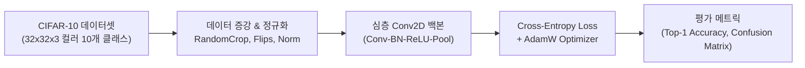
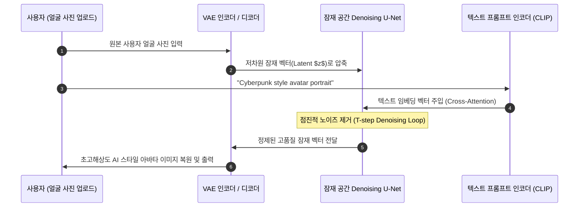

> [!abstract] 핵심 요약
> 컴퓨터 비전 실무 파이프라인은 데이터 전처리(Normalization, Data Augmentation)부터 심층 신경망 모델링, 손실 최적화, 그리고 추론 및 생성형 확산(Diffusion) 모델 적용까지의 유기적인 워크플로로 완성된다.
> 60,000장의 $32 \times 32$ 이미지로 구성된 **CIFAR-10 분류 벤치마크**를 통해 과적합 방지와 학습률 스케줄링을 체계화하고, 최신 텍스트-이미지 생성 기술을 결합한 **AI 아바타 파이프라인**의 아키텍처를 이해하는 것이 핵심이다.

---

## 1. CIFAR-10 엔드-투-엔드 학습 파이프라인



---

## 2. 생성형 AI 아바타 (Diffusion 기반) 3단계 워크플로



---

## 3. 실시간 CIFAR-10 이미지 분류 & 신뢰도(Confidence) 예측기

```html preview
<div style="font-family:system-ui,-apple-system,sans-serif;padding:20px;background:var(--card);color:var(--card-foreground);border:1px solid var(--border);border-radius:var(--radius)">
  <div style="font-size:16px;font-weight:700;margin-bottom:14px;color:var(--primary);display:flex;align-items:center;gap:8px">
    <span>🖼️ CIFAR-10 심층 CNN 추론 및 Top-3 클래스 확률 판별기</span>
  </div>

  <div style="display:flex;gap:10px;align-items:center;margin-bottom:14px">
    <label style="font-size:12px;font-weight:700">테스트 이미지 샘플:</label>
    <select id="cifarSampleSelect" style="padding:4px 8px;background:var(--background);color:var(--foreground);border:1px solid var(--border);border-radius:var(--radius);font-weight:700">
      <option value="airplane">✈️ Sample #1: Airplane (비행기)</option>
      <option value="dog">🐕 Sample #2: Dog (강아지)</option>
      <option value="ship">🚢 Sample #3: Ship (선박)</option>
    </select>
  </div>

  <div style="padding:10px;background:var(--background);border:1px solid var(--border);border-radius:var(--radius);margin-bottom:12px">
    <div style="font-size:11px;font-weight:700;color:var(--primary);margin-bottom:6px">CNN 모델 Softmax 추론 결과:</div>
    <div id="cifarPredBars" style="font-family:monospace;font-size:11px;line-height:1.8">
      1. Airplane: 94.2% [█████████░]<br/>
      2. Bird: 4.1% [░░░░░░░░░░]<br/>
      3. Ship: 1.1% [░░░░░░░░░░]
    </div>
  </div>

  <div id="cifarLogDesc" style="font-size:11px;color:var(--muted-foreground)">
    입력된 32x32 이미지의 특징 맵을 추출하여 94.2%의 높은 확신도로 정답(Airplane)을 분류했습니다.
  </div>

  <script>
    document.getElementById('cifarSampleSelect').onchange = function() {
      var s = this.value;
      var bars = document.getElementById('cifarPredBars');
      var desc = document.getElementById('cifarLogDesc');

      if (s === 'airplane') {
        bars.innerHTML = "1. Airplane: 94.2% [█████████░]<br/>2. Bird: 4.1% [░░░░░░░░░░]<br/>3. Ship: 1.1% [░░░░░░░░░░]";
        desc.textContent = "입력된 32x32 이미지의 특징 맵을 추출하여 94.2%의 높은 확신도로 정답(Airplane)을 분류했습니다.";
      } else if (s === 'dog') {
        bars.innerHTML = "1. Dog: 89.6% [████████░░]<br/>2. Cat: 8.7% [█░░░░░░░░░]<br/>3. Horse: 1.2% [░░░░░░░░░░]";
        desc.textContent = "강아지 텍스처와 귀 모양 특징을 검출하여 89.6% 확률로 정답(Dog)으로 분류했습니다.";
      } else {
        bars.innerHTML = "1. Ship: 96.5% [██████████]<br/>2. Airplane: 2.3% [░░░░░░░░░░]<br/>3. Truck: 0.8% [░░░░░░░░░░]";
        desc.textContent = "수평선 배경과 선체 윤곽선을 바탕으로 96.5% 확률로 정답(Ship)으로 판별했습니다.";
      }
    };
  </script>
</div>
```
