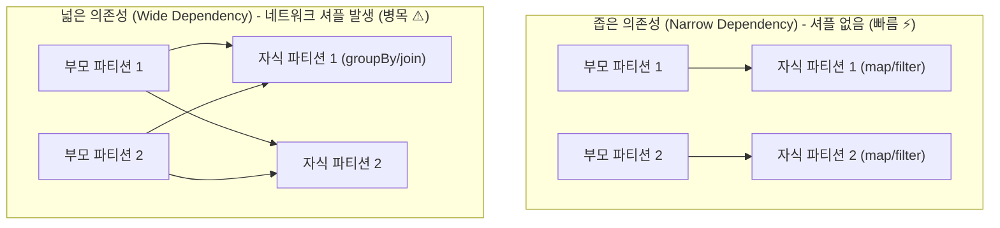

> [!abstract] 핵심 요약
> 하둡 맵리듀스는 반복 연산 시 매 단계마다 결과를 HDFS 디스크에 읽고 써야 하므로 머신러닝이나 그래프 알고리즘에서 심각한 I/O 오버헤드가 발생한다.
> **아파치 스파크(Apache Spark)**는 **RDD(탄력적 분산 데이터셋)**를 기반으로 데이터를 메모리에 유지하며 연산 속도를 최대 100배 향상시켰다. 데이터 유실 시 디스크 복제 대신 연산 그래프인 **계보(Lineage DAG)**를 통해 유실된 파티션만 결정론적으로 즉시 재계산한다.

---

## 1. 좁은 의존성(Narrow) vs 넓은 의존성(Wide)



---

## 2. Transformation(변환) vs Action(액션)

| 구분 | 주요 연산 | 동작 메커니즘 | 실행 시점 |
| :-- | :-- | :-- | :-- |
| **Transformation** | `map`, `filter`, `flatMap`, `groupByKey`, `reduceByKey` | 새로운 RDD를 정의하고 DAG 계보에 노드만 추가 | **지연 평가 (Lazy Evaluation)** |
| **Action** | `count`, `collect`, `take`, `saveAsTextFile`, `reduce` | 드라이버 프로그램으로 결과를 반환하거나 스토리지에 저장 | **즉시 실행 (Job 생성 및 물리 태스크 스케줄링)** |

---

## 3. 실시간 Spark 파티션 셔플(Shuffle) 오버헤드 계산기

```html preview
<div style="font-family:system-ui,-apple-system,sans-serif;padding:20px;background:var(--card);color:var(--card-foreground);border:1px solid var(--border);border-radius:var(--radius)">
  <div style="font-size:16px;font-weight:700;margin-bottom:14px;color:var(--primary);display:flex;align-items:center;gap:8px">
    <span>⚡ Spark 파티션 수에 따른 네트워크 셔플(Shuffle) 분석기</span>
  </div>

  <div style="display:grid;grid-template-columns:1fr 1fr;gap:12px;margin-bottom:14px">
    <div>
      <div style="display:flex;justify-content:space-between;font-size:11px;color:var(--muted-foreground)">
        <span>입력 파티션 수 (M):</span>
        <span id="inPartVal" style="font-weight:700;color:var(--primary)">16 파티션</span>
      </div>
      <input id="inPartNum" type="range" min="2" max="64" step="2" value="16" style="width:100%" />
    </div>
    <div>
      <div style="display:flex;justify-content:space-between;font-size:11px;color:var(--muted-foreground)">
        <span>리듀스 파티션 수 (N):</span>
        <span id="inRedVal" style="font-weight:700;color:var(--chart-1)">8 파티션</span>
      </div>
      <input id="inRedNum" type="range" min="2" max="32" step="2" value="8" style="width:100%" />
    </div>
  </div>

  <div style="display:grid;grid-template-columns:repeat(3, 1fr);gap:10px;margin-bottom:12px">
    <div style="padding:10px;background:var(--background);border:1px solid var(--border);border-radius:var(--radius);text-align:center">
      <div style="font-size:10px;color:var(--muted-foreground)">셔플 블록 파일 수 (M × N)</div>
      <div id="shuffleBlocksOut" style="font-family:monospace;font-size:14px;font-weight:800;color:var(--primary)">128 개</div>
    </div>
    <div style="padding:10px;background:var(--background);border:1px solid var(--border);border-radius:var(--radius);text-align:center">
      <div style="font-size:10px;color:var(--muted-foreground)">추천 연산자</div>
      <div style="font-size:11px;font-weight:700;color:var(--chart-1);margin-top:2px">reduceByKey (맵사이드 결합)</div>
    </div>
    <div style="padding:10px;background:var(--background);border:1px solid var(--border);border-radius:var(--radius);text-align:center">
      <div style="font-size:10px;color:var(--muted-foreground)">비추천 연산자</div>
      <div style="font-size:11px;font-weight:700;color:var(--destructive,#ef4444);margin-top:2px">groupByKey (전체 셔플)</div>
    </div>
  </div>

  <script>
    function updateShuffle() {
      var m = parseInt(document.getElementById('inPartNum').value);
      var n = parseInt(document.getElementById('inRedNum').value);

      document.getElementById('inPartVal').textContent = m + " 파티션";
      document.getElementById('inRedVal').textContent = n + " 파티션";

      var blocks = m * n;
      document.getElementById('shuffleBlocksOut').textContent = blocks + " 개";
    }

    ['inPartNum', 'inRedNum'].forEach(function(id) {
      document.getElementById(id).addEventListener('input', updateShuffle);
    });
    updateShuffle();
  </script>
</div>
```
