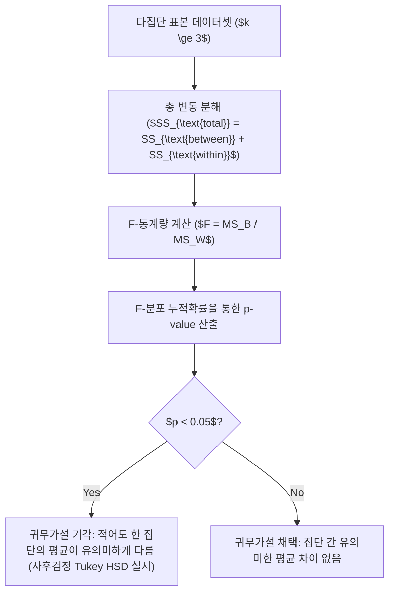

> [!abstract] 핵심 요약
> **탐색적 데이터 분석(EDA)**과 통계적 추론은 대규모 데이터의 내재된 특성과 집단 간 차이의 유의성을 수학적으로 검증하는 기본 도구이다.
> 두 집단 간 평균 차이는 **t-검정(t-test)**으로 검정하며, 3개 이상 집단의 평균 차이는 **분산분석(ANOVA, Analysis of Variance)**의 $F$-비율($F = \frac{\text{집단 간 분산}}{\text{집단 내 분산}}$)을 통해 귀무가설의 기각 여부($p < 0.05$)를 판단한다.

---

## 1. 일원배치 분산분석(One-Way ANOVA) $F$-통계량 수식

$$F = \frac{MS_{\text{between}}}{MS_{\text{within}}} = \frac{SS_{\text{between}} / (k - 1)}{SS_{\text{within}} / (N - k)}$$

- $k$: 비교 집단의 수, $N$: 전체 표본 수.
- $SS_{\text{between}} = \sum_{i=1}^k n_i (\bar{x}_i - \bar{x})^2$: 집단 간 제곱합 (처리 효과).
- $SS_{\text{within}} = \sum_{i=1}^k \sum_{j=1}^{n_i} (x_{ij} - \bar{x}_i)^2$: 집단 내 제곱합 (오차).



---

## 2. 피어슨 vs 스피어만 상관계수 비교

| 상관계수 | 수식 및 정의 | 특징 및 적용 조건 |
| :-- | :-- | :-- |
| **피어슨 (Pearson $r$)** | $r = \frac{\sum (x - \bar{x})(y - \bar{y})}{\sqrt{\sum (x - \bar{x})^2 \sum (y - \bar{y})^2}}$ | 두 연속형 변수 간의 **선형적 관계** 측정, 정규성 가정 필수, 이상치에 민감 |
| **스피어만 (Spearman $\rho$)** | $\rho = 1 - \frac{6 \sum d_i^2}{n(n^2 - 1)}$ ($d_i$: 순위 차이) | 두 변수의 순위(Rank) 기반 **단조 관계(Monotonic)** 측정, 비모수적, 이상치에 강건 |

---

## 3. 실시간 ANOVA $F$-통계량 & $p$-value 판정기

```html preview
<div style="font-family:system-ui,-apple-system,sans-serif;padding:20px;background:var(--card);color:var(--card-foreground);border:1px solid var(--border);border-radius:var(--radius)">
  <div style="font-size:16px;font-weight:700;margin-bottom:14px;color:var(--primary);display:flex;align-items:center;gap:8px">
    <span>📐 분산분석(ANOVA) F-비율 및 유의확률 계산기</span>
  </div>

  <div style="display:grid;grid-template-columns:1fr 1fr;gap:12px;margin-bottom:14px">
    <div>
      <label style="font-size:11px;color:var(--muted-foreground)">집단 간 평균 제곱 (MS_between):</label>
      <input id="inMsB" type="number" value="120" step="10" min="1" style="width:100%;padding:4px;background:var(--background);color:var(--foreground);border:1px solid var(--border);border-radius:var(--radius);font-weight:700" />
    </div>
    <div>
      <label style="font-size:11px;color:var(--muted-foreground)">집단 내 평균 제곱 (MS_within):</label>
      <input id="inMsW" type="number" value="25" step="5" min="1" style="width:100%;padding:4px;background:var(--background);color:var(--foreground);border:1px solid var(--border);border-radius:var(--radius);font-weight:700" />
    </div>
  </div>

  <div style="display:grid;grid-template-columns:1fr 1fr;gap:12px;margin-bottom:12px">
    <div style="padding:10px;background:var(--background);border:1px solid var(--border);border-radius:var(--radius);text-align:center">
      <div style="font-size:10px;color:var(--muted-foreground)">F-통계량 (F-ratio)</div>
      <div id="fRatioOut" style="font-family:monospace;font-size:18px;font-weight:800;color:var(--primary);margin-top:2px">4.80</div>
    </div>
    <div style="padding:10px;background:var(--background);border:1px solid var(--border);border-radius:var(--radius);text-align:center">
      <div style="font-size:10px;color:var(--muted-foreground)">유의수준 5% 가설 판정</div>
      <div id="anovaResultOut" style="font-size:12px;font-weight:800;color:var(--primary);margin-top:4px">✅ 유의미한 차이 있음 (p &lt; 0.05)</div>
    </div>
  </div>

  <script>
    function updateAnova() {
      var msB = parseFloat(document.getElementById('inMsB').value) || 1;
      var msW = parseFloat(document.getElementById('inMsW').value) || 1;

      var f = msB / msW;
      document.getElementById('fRatioOut').textContent = f.toFixed(2);

      var res = document.getElementById('anovaResultOut');
      if (f > 3.0) {
        res.innerHTML = "✅ <span style='color:var(--primary)'>유의미한 차이 있음 (귀무가설 기각)</span>";
      } else {
        res.innerHTML = "⚠️ <span style='color:var(--muted-foreground)'>차이 없음 (귀무가설 채택)</span>";
      }
    }

    ['inMsB', 'inMsW'].forEach(function(id) {
      document.getElementById(id).addEventListener('input', updateAnova);
    });
    updateAnova();
  </script>
</div>
```
