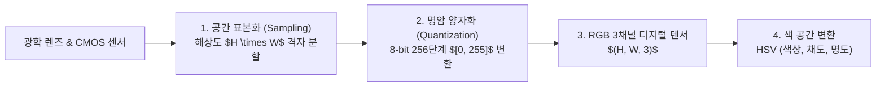

> [!abstract] 핵심 요약
> **컴퓨터 비전(Computer Vision)**은 카메라 센서로 획득한 2차원 디지털 영상으로부터 3차원 물리 세계의 형태, 의미, 깊이 정보를 재구성하고 해석하는 학문이다.
> 연속적인 아날로그 빛은 **표본화(Sampling - 공간 해상도)**와 **양자화(Quantization - 명암 밝기 단계)**를 거쳐 $H \times W \times C$ 형태의 디지털 텐서로 변환되며, 인간의 시각적 명도 인지 특성을 반영한 **RGB $\to$ Grayscale 변환($Y = 0.299R + 0.587G + 0.114B$)**과 **히스토그램 평활화(CDF 변환)**가 영상 전처리의 기초가 된다.

---

## 1. 디지털 영상 형성 및 색 공간 변환 수식

### 1) RGB to Grayscale 가중치 변환 공식 (ITU-R BT.601)
$$Y = 0.299 \cdot R + 0.587 \cdot G + 0.114 \cdot B \quad (\text{인간의 눈이 녹색에 가장 민감})$$

### 2) 히스토그램 평활화 (Histogram Equalization) 변환 함수
$$s_k = T(r_k) = (L - 1) \sum_{j=0}^{k} p_r(r_j) = (L - 1) \sum_{j=0}^{k} \frac{n_j}{M \times N}$$



---

## 2. RGB vs HSV 색 공간 특성 비교

| 색 공간 | 채널 구성 | 핵심 장점 | 주요 활용 분야 |
| :-- | :-- | :-- | :-- |
| **RGB** | Red, Green, Blue (빛의 3원색) | 하드웨어 디스플레이 및 카메라 센서 직결 | 디스플레이 출력, 원본 캡처 |
| **HSV / HSL** | Hue (색상), Saturation (채도), Value (명도) | **조명 밝기 변화(Value)에 강건한 색상(Hue) 분리** | 객체 색상 추적, 영상 분할 |
| **Grayscale** | 단일 명도 강도 $Y \in [0, 255]$ | 계산 연산량 1/3로 절감, 구조적 에지 보존 | 에지 검출, 특징점 추출, 광학 흐름 |

---

## 3. 실시간 RGB to Grayscale & HSV 컬러 변환기

```html preview
<div style="font-family:system-ui,-apple-system,sans-serif;padding:20px;background:var(--card);color:var(--card-foreground);border:1px solid var(--border);border-radius:var(--radius)">
  <div style="font-size:16px;font-weight:700;margin-bottom:14px;color:var(--primary);display:flex;align-items:center;gap:8px">
    <span>🎨 디지털 색 공간(RGB ➔ Grayscale & HSV) 실시간 변환기</span>
  </div>

  <div style="display:grid;grid-template-columns:repeat(3, 1fr);gap:10px;margin-bottom:14px">
    <div>
      <label style="font-size:10px;color:var(--muted-foreground)">Red (0~255):</label>
      <input id="inCvR" type="number" min="0" max="255" value="220" style="width:100%;padding:4px;background:var(--background);color:var(--foreground);border:1px solid var(--border);border-radius:var(--radius);font-weight:700" />
    </div>
    <div>
      <label style="font-size:10px;color:var(--muted-foreground)">Green (0~255):</label>
      <input id="inCvG" type="number" min="0" max="255" value="80" style="width:100%;padding:4px;background:var(--background);color:var(--foreground);border:1px solid var(--border);border-radius:var(--radius);font-weight:700" />
    </div>
    <div>
      <label style="font-size:10px;color:var(--muted-foreground)">Blue (0~255):</label>
      <input id="inCvB" type="number" min="0" max="255" value="50" style="width:100%;padding:4px;background:var(--background);color:var(--foreground);border:1px solid var(--border);border-radius:var(--radius);font-weight:700" />
    </div>
  </div>

  <div style="display:grid;grid-template-columns:1fr 1fr;gap:12px;margin-bottom:12px">
    <div style="padding:10px;background:var(--background);border:1px solid var(--border);border-radius:var(--radius);text-align:center">
      <div style="font-size:10px;color:var(--muted-foreground)">Grayscale 명도 Y (BT.601)</div>
      <div id="outCvGray" style="font-family:monospace;font-size:16px;font-weight:800;color:var(--primary);margin-top:2px">118.4 / 255</div>
    </div>
    <div style="padding:10px;background:var(--background);border:1px solid var(--border);border-radius:var(--radius);text-align:center">
      <div style="font-size:10px;color:var(--muted-foreground)">HSV 색 공간 [H°, S%, V%]</div>
      <div id="outCvHsv" style="font-family:monospace;font-size:15px;font-weight:800;color:var(--chart-1);margin-top:2px">[10.6°, 77.3%, 86.3%]</div>
    </div>
  </div>

  <script>
    function updateCvColor() {
      var r = parseInt(document.getElementById('inCvR').value) || 0;
      var g = parseInt(document.getElementById('inCvG').value) || 0;
      var b = parseInt(document.getElementById('inCvB').value) || 0;

      var y = 0.299 * r + 0.587 * g + 0.114 * b;

      var rN = r / 255, gN = g / 255, bN = b / 255;
      var max = Math.max(rN, gN, bN), min = Math.min(rN, gN, bN);
      var delta = max - min;
      var h = 0, s = (max === 0) ? 0 : delta / max, v = max;

      if (delta !== 0) {
        if (max === rN) h = ((gN - bN) / delta) % 6;
        else if (max === gN) h = (bN - rN) / delta + 2;
        else h = (rN - gN) / delta + 4;
        h = Math.round(h * 60);
        if (h < 0) h += 360;
      }

      document.getElementById('outCvGray').textContent = y.toFixed(1) + " / 255";
      document.getElementById('outCvHsv').textContent = "[" + h + "°, " + (s*100).toFixed(1) + "%, " + (v*100).toFixed(1) + "%]";
    }

    ['inCvR', 'inCvG', 'inCvB'].forEach(function(id) {
      document.getElementById(id).addEventListener('input', updateCvColor);
    });
    updateCvColor();
  </script>
</div>
```
