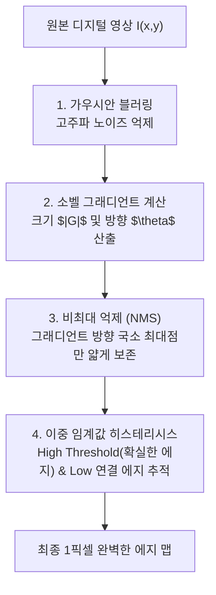

> [!abstract] 핵심 요약
> 디지털 영상 처리의 핵심은 커널(마스크)과의 공간 합성곱(2D Spatial Convolution)을 통해 잡음을 억제하고 유의미한 경계선(Edge)을 추출하는 것이다.
> **가우시안 평활화(Gaussian Blur)**로 고주파 노이즈를 사전에 제거한 후, $x, y$ 방향의 1차 미분 근사 마스크인 **소벨(Sobel)**로 그래디언트 크기와 방향을 구하며, **캐니(Canny) 에지 검출기**의 비최대 억제(NMS)와 이중 임계값 히스테리시스(Hysteresis Thresholding)를 통해 단 1픽셀 두께의 완벽한 에지 맵을 도출한다.

---

## 1. 2D 공간 컨볼루션 및 소벨(Sobel) 마스크 수식

$$I'(x, y) = \sum_{u=-k}^k \sum_{v=-k}^k I(x - u, y - v) K(u, v)$$
$$\mathbf{G}_x = \begin{bmatrix} -1 & 0 & +1 \\ -2 & 0 & +2 \\ -1 & 0 & +1 \end{bmatrix} * I, \quad \mathbf{G}_y = \begin{bmatrix} +1 & +2 & +1 \\ 0 & 0 & 0 \\ -1 & -2 & -1 \end{bmatrix} * I$$
$$|\mathbf{G}| = \sqrt{\mathbf{G}_x^2 + \mathbf{G}_y^2} \approx |\mathbf{G}_x| + |\mathbf{G}_y|, \quad \theta = \operatorname{arctan2}(\mathbf{G}_y, \mathbf{G}_x)$$



---

## 2. 실시간 소벨(Sobel) 마스크 그래디언트 크기 및 에지 검출기

```html preview
<div style="font-family:system-ui,-apple-system,sans-serif;padding:20px;background:var(--card);color:var(--card-foreground);border:1px solid var(--border);border-radius:var(--radius)">
  <div style="font-size:16px;font-weight:700;margin-bottom:14px;color:var(--primary);display:flex;align-items:center;gap:8px">
    <span>📐 소벨(Sobel) 그래디언트 마스크 에지 검출 시뮬레이터</span>
  </div>

  <div style="display:grid;grid-template-columns:1fr 1fr;gap:12px;margin-bottom:14px">
    <div>
      <label style="font-size:11px;color:var(--muted-foreground)">수평 방향 그래디언트 Gx:</label>
      <input id="inSobelGx" type="number" value="120" step="10" style="width:100%;padding:4px 8px;background:var(--background);color:var(--foreground);border:1px solid var(--border);border-radius:var(--radius);font-weight:700" />
    </div>
    <div>
      <label style="font-size:11px;color:var(--muted-foreground)">수직 방향 그래디언트 Gy:</label>
      <input id="inSobelGy" type="number" value="80" step="10" style="width:100%;padding:4px 8px;background:var(--background);color:var(--foreground);border:1px solid var(--border);border-radius:var(--radius);font-weight:700" />
    </div>
  </div>

  <div style="display:grid;grid-template-columns:1fr 1fr;gap:12px;margin-bottom:12px">
    <div style="padding:10px;background:var(--background);border:1px solid var(--border);border-radius:var(--radius);text-align:center">
      <div style="font-size:10px;color:var(--muted-foreground)">에지 강도 Magnitude |G|</div>
      <div id="outSobelMag" style="font-family:monospace;font-size:16px;font-weight:800;color:var(--primary);margin-top:2px">144.22</div>
    </div>
    <div style="padding:10px;background:var(--background);border:1px solid var(--border);border-radius:var(--radius);text-align:center">
      <div style="font-size:10px;color:var(--muted-foreground)">에지 법선 각도 Theta</div>
      <div id="outSobelTheta" style="font-family:monospace;font-size:16px;font-weight:800;color:var(--chart-1);margin-top:2px">33.7° (동북 방향)</div>
    </div>
  </div>

  <script>
    function updateSobel() {
      var gx = parseFloat(document.getElementById('inSobelGx').value) || 0;
      var gy = parseFloat(document.getElementById('inSobelGy').value) || 0;

      var mag = Math.sqrt(gx * gx + gy * gy);
      var rad = Math.atan2(gy, gx);
      var deg = (rad * 180 / Math.PI + 360) % 360;

      document.getElementById('outSobelMag').textContent = mag.toFixed(2);
      document.getElementById('outSobelTheta').textContent = deg.toFixed(1) + "°";
    }

    ['inSobelGx', 'inSobelGy'].forEach(function(id) {
      document.getElementById(id).addEventListener('input', updateSobel);
    });
    updateSobel();
  </script>
</div>
```
