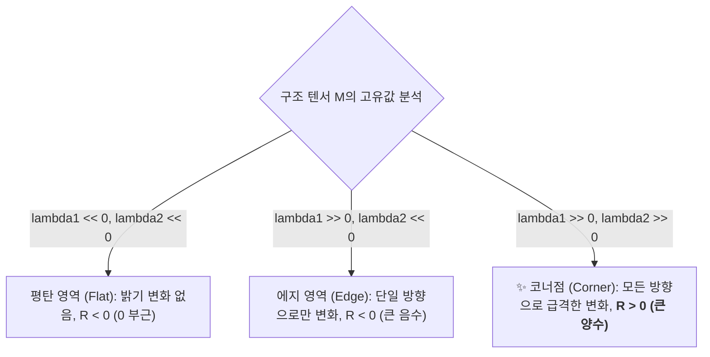

> [!abstract] 핵심 요약
> 영상 내에서 위치가 바뀌거나 카메라의 각도가 변하더라도 신뢰할 수 있는 특징을 추출하기 위해 **기하학적 변환**과 **코너(Corner) 검출**의 수학을 정립해야 한다.
> 2차원 평면의 모든 선형 변환은 **동차 좌표계($[x, y, 1]^T$)**를 통해 단일 $3 \times 3$ 행렬 곱으로 통합 표현되며, **해리스 코너(Harris Corner)**는 구조 텐서 $M$의 두 고유값 $\lambda_1, \lambda_2$가 모두 클 때($R > 0$) 모든 방향으로 강한 밝기 변화를 갖는 불변의 코너점을 정확하게 찾아낸다.

---

## 1. 해리스 코너(Harris Corner) 반응 함수 수학적 유도

$$M = \sum_{(x,y) \in W} w(x,y) \begin{bmatrix} I_x^2 & I_x I_y \\ I_x I_y & I_y^2 \end{bmatrix}$$
$$R = \det(M) - k \cdot (\operatorname{trace}(M))^2 = (\lambda_1 \lambda_2) - k (\lambda_1 + \lambda_2)^2 \quad (k \approx 0.04 \sim 0.06)$$



---

## 2. 실시간 해리스 코너(Harris Corner) 반응 점수 $R$ 판별기

```html preview
<div style="font-family:system-ui,-apple-system,sans-serif;padding:20px;background:var(--card);color:var(--card-foreground);border:1px solid var(--border);border-radius:var(--radius)">
  <div style="font-size:16px;font-weight:700;margin-bottom:14px;color:var(--primary);display:flex;align-items:center;gap:8px">
    <span>🔍 해리스 코너 구조 텐서 고유값(lambda1, lambda2) 반응성 시뮬레이터</span>
  </div>

  <div style="display:grid;grid-template-columns:1fr 1fr;gap:12px;margin-bottom:14px">
    <div>
      <label style="font-size:11px;color:var(--muted-foreground)">고유값 1 (lambda 1):</label>
      <input id="inHarrisL1" type="number" min="0" max="100" value="80" style="width:100%;padding:4px 8px;background:var(--background);color:var(--foreground);border:1px solid var(--border);border-radius:var(--radius);font-weight:700" />
    </div>
    <div>
      <label style="font-size:11px;color:var(--muted-foreground)">고유값 2 (lambda 2):</label>
      <input id="inHarrisL2" type="number" min="0" max="100" value="70" style="width:100%;padding:4px 8px;background:var(--background);color:var(--foreground);border:1px solid var(--border);border-radius:var(--radius);font-weight:700" />
    </div>
  </div>

  <div style="display:grid;grid-template-columns:1fr 1fr;gap:12px;margin-bottom:12px">
    <div style="padding:10px;background:var(--background);border:1px solid var(--border);border-radius:var(--radius);text-align:center">
      <div style="font-size:10px;color:var(--muted-foreground)">해리스 반응값 R (k=0.04)</div>
      <div id="outHarrisR" style="font-family:monospace;font-size:16px;font-weight:800;color:var(--primary);margin-top:2px">+4700.0</div>
    </div>
    <div style="padding:10px;background:var(--background);border:1px solid var(--border);border-radius:var(--radius);text-align:center">
      <div style="font-size:10px;color:var(--muted-foreground)">기하 구조 영역 판별</div>
      <div id="outHarrisType" style="font-size:12px;font-weight:800;color:var(--primary);margin-top:4px">✨ 완벽한 코너점 (Corner)</div>
    </div>
  </div>

  <script>
    function updateHarris() {
      var l1 = parseFloat(document.getElementById('inHarrisL1').value) || 0;
      var l2 = parseFloat(document.getElementById('inHarrisL2').value) || 0;
      var k = 0.04;

      var det = l1 * l2;
      var trace = l1 + l2;
      var r = det - k * (trace * trace);

      document.getElementById('outHarrisR').textContent = ((r >= 0 ? "+" : "") + r.toFixed(1));

      var tElem = document.getElementById('outHarrisType');
      if (l1 < 10 && l2 < 10) {
        tElem.innerHTML = "<span style='color:var(--muted-foreground)'>🟦 평탄 영역 (Flat)</span>";
      } else if (r < -200) {
        tElem.innerHTML = "<span style='color:var(--chart-2)'>➖ 에지 경계선 (Edge)</span>";
      } else if (r > 1000) {
        tElem.innerHTML = "<span style='color:var(--primary)'>✨ 완벽한 코너점 (Corner)</span>";
      } else {
        tElem.innerHTML = "<span style='color:var(--foreground)'>모호한 전이 영역</span>";
      }
    }

    ['inHarrisL1', 'inHarrisL2'].forEach(function(id) {
      document.getElementById(id).addEventListener('input', updateHarris);
    });
    updateHarris();
  </script>
</div>
```
