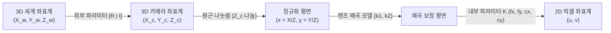

> [!abstract] 핵심 요약
> **카메라 캘리브레이션(Camera Calibration)**은 실제 3차원 공간의 좌표 $\mathbf{X}_w = [X_w, Y_w, Z_w, 1]^T$가 2차원 디지털 영상 평면의 픽셀 좌표 $\mathbf{x} = [u, v, 1]^T$로 투영되는 전 과정을 수학적으로 모델링하고 파라미터를 추정하는 과정이다.
> 카메라는 **내부 파라미터 행렬 $\mathbf{K}$**(초점거리 $f_x, f_y$, 주점 $c_x, c_y$)와 **외부 파라미터 행렬 $[\mathbf{R} \mid \mathbf{t}]$**(세계 좌표계 대비 카메라의 3D 위치 및 자세)의 곱인 **$3 \times 4$ 투영 행렬 $\mathbf{P} = \mathbf{K} [\mathbf{R} \mid \mathbf{t}]$**로 표현된다.

---

## 1. 핀홀 카메라 원근 투영 행렬 수식

$$\begin{bmatrix} u \\ v \\ 1 \end{bmatrix} \sim \mathbf{P} \mathbf{X}_w = \underbrace{\begin{bmatrix} f_x & s & c_x \\ 0 & f_y & c_y \\ 0 & 0 & 1 \end{bmatrix}}_{\text{내부 행렬 } \mathbf{K}} \underbrace{\begin{bmatrix} r_{11} & r_{12} & r_{13} & t_x \\ r_{21} & r_{22} & r_{23} & t_y \\ r_{31} & r_{32} & r_{33} & t_z \end{bmatrix}}_{\text{외부 행렬 } [\mathbf{R} \mid \mathbf{t}]} \begin{bmatrix} X_w \\ Y_w \\ Z_w \\ 1 \end{bmatrix}$$



---

## 2. 실시간 핀홀 카메라 3D 점 사영(Projection) 픽셀 좌표 계산기

```html preview
<div style="font-family:system-ui,-apple-system,sans-serif;padding:20px;background:var(--card);color:var(--card-foreground);border:1px solid var(--border);border-radius:var(--radius)">
  <div style="font-size:16px;font-weight:700;margin-bottom:14px;color:var(--primary);display:flex;align-items:center;gap:8px">
    <span>📷 핀홀 카메라 3D ➔ 2D 픽셀 좌표 사영 시뮬레이터</span>
  </div>

  <div style="display:grid;grid-template-columns:repeat(3, 1fr);gap:10px;margin-bottom:14px">
    <div>
      <label style="font-size:10px;color:var(--muted-foreground)">3D 점 X_c (m):</label>
      <input id="inCamX" type="number" value="1.0" step="0.2" style="width:100%;padding:4px;background:var(--background);color:var(--foreground);border:1px solid var(--border);border-radius:var(--radius);font-weight:700" />
    </div>
    <div>
      <label style="font-size:10px;color:var(--muted-foreground)">3D 점 Y_c (m):</label>
      <input id="inCamY" type="number" value="0.5" step="0.2" style="width:100%;padding:4px;background:var(--background);color:var(--foreground);border:1px solid var(--border);border-radius:var(--radius);font-weight:700" />
    </div>
    <div>
      <label style="font-size:10px;color:var(--muted-foreground)">3D 점 Z_c 깊이 (m):</label>
      <input id="inCamZ" type="number" value="2.0" step="0.2" style="width:100%;padding:4px;background:var(--background);color:var(--foreground);border:1px solid var(--border);border-radius:var(--radius);font-weight:700" />
    </div>
  </div>

  <div style="display:grid;grid-template-columns:1fr 1fr;gap:12px;margin-bottom:12px">
    <div style="padding:10px;background:var(--background);border:1px solid var(--border);border-radius:var(--radius);text-align:center">
      <div style="font-size:10px;color:var(--muted-foreground)">사영된 픽셀 좌표 u (fx=800, cx=640)</div>
      <div id="camPixUOut" style="font-family:monospace;font-size:16px;font-weight:800;color:var(--primary);margin-top:2px">1040.0 px</div>
    </div>
    <div style="padding:10px;background:var(--background);border:1px solid var(--border);border-radius:var(--radius);text-align:center">
      <div style="font-size:10px;color:var(--muted-foreground)">사영된 픽셀 좌표 v (fy=800, cy=360)</div>
      <div id="camPixVOut" style="font-family:monospace;font-size:16px;font-weight:800;color:var(--chart-1);margin-top:2px">560.0 px</div>
    </div>
  </div>

  <div id="camProjDesc" style="padding:10px;background:var(--background);border:1px solid var(--border);border-radius:var(--radius);font-size:11px">
    계산: <code>u = 800 × (1.0 / 2.0) + 640 = 1040 px, v = 800 × (0.5 / 2.0) + 360 = 560 px</code>
  </div>

  <script>
    function updateCamProj() {
      var x = parseFloat(document.getElementById('inCamX').value) || 0;
      var y = parseFloat(document.getElementById('inCamY').value) || 0;
      var z = parseFloat(document.getElementById('inCamZ').value) || 2.0;

      if (z <= 0) return;

      var fx = 800, fy = 800, cx = 640, cy = 360;
      var u = fx * (x / z) + cx;
      var v = fy * (y / z) + cy;

      document.getElementById('camPixUOut').textContent = u.toFixed(1) + " px";
      document.getElementById('camPixVOut').textContent = v.toFixed(1) + " px";
      document.getElementById('camProjDesc').innerHTML = "계산: <code>u = " + fx + " × (" + x + "/" + z + ") + " + cx + " = <b>" + u.toFixed(1) + " px</b>, v = " + fy + " × (" + y + "/" + z + ") + " + cy + " = <b>" + v.toFixed(1) + " px</b></code>";
    }

    ['inCamX', 'inCamY', 'inCamZ'].forEach(function(id) {
      document.getElementById(id).addEventListener('input', updateCamProj);
    });
    updateCamProj();
  </script>
</div>
```
