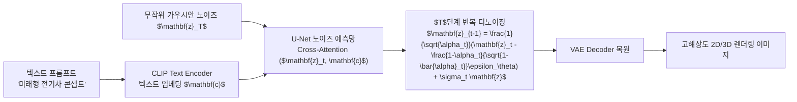

> [!abstract] 핵심 요약
> **생성형 인공지능(Generative AI)**은 대규모 데이터셋으로부터 데이터의 근원적인 결합 확률 분포 $P(X)$를 학습하여 새로운 고화질 콘텐츠(텍스트, 이미지, 3D 메시, 오디오)를 합성하는 패러다임 전환이다.
> 특히 **잠재 확산 모델(LDM, Latent Diffusion Model)**은 고해상도 픽셀 공간 대신 사전학습된 VAE(Variational Autoencoder)의 압축된 잠재 공간(Latent Space)에서 정방향 가우시안 노이즈 주입과 역방향 노이즈 제거(Denoising)를 수행함으로써 컴퓨터 연산 효율성과 생성 품질을 획기적으로 개선했다.

---

## 1. 잠재 확산 모델(Latent Diffusion Model) 아키텍처



---

## 2. 생성형 디자인 도구 및 플랫폼 생태계

| 도구/모델 | 주요 기술적 특징 | 주 활용 산업군 |
| :-- | :-- | :-- |
| **Stable Diffusion (SDXL/SD3)** | 오픈소스 잠재 확산 모델, 완전한 로컬 제어 및 LoRA 학습 지원 | 게임 에셋, 일러스트, 콘셉트 아트 |
| **Midjourney (v6)** | 심미적 화풍과 포토리얼리즘에 특화된 독자 확산 파이프라인 | 광고 기획, 비주얼 무드보드 |
| **MNML AI / Luw AI** | 건축 스케치·CAD 도면을 포토리얼 3D 렌더링으로 변환 (Sketch-to-Image) | 건축 설계, 인테리어 디자인, 공간 기획 |
| **Autodesk Generative Design** | 물리학적 구조 해석(CAE) 및 경량화 다목적 최적화 생성 | 자동차 차체, 항공우주 부품 설계 |

---

## 3. 실시간 잠재 확산 디노이징(Denoising) 스텝 시뮬레이터

```html preview
<div style="font-family:system-ui,-apple-system,sans-serif;padding:20px;background:var(--card);color:var(--card-foreground);border:1px solid var(--border);border-radius:var(--radius)">
  <div style="font-size:16px;font-weight:700;margin-bottom:14px;color:var(--primary);display:flex;align-items:center;gap:8px">
    <span>✨ Latent Diffusion 디노이징 타임스텝(T) 시뮬레이터</span>
  </div>

  <div style="margin-bottom:14px">
    <div style="display:flex;justify-content:space-between;font-size:11px;color:var(--muted-foreground);margin-bottom:4px">
      <span>디노이징 스텝 진행 (Step / 50):</span>
      <span id="diffStepVal" style="font-weight:700;color:var(--primary)">Step 25 / 50</span>
    </div>
    <input id="inDiffStep" type="range" min="0" max="50" step="5" value="25" style="width:100%" />
  </div>

  <div style="display:grid;grid-template-columns:1fr 1fr;gap:12px;margin-bottom:12px">
    <div style="padding:10px;background:var(--background);border:1px solid var(--border);border-radius:var(--radius);text-align:center">
      <div style="font-size:10px;color:var(--muted-foreground)">잔여 노이즈 비율 (Noise Rate)</div>
      <div id="diffNoiseOut" style="font-family:monospace;font-size:16px;font-weight:800;color:var(--destructive,#ef4444);margin-top:2px">50.0 %</div>
    </div>
    <div style="padding:10px;background:var(--background);border:1px solid var(--border);border-radius:var(--radius);text-align:center">
      <div style="font-size:10px;color:var(--muted-foreground)">형상 선명도 (Image Clarity)</div>
      <div id="diffClarityOut" style="font-family:monospace;font-size:16px;font-weight:800;color:var(--primary);margin-top:2px">50.0 %</div>
    </div>
  </div>

  <div id="diffStepDesc" style="padding:10px;background:var(--background);border:1px solid var(--border);border-radius:var(--radius);font-size:11px">
    스텝 25: 노이즈가 절반 제거되어 대략적인 자동차 외곽 실루엣이 형성되었습니다.
  </div>

  <script>
    document.getElementById('inDiffStep').oninput = function() {
      var s = parseInt(this.value);
      document.getElementById('diffStepVal').textContent = "Step " + s + " / 50";

      var noise = (1.0 - s / 50.0) * 100;
      var clarity = (s / 50.0) * 100;

      document.getElementById('diffNoiseOut').textContent = noise.toFixed(1) + " %";
      document.getElementById('diffClarityOut').textContent = clarity.toFixed(1) + " %";

      var dElem = document.getElementById('diffStepDesc');
      if (s === 0) {
        dElem.innerHTML = "🌫️ <b>[스텝 0]</b> 완전한 무작위 가우시안 노이즈(Pure Noise) 상태입니다.";
      } else if (s < 20) {
        dElem.innerHTML = "🎨 <b>[스텝 " + s + "]</b> U-Net이 텍스트 프롬프트와의 Cross-Attention으로 전반적인 색상 구도를 형성 중입니다.";
      } else if (s < 45) {
        dElem.innerHTML = "🚗 <b>[스텝 " + s + "]</b> 주요 물체의 외곽선과 형태 구조가 뚜렷해지고 있습니다.";
      } else {
        dElem.innerHTML = "✨ <b>[스텝 50 - 완료]</b> VAE 디코더를 통해 고화질 텍스처와 반사광이 완성된 최종 이미지가 복원되었습니다.";
      }
    };
  </script>
</div>
```
