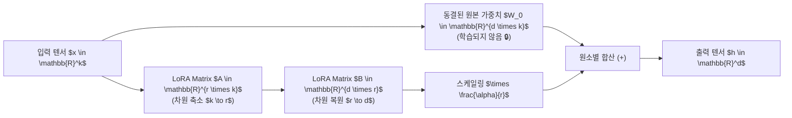

> [!abstract] 핵심 요약
> 거대 모델의 전체 파라미터를 미세조정(Full Fine-Tuning)하는 것은 VRAM 메모리와 체크포인트 저장 공간 측면에서 극도로 비효율적이다.
> **LoRA(Low-Rank Adaptation)**는 사전학습 가중치 $W_0 \in \mathbb{R}^{d \times k}$를 완전히 동결(Freeze)한 채, 변화량 $\Delta W$를 두 개의 초소형 저랭크 행렬의 곱 **$\Delta W = B \cdot A$ ($B \in \mathbb{R}^{d \times r}, A \in \mathbb{R}^{r \times k}, r \ll \min(d,k)$)**로 분해하여 **학습 파라미터 수를 99% 이상 절감**하면서도 기존 모델과 동등한 미세조정 성능을 달성한다.

---

## 1. LoRA(Low-Rank Adaptation) 순전파 및 스케일링 수식

$$h = W_0 x + \Delta W x = W_0 x + \frac{\alpha}{r} (B A) x$$

- $W_0 \in \mathbb{R}^{d \times k}$: 사전학습된 고정 가중치 (Gradient 갱신 차단 $\nabla W_0 = 0$).
- $A \in \mathbb{R}^{r \times k}$: 가우시안 정규분포 $\mathcal{N}(0, \sigma^2)$로 초기화되는 입력 다운프로젝션 행렬.
- $B \in \mathbb{R}^{d \times r}$: 학습 시작 시 $0$으로 초기화($B=0$)되어 초기 상태에서 $\Delta W = 0$을 보장하는 업프로젝션 행렬.
- $r$: 고유 랭크 (Rank, 통상 $4 \sim 64$).
- $\alpha$: 스케일링 상수 (통상 $\alpha = 2r$ 또는 $\alpha = r$).



---

## 2. 전체 파인튜닝 vs LoRA 비교

| 비교 항목 | 전체 파인튜닝 (Full Fine-Tuning) | LoRA (Low-Rank Adaptation) |
| :-- | :-- | :-- |
| **학습 가중치 비율** | 모델 전체 100% (수십억~수백억 개) | **0.01% ~ 0.5% (수백만 개)** |
| **GPU VRAM 소모량** | 극도로 큼 (A100/H100 멀티 클러스터 필수) | **일반 소비자용 GPU (RTX 4090 24GB 등)에서 원활** |
| **어댑터 파일 용량** | 수십 GB (체크포인트마다 모델 전체 복사) | **수십 MB ~ 수백 MB (초경량 교체 가능)** |
| **추론 서빙 지연** | 없음 ($W$ 직접 사용) | **배포 시 $W = W_0 + \frac{\alpha}{r}BA$로 가산하여 오버헤드 0** |

---

## 3. 실시간 LoRA 파라미터 절감률 & 메모리 시뮬레이터

```html preview
<div style="font-family:system-ui,-apple-system,sans-serif;padding:20px;background:var(--card);color:var(--card-foreground);border:1px solid var(--border);border-radius:var(--radius)">
  <div style="font-size:16px;font-weight:700;margin-bottom:14px;color:var(--primary);display:flex;align-items:center;gap:8px">
    <span>🧮 LoRA 저차원 랭크(Rank r) 파라미터 절감 계산기</span>
  </div>

  <div style="display:grid;grid-template-columns:1fr 1fr;gap:12px;margin-bottom:14px">
    <div>
      <div style="display:flex;justify-content:space-between;font-size:11px;color:var(--muted-foreground)">
        <span>LoRA 랭크 크기 (Rank r):</span>
        <span id="loraRankVal" style="font-weight:700;color:var(--primary)">r = 16</span>
      </div>
      <input id="inLoraRank" type="range" min="2" max="64" step="2" value="16" style="width:100%" />
    </div>
    <div>
      <div style="display:flex;justify-content:space-between;font-size:11px;color:var(--muted-foreground)">
        <span>트랜스포머 은닉 차원 d:</span>
        <span style="font-weight:700;color:var(--chart-1)">d = 4,096</span>
      </div>
      <input type="text" value="4096" disabled style="width:100%;background:var(--muted);color:var(--foreground);border:1px solid var(--border);border-radius:var(--radius);padding:4px;font-size:11px;font-weight:700" />
    </div>
  </div>

  <div style="display:grid;grid-template-columns:repeat(3, 1fr);gap:10px;margin-bottom:12px">
    <div style="padding:10px;background:var(--background);border:1px solid var(--border);border-radius:var(--radius);text-align:center">
      <div style="font-size:10px;color:var(--muted-foreground)">원본 레이어 가중치 수</div>
      <div style="font-family:monospace;font-size:13px;font-weight:800">16,777,216 개</div>
    </div>
    <div style="padding:10px;background:var(--background);border:1px solid var(--border);border-radius:var(--radius);text-align:center">
      <div style="font-size:10px;color:var(--muted-foreground)">LoRA 학습 가중치 수</div>
      <div id="loraParamOut" style="font-family:monospace;font-size:13px;font-weight:800;color:var(--primary)">131,072 개</div>
    </div>
    <div style="padding:10px;background:var(--background);border:1px solid var(--border);border-radius:var(--radius);text-align:center">
      <div style="font-size:10px;color:var(--muted-foreground)">파라미터 절감 비율</div>
      <div id="loraSaveOut" style="font-family:monospace;font-size:13px;font-weight:800;color:var(--chart-1)">99.22 % 절감</div>
    </div>
  </div>

  <div id="loraCalcDesc" style="padding:10px;background:var(--background);border:1px solid var(--border);border-radius:var(--radius);font-size:11px">
    공식: <code>LoRA Params = 2 × d × r = 2 × 4096 × 16 = 131,072 개 (원본 대비 0.78%만 학습)</code>
  </div>

  <script>
    document.getElementById('inLoraRank').oninput = function() {
      var r = parseInt(this.value);
      document.getElementById('loraRankVal').textContent = "r = " + r;

      var d = 4096;
      var origParams = d * d;
      var loraParams = 2 * d * r;
      var savePct = (1.0 - loraParams / origParams) * 100;

      document.getElementById('loraParamOut').textContent = loraParams.toLocaleString() + " 개";
      document.getElementById('loraSaveOut').textContent = savePct.toFixed(2) + " % 절감";
      document.getElementById('loraCalcDesc').innerHTML = "공식: <code>2 × " + d + " × " + r + " = <b>" + loraParams.toLocaleString() + " 개</b> (전체 가중치의 " + (100 - savePct).toFixed(2) + "%만 갱신)</code>";
    };
  </script>
</div>
```
