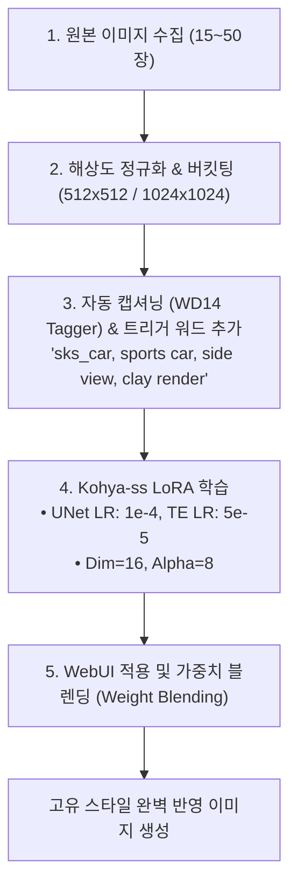

> [!abstract] 핵심 요약
> 이미지 생성 LoRA 학습은 특정 인물, 캐릭터, 제품 디자인 화풍, 3D 렌더링 스타일을 단 15~30장의 정제된 이미지로 모델에 주입하는 고효율 커스터마이징 기법이다.
> 학습 성공의 결정적 요인은 일관된 해상도의 데이터셋 정제, 고유 식별자 역할을 하는 **트리거 워드(Trigger Word)**와 세부 묘사 태그의 분리, 그리고 Text Encoder 학습률과 UNet 학습률의 조화로운 밸런스에 있다.

---

## 1. 이미지 LoRA 엔드투엔드 학습 파이프라인



---

## 2. 실시간 다중 LoRA 어댑터 가중치 블렌딩 시뮬레이터

```html preview
<div style="font-family:system-ui,-apple-system,sans-serif;padding:20px;background:var(--card);color:var(--card-foreground);border:1px solid var(--border);border-radius:var(--radius)">
  <div style="font-size:16px;font-weight:700;margin-bottom:14px;color:var(--primary);display:flex;align-items:center;gap:8px">
    <span>🎨 다중 LoRA 가중치 합성(Weight Blending) 시뮬레이터</span>
  </div>

  <div style="display:grid;grid-template-columns:1fr 1fr;gap:12px;margin-bottom:14px">
    <div>
      <div style="display:flex;justify-content:space-between;font-size:11px;color:var(--muted-foreground)">
        <span>LoRA 1 [Cyberpunk Style]:</span>
        <span id="lora1Val" style="font-weight:700;color:var(--primary)">0.70</span>
      </div>
      <input id="inLora1" type="range" min="0.0" max="1.5" step="0.05" value="0.7" style="width:100%" />
    </div>
    <div>
      <div style="display:flex;justify-content:space-between;font-size:11px;color:var(--muted-foreground)">
        <span>LoRA 2 [Clay 3D Render]:</span>
        <span id="lora2Val" style="font-weight:700;color:var(--chart-1)">0.40</span>
      </div>
      <input id="inLora2" type="range" min="0.0" max="1.5" step="0.05" value="0.4" style="width:100%" />
    </div>
  </div>

  <div style="padding:10px;background:var(--background);border:1px solid var(--border);border-radius:var(--radius);margin-bottom:12px">
    <div style="font-size:10px;color:var(--muted-foreground);margin-bottom:4px">WebUI 결합 프롬프트:</div>
    <div id="loraPromptOut" style="font-family:monospace;font-size:11px;color:var(--foreground)">
      &lt;lora:cyberpunk_v2:0.70&gt;, &lt;lora:clay_render:0.40&gt;, futuristic sports car, studio lighting
    </div>
  </div>

  <div id="loraBlendDesc" style="padding:10px;background:var(--background);border:1px solid var(--border);border-radius:var(--radius);font-size:11px">
    가중치 합이 1.10으로 사이버펑크 네온 색조와 점토 3D 텍스처가 조화롭게 결합된 결과가 렌더링됩니다.
  </div>

  <script>
    function updateLoraBlend() {
      var w1 = parseFloat(document.getElementById('inLora1').value);
      var w2 = parseFloat(document.getElementById('inLora2').value);
      document.getElementById('lora1Val').textContent = w1.toFixed(2);
      document.getElementById('lora2Val').textContent = w2.toFixed(2);

      document.getElementById('loraPromptOut').textContent = "<lora:cyberpunk_v2:" + w1.toFixed(2) + ">, <lora:clay_render:" + w2.toFixed(2) + ">, futuristic sports car, studio lighting";

      var sum = w1 + w2;
      var dElem = document.getElementById('loraBlendDesc');
      if (sum > 1.8) {
        dElem.innerHTML = "<span style='color:var(--destructive,#ef4444);font-weight:700'>⚠️ [가중치 과다 (Over-baking)]</span> LoRA 가중치 합이 너무 높아 이미지가 깨지거나 아티팩트가 발생할 수 있습니다.";
      } else if (sum === 0) {
        dElem.textContent = "기본 베이스 체크포인트 모델만으로 렌더링됩니다.";
      } else {
        dElem.innerHTML = "✅ 가중치 총합 <b>" + sum.toFixed(2) + "</b>: 두 가지 독립적 화풍이 안정적으로 합성됩니다.";
      }
    }

    ['inLora1', 'inLora2'].forEach(function(id) {
      document.getElementById(id).addEventListener('input', updateLoraBlend);
    });
    updateLoraBlend();
  </script>
</div>
```
