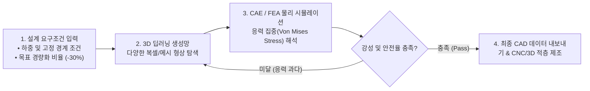

> [!abstract] 핵심 요약
> **엔지니어링 생성 설계(Generative Design)**는 디자이너가 단순히 형상을 그리는 것을 넘어 하중 조건, 재료 특성, 제조 제약(3D 프린팅, 주조 등), 목표 중량 등의 공학적 파라미터를 입력하면 AI 알고리즘이 수백 가지 최적의 3D 구조를 자동 생성하는 기술이다.
> 기아 자동차의 3D 콘셉트 휠 생성 연구와 같이 **딥러닝 생성망(VAE/GAN/Diffusion)**과 **유한요소해석(FEA/CAE)**을 긴밀히 결합하여 심미적 우수성과 물리적 내구성(응력 분산 및 경량화)을 동시에 달성한다.

---

## 1. AI 기반 생성 설계(Generative Design) 통합 파이프라인



---

## 2. 전통적 설계 방식 vs AI 생성 설계 비교

| 비교 항목 | 전통적 CAD 설계 (Traditional CAD) | AI 기반 생성 설계 (Generative Design) |
| :-- | :-- | :-- |
| **형상 접근법** | 설계자의 직관과 표준 기하 도형 조합 | **자연계 유기적 구조(Biomimicry)를 닮은 최적 형상** |
| **디자인 반복 주기** | 수주 ~ 수개월 소요 (도면 수정-해석 반복) | **수시간 내 수백 개 대안 동시 생성 및 비교** |
| **경량화 및 강성** | 안전율 고려한 보수적 중량 설계 | **불필요한 소재를 극도로 제거하여 최대 40% 경량화** |

---

## 3. 실시간 위상 최적화(Topology Optimization) 경량화 시뮬레이터

```html preview
<div style="font-family:system-ui,-apple-system,sans-serif;padding:20px;background:var(--card);color:var(--card-foreground);border:1px solid var(--border);border-radius:var(--radius)">
  <div style="font-size:16px;font-weight:700;margin-bottom:14px;color:var(--primary);display:flex;align-items:center;gap:8px">
    <span>🏗️ AI 엔지니어링 생성 설계 경량화 & 강성 시뮬레이터</span>
  </div>

  <div style="margin-bottom:14px">
    <div style="display:flex;justify-content:space-between;font-size:11px;color:var(--muted-foreground);margin-bottom:4px">
      <span>목표 소재 제거율 (Mass Reduction):</span>
      <span id="genRedVal" style="font-weight:700;color:var(--primary)">35 % 경량화</span>
    </div>
    <input id="inGenRed" type="range" min="0" max="60" step="5" value="35" style="width:100%" />
  </div>

  <div style="display:grid;grid-template-columns:repeat(3, 1fr);gap:10px;margin-bottom:12px">
    <div style="padding:10px;background:var(--background);border:1px solid var(--border);border-radius:var(--radius);text-align:center">
      <div style="font-size:10px;color:var(--muted-foreground)">부품 중량 (Weight)</div>
      <div id="genWeightOut" style="font-family:monospace;font-size:14px;font-weight:800;color:var(--primary)">6.5 kg</div>
    </div>
    <div style="padding:10px;background:var(--background);border:1px solid var(--border);border-radius:var(--radius);text-align:center">
      <div style="font-size:10px;color:var(--muted-foreground)">최대 폰 미세스 응력</div>
      <div id="genStressOut" style="font-family:monospace;font-size:14px;font-weight:800;color:var(--chart-1)">180 MPa</div>
    </div>
    <div style="padding:10px;background:var(--background);border:1px solid var(--border);border-radius:var(--radius);text-align:center">
      <div style="font-size:10px;color:var(--muted-foreground)">구조 안전율 (Safety)</div>
      <div id="genSafetyOut" style="font-family:monospace;font-size:14px;font-weight:800;color:var(--primary)">2.22 (안전)</div>
    </div>
  </div>

  <div id="genDesignDesc" style="padding:10px;background:var(--background);border:1px solid var(--border);border-radius:var(--radius);font-size:11px">
    AI가 응력이 집중되지 않는 중립축 부위의 소재를 우선 제거하여 안전율 2.22를 유지하며 35% 경량화에 성공했습니다.
  </div>

  <script>
    document.getElementById('inGenRed').oninput = function() {
      var red = parseInt(this.value);
      document.getElementById('genRedVal').textContent = red + " % 경량화";

      var origW = 10.0;
      var curW = origW * (1.0 - red / 100.0);
      var yieldStress = 400; // 알루미늄 합금 항복강도
      var curStress = 120 + Math.pow(red / 10.0, 2) * 4.5;
      var safety = yieldStress / curStress;

      document.getElementById('genWeightOut').textContent = curW.toFixed(1) + " kg";
      document.getElementById('genStressOut').textContent = curStress.toFixed(0) + " MPa";
      document.getElementById('genSafetyOut').textContent = safety.toFixed(2) + (safety >= 1.5 ? " (안전)" : " (위험)");

      var dElem = document.getElementById('genDesignDesc');
      if (safety < 1.5) {
        document.getElementById('genSafetyOut').style.color = "var(--destructive,#ef4444)";
        dElem.innerHTML = "<span style='color:var(--destructive,#ef4444);font-weight:700'>⚠️ [구조 파손 위험]</span> 과도한 경량화로 안전율이 기준치(1.5) 이하로 떨어졌습니다.";
      } else {
        document.getElementById('genSafetyOut').style.color = "var(--primary)";
        dElem.innerHTML = "✅ AI 최적화 알고리즘이 하중 경로(Load Path)를 보존하여 안전율 <b>" + safety.toFixed(2) + "</b>를 유지합니다.";
      }
    };
  </script>
</div>
```
