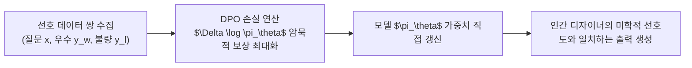

> [!abstract] 핵심 요약
> 생성 모델이 고품질 출력을 내더라도 인간이 선호하는 미학적 기준이나 물리적 타당성에서 벗어날 수 있다.
> 이를 교정하기 위해 **RLHF(인간 피드백 기반 강화학습)**와 **DPO(Direct Preference Optimization)**가 도입되었으며, 복잡한 보상 모델 훈련과 PPO 강화학습 루프 없이 선호 데이터 쌍($y_w \succ y_l$)만을 사용하여 모델의 생성 확률을 직접 인간 선호 방향으로 정렬한다.

---

## 1. DPO(Direct Preference Optimization) 목적 함수 수식

$$\mathcal{L}_{\text{DPO}}(\theta; \pi_{\text{ref}}) = -\mathbb{E}_{(x, y_w, y_l) \sim \mathcal{D}} \left[ \log \sigma \left( \beta \log \frac{\pi_\theta(y_w \mid x)}{\pi_{\text{ref}}(y_w \mid x)} - \beta \log \frac{\pi_\theta(y_l \mid x)}{\pi_{\text{ref}}(y_l \mid x)} \right) \right]$$

- $y_w$: 인간 평가자가 선택한 선호 출력 (Winning completion).
- $y_l$: 탈락한 비선호 출력 (Losing completion).
- $\pi_{\text{ref}}$: 기준이 되는 동결된 사전학습 모델.
- $\beta$: 기준 모델 $\pi_{\text{ref}}$로부터의 과도한 이탈을 억제하는 정규화 계수 (통상 $0.1 \sim 0.5$).



---

## 2. 실시간 DPO 암묵적 보상 차이 및 정렬 손실 계산기

```html preview
<div style="font-family:system-ui,-apple-system,sans-serif;padding:20px;background:var(--card);color:var(--card-foreground);border:1px solid var(--border);border-radius:var(--radius)">
  <div style="font-size:16px;font-weight:700;margin-bottom:14px;color:var(--primary);display:flex;align-items:center;gap:8px">
    <span>🎯 DPO (Direct Preference Optimization) 손실 및 보상 계산기</span>
  </div>

  <div style="display:grid;grid-template-columns:1fr 1fr;gap:12px;margin-bottom:14px">
    <div>
      <label style="font-size:11px;color:var(--muted-foreground)">선호 응답 y_w 로그 확률 차이:</label>
      <input id="inDpoW" type="number" step="0.2" value="1.5" style="width:100%;padding:4px;background:var(--background);color:var(--foreground);border:1px solid var(--border);border-radius:var(--radius);font-weight:700" />
    </div>
    <div>
      <label style="font-size:11px;color:var(--muted-foreground)">비선호 응답 y_l 로그 확률 차이:</label>
      <input id="inDpoL" type="number" step="0.2" value="-1.0" style="width:100%;padding:4px;background:var(--background);color:var(--foreground);border:1px solid var(--border);border-radius:var(--radius);font-weight:700" />
    </div>
  </div>

  <div style="display:grid;grid-template-columns:1fr 1fr;gap:12px;margin-bottom:12px">
    <div style="padding:10px;background:var(--background);border:1px solid var(--border);border-radius:var(--radius);text-align:center">
      <div style="font-size:10px;color:var(--muted-foreground)">암묵적 보상 마진 (beta * Delta)</div>
      <div id="dpoMarginOut" style="font-family:monospace;font-size:16px;font-weight:800;color:var(--primary);margin-top:2px">+0.250</div>
    </div>
    <div style="padding:10px;background:var(--background);border:1px solid var(--border);border-radius:var(--radius);text-align:center">
      <div style="font-size:10px;color:var(--muted-foreground)">DPO 손실 (Loss)</div>
      <div id="dpoLossOut" style="font-family:monospace;font-size:16px;font-weight:800;color:var(--chart-1);margin-top:2px">0.574</div>
    </div>
  </div>

  <script>
    function updateDpo() {
      var w = parseFloat(document.getElementById('inDpoW').value) || 0;
      var l = parseFloat(document.getElementById('inDpoL').value) || 0;
      var beta = 0.1;

      var margin = beta * (w - l);
      var loss = -Math.log(1.0 / (1.0 + Math.exp(-margin)));

      document.getElementById('dpoMarginOut').textContent = (margin >= 0 ? "+" : "") + margin.toFixed(3);
      document.getElementById('dpoLossOut').textContent = loss.toFixed(3);
    }

    ['inDpoW', 'inDpoL'].forEach(function(id) {
      document.getElementById(id).addEventListener('input', updateDpo);
    });
    updateDpo();
  </script>
</div>
```
