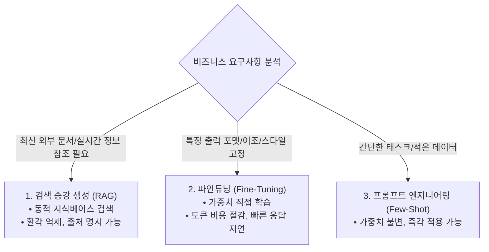

> [!abstract] 핵심 요약
> 거대언어모델을 기업 특화 업무에 최적화하는 3대 전략은 **프롬프트 엔지니어링(Few-Shot)**, **검색 증강 생성(RAG)**, **파인튜닝(Fine-Tuning)**이다.
> 파인튜닝은 모델 내부의 가중치를 직접 갱신하여 **원하는 응답 어조, 출력 포맷(JSON 등), 도메인 전문 지식의 일관성**을 완벽히 주입하는 지도 미세조정(SFT) 기법이며, 수백~수천 건의 고품질 `JSONL` 포맷 데이터셋과 에포크/학습률 제어를 통해 모델의 과적합과 치명적 망각(Catastrophic Forgetting)을 방지해야 한다.

---

## 1. LLM 도메인 커스터마이징 3대 전략 비교



---

## 2. OpenAI 파인튜닝 표준 JSONL 데이터 구조

```json
{"messages": [{"role": "system", "content": "너는 금융 사기 탐지 전문가 AI이다."}, {"role": "user", "content": "트랜잭션: 3분 내 해외 1000만원 결제"}, {"role": "assistant", "content": "{\"risk_level\": \"CRITICAL\", \"action\": \"BLOCK\"}"}]}
```

---

## 3. 실시간 파인튜닝 학습 손실 곡선 & 에포크 튜닝 시뮬레이터

```html preview
<div style="font-family:system-ui,-apple-system,sans-serif;padding:20px;background:var(--card);color:var(--card-foreground);border:1px solid var(--border);border-radius:var(--radius)">
  <div style="font-size:16px;font-weight:700;margin-bottom:14px;color:var(--primary);display:flex;align-items:center;gap:8px">
    <span>📊 LLM 파인튜닝(Fine-Tuning) 학습 손실 & 검증 손실 모니터링</span>
  </div>

  <div style="display:grid;grid-template-columns:1fr 1fr;gap:12px;margin-bottom:14px">
    <div>
      <div style="display:flex;justify-content:space-between;font-size:11px;color:var(--muted-foreground)">
        <span>학습 에포크 수 (n_epochs):</span>
        <span id="ftEpochVal" style="font-weight:700;color:var(--primary)">Epoch 3</span>
      </div>
      <input id="inFtEpoch" type="range" min="1" max="10" step="1" value="3" style="width:100%" />
    </div>
    <div>
      <div style="display:flex;justify-content:space-between;font-size:11px;color:var(--muted-foreground)">
        <span>학습률 배수 (LR Multiplier):</span>
        <span id="ftLrVal" style="font-weight:700;color:var(--chart-1)">1.0x</span>
      </div>
      <input id="inFtLr" type="range" min="0.2" max="3.0" step="0.2" value="1.0" style="width:100%" />
    </div>
  </div>

  <div style="display:grid;grid-template-columns:1fr 1fr;gap:12px;margin-bottom:12px">
    <div style="padding:10px;background:var(--background);border:1px solid var(--border);border-radius:var(--radius);text-align:center">
      <div style="font-size:10px;color:var(--muted-foreground)">훈련 손실 (Train Loss)</div>
      <div id="ftTrainLossOut" style="font-family:monospace;font-size:16px;font-weight:800;color:var(--primary);margin-top:2px">0.421</div>
    </div>
    <div style="padding:10px;background:var(--background);border:1px solid var(--border);border-radius:var(--radius);text-align:center">
      <div style="font-size:10px;color:var(--muted-foreground)">검증 손실 (Validation Loss)</div>
      <div id="ftValLossOut" style="font-family:monospace;font-size:16px;font-weight:800;color:var(--chart-1);margin-top:2px">0.450</div>
    </div>
  </div>

  <div id="ftStatusDesc" style="padding:10px;background:var(--background);border:1px solid var(--border);border-radius:var(--radius);font-size:11px">
    적절한 에포크(3)와 학습률로 훈련 손실과 검증 손실이 안정적으로 동반 하강하여 최적의 일반화 성능을 달성했습니다.
  </div>

  <script>
    function updateFtSim() {
      var ep = parseInt(document.getElementById('inFtEpoch').value);
      var lr = parseFloat(document.getElementById('inFtLr').value);
      document.getElementById('ftEpochVal').textContent = "Epoch " + ep;
      document.getElementById('ftLrVal').textContent = lr.toFixed(1) + "x";

      var trainLoss = Math.max(0.05, 2.0 / (1.0 + ep * 0.8 * lr));
      var valLoss = 0;
      if (ep > 5 && lr >= 1.5) {
        valLoss = 0.4 + (ep - 5) * 0.15 * lr;
      } else {
        valLoss = trainLoss + 0.03 + (ep * 0.01);
      }

      document.getElementById('ftTrainLossOut').textContent = trainLoss.toFixed(3);
      document.getElementById('ftValLossOut').textContent = valLoss.toFixed(3);

      if (valLoss > trainLoss + 0.3) {
        document.getElementById('ftStatusDesc').innerHTML = "<span style='color:var(--destructive,#ef4444);font-weight:700'>⚠️ [과적합(Overfitting) 경고]</span> 검증 손실이 반등하고 있습니다! 에포크를 줄이거나 학습률을 낮추세요.";
      } else {
        document.getElementById('ftStatusDesc').innerHTML = "<span style='color:var(--primary);font-weight:700'>✅ [안정적 수렴]</span> 훈련 및 검증 손실이 조화롭게 감소했습니다.";
      }
    }

    ['inFtEpoch', 'inFtLr'].forEach(function(id) {
      document.getElementById(id).addEventListener('input', updateFtSim);
    });
    updateFtSim();
  </script>
</div>
```
