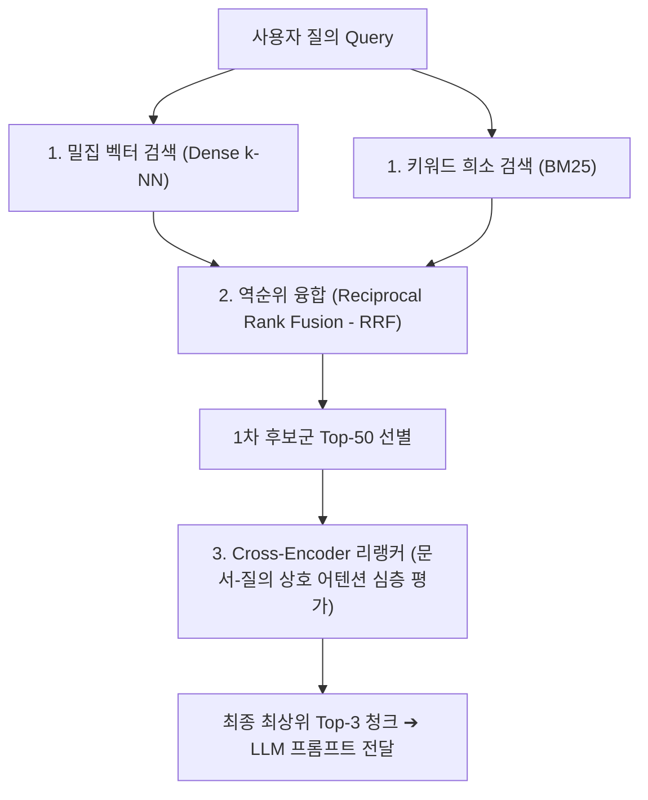

> [!abstract] 핵심 요약
> 초기 RAG의 단순 벡터 유사도 검색은 동일한 내용의 중복 청크가 상위권을 독점하거나 전문 용어 키워드 매칭에 취약한 문제가 있다.
> **MMR(Maximal Marginal Relevance)**은 관련성과 다양성 간의 가중치($\lambda$)를 조절하여 정보의 다각화를 실현하며, 1차 검색된 후보군($K=50$)을 **Cross-Encoder Re-ranker**(Cohere/BGE)로 재평가하는 2단계 파이프라인을 통해 RAG 답변의 신뢰도를 비약적으로 향상시킨다.

---

## 1. MMR(Maximal Marginal Relevance) 목적 함수

$$\operatorname{MMR} = \arg\max_{d_i \in R \setminus S} \left[ \lambda \operatorname{Sim}_1(d_i, q) - (1 - \lambda) \max_{d_j \in S} \operatorname{Sim}_2(d_i, d_j) \right]$$

- $\lambda = 1.0$: 순수 유사도 검색 (중복 청크 다수 포함 위험).
- $\lambda = 0.0$: 순수 다양성 검색 (질문과의 관련성 저하).
- $\lambda = 0.5 \sim 0.7$: **관련성이 높으면서도 서로 다른 관점의 청크를 고르게 선별**.



---

## 2. 실시간 MMR 파라미터($\lambda$) 다양성 vs 관련성 시뮬레이터

```html preview
<div style="font-family:system-ui,-apple-system,sans-serif;padding:20px;background:var(--card);color:var(--card-foreground);border:1px solid var(--border);border-radius:var(--radius)">
  <div style="font-size:16px;font-weight:700;margin-bottom:14px;color:var(--primary);display:flex;align-items:center;gap:8px">
    <span>⚖️ MMR(최대 한계 관련성) 람다(lambda) 다양성 제어 시뮬레이터</span>
  </div>

  <div style="margin-bottom:14px">
    <div style="display:flex;justify-content:space-between;font-size:11px;color:var(--muted-foreground);margin-bottom:4px">
      <span>다양성 가중치 람다 (lambda):</span>
      <span id="mmrLambdaVal" style="font-weight:700;color:var(--primary)">lambda = 0.60</span>
    </div>
    <input id="inMmrLambda" type="range" min="0.0" max="1.0" step="0.1" value="0.6" style="width:100%" />
  </div>

  <div style="padding:10px;background:var(--background);border:1px solid var(--border);border-radius:var(--radius);margin-bottom:12px">
    <div style="font-size:10px;color:var(--muted-foreground);margin-bottom:6px">최종 선별된 Top-3 청크 구성:</div>
    <div id="mmrSelectedDocs" style="font-family:monospace;font-size:12px;line-height:1.8">
      1. [Doc A] 회사의 2024년 매출 실적 (관련도 0.95)<br/>
      2. [Doc C] 회사의 미래 AI 신사업 로드맵 (관련도 0.82, 다양성 확보)<br/>
      3. [Doc E] 회사의 글로벌 지사 현황 (관련도 0.78, 다양성 확보)
    </div>
  </div>

  <div id="mmrStatusDesc" style="padding:10px;background:var(--background);border:1px solid var(--border);border-radius:var(--radius);font-size:11px">
    lambda=0.6으로 Doc A와 중복 내용인 Doc B(매출 세부항목)를 배제하고 다양한 관점의 유용한 문서를 성공적으로 수집했습니다.
  </div>

  <script>
    document.getElementById('inMmrLambda').oninput = function() {
      var l = parseFloat(this.value);
      document.getElementById('mmrLambdaVal').textContent = "lambda = " + l.toFixed(2);

      if (l >= 0.9) {
        document.getElementById('mmrSelectedDocs').innerHTML = "1. [Doc A] 2024년 매출 실적 (관련도 0.95)<br/>2. [Doc B] 2024년 4분기 매출 실적 상세 (관련도 0.94 - <span style='color:var(--destructive,#ef4444)'>중복</span>)<br/>3. [Doc A-2] 2024년 매출 요약본 (관련도 0.92 - <span style='color:var(--destructive,#ef4444)'>중복</span>)";
        document.getElementById('mmrStatusDesc').innerHTML = "⚠️ <b>[중복 정보 과다]</b> 람다가 너무 높아 거의 동일한 매출 관련 문서들만 중복 추출되었습니다.";
      } else if (l <= 0.2) {
        document.getElementById('mmrSelectedDocs').innerHTML = "1. [Doc A] 2024년 매출 실적 (관련도 0.95)<br/>2. [Doc Z] 사내 복지 포인트 규정 (관련도 0.35 - <span style='color:var(--chart-2)'>무관</span>)<br/>3. [Doc K] 구내식당 식단표 (관련도 0.20 - <span style='color:var(--chart-2)'>무관</span>)";
        document.getElementById('mmrStatusDesc').innerHTML = "⚠️ <b>[관련성 결여]</b> 다양성만 극단적으로 추구하여 질문과 무관한 문서가 포함되었습니다.";
      } else {
        document.getElementById('mmrSelectedDocs').innerHTML = "1. [Doc A] 2024년 매출 실적 (관련도 0.95)<br/>2. [Doc C] 미래 AI 신사업 로드맵 (관련도 0.82)<br/>3. [Doc E] 글로벌 지사 현황 (관련도 0.78)";
        document.getElementById('mmrStatusDesc').innerHTML = "✅ <b>[최적의 MMR 균형]</b> 핵심 질문 답변과 다각도 배경 지식을 조화롭게 갖춘 조합입니다.";
      }
    };
  </script>
</div>
```
