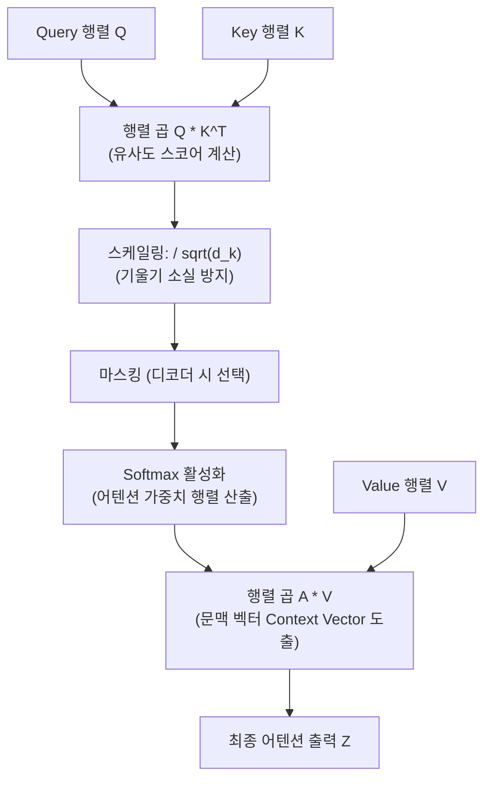

> [!abstract] 핵심 요약
> **트랜스포머(Transformer)**는 순환(Recurrence) 구조를 완전히 배제하고 오직 **어텐션(Attention)** 메커니즘만으로 시퀀스 간의 상호작용을 모델링하는 현대 생성형 AI와 거대언어모델(LLM)의 핵심 근간 아키텍처이다.
> 입력 문장 내 모든 단어 쌍 간의 연관도를 동시에 계산하는 **스케일드 닷 프로덕트 셀프 어텐션(Scaled Dot-Product Self-Attention)**과 여러 부분 공간에서 다각도로 특징을 추출하는 **멀티헤드 어텐션(Multi-Head Attention)**을 통해 $O(1)$의 경로 길이로 장기 의존성을 완벽히 해결했다.

---

## 1. 스케일드 닷 프로덕트 어텐션(Scaled Dot-Product Attention) 수식

$$\operatorname{Attention}(\mathbf{Q}, \mathbf{K}, \mathbf{V}) = \operatorname{softmax}\left( \frac{\mathbf{Q} \mathbf{K}^T}{\sqrt{d_k}} \right) \mathbf{V}$$



---

## 2. 삼각함수 기반 위치 인코딩(Positional Encoding)

$$PE_{(pos, 2i)} = \sin\left(\frac{pos}{10000^{2i/d_{\text{model}}}}\right), \quad PE_{(pos, 2i+1)} = \cos\left(\frac{pos}{10000^{2i/d_{\text{model}}}}\right)$$

---

## 3. 실시간 3단어 셀프 어텐션(Self-Attention) 가중치 계산기

```html preview
<div style="font-family:system-ui,-apple-system,sans-serif;padding:20px;background:var(--card);color:var(--card-foreground);border:1px solid var(--border);border-radius:var(--radius)">
  <div style="font-size:16px;font-weight:700;margin-bottom:14px;color:var(--primary);display:flex;align-items:center;gap:8px">
    <span>⚡ 트랜스포머 셀프 어텐션(Self-Attention) Q-K 유사도 가중치 계산기</span>
  </div>

  <div style="margin-bottom:12px;font-size:12px;font-weight:700;color:var(--foreground)">
    문장 예시: <code>[1] "The" &nbsp; [2] "animal" &nbsp; [3] "tired"</code>
  </div>

  <div style="display:grid;grid-template-columns:1fr 1fr;gap:12px;margin-bottom:12px">
    <div style="padding:10px;background:var(--background);border:1px solid var(--border);border-radius:var(--radius)">
      <div style="font-size:10px;color:var(--muted-foreground);margin-bottom:4px">Query: "animal"의 Key 어텐션 가중치 (Softmax)</div>
      <div id="attnWeightsOut" style="font-family:monospace;font-size:12px;line-height:1.8">
        • to "The": 8.5% [█░░░░░░░░░]<br/>
        • to "animal": 78.2% [████████░░]<br/>
        • to "tired": 13.3% [█░░░░░░░░░]
      </div>
    </div>
    <div style="padding:10px;background:var(--background);border:1px solid var(--border);border-radius:var(--radius)">
      <div style="font-size:10px;color:var(--muted-foreground);margin-bottom:4px">Query: "tired"의 Key 어텐션 가중치 (Softmax)</div>
      <div id="attnTiredOut" style="font-family:monospace;font-size:12px;line-height:1.8">
        • to "The": 3.2% [░░░░░░░░░░]<br/>
        • to "animal": 64.5% [██████░░░░]<br/>
        • to "tired": 32.3% [███░░░░░░░]
      </div>
    </div>
  </div>

  <div id="attnLogDesc" style="padding:10px;background:var(--background);border:1px solid var(--border);border-radius:var(--radius);font-size:11px">
    'tired'(피곤한) 단어는 주어인 'animal'(동물)에 64.5%의 가장 높은 어텐션 가중치를 집중하여 문맥적 연관성을 포착합니다.
  </div>
</div>
```
