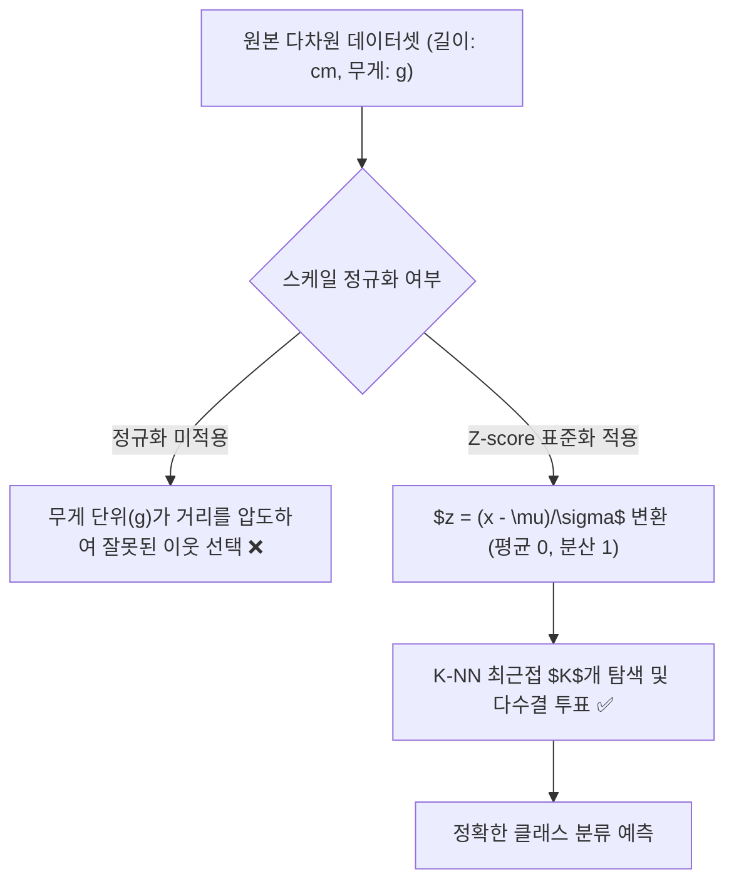

> [!abstract] 핵심 요약
> **K-최근접 이웃(K-NN)**은 별도의 훈련 단계 없이 새로운 데이터 포인트가 들어왔을 때 가장 가까운 $K$개의 기존 학습 데이터 레이블 다수결 투표(Majority Voting)로 클래스를 판별하는 대표적인 인스턴스 기반 학습 알고리즘이다.
> 데이터의 각 특성(길이 vs 무게)이 서로 다른 단위와 스케일을 가질 경우 거리가 특정 축에 의해 왜곡되므로, 모델 적용 전 반드시 **표준점수(Z-score)** 또는 **Min-Max 정규화**를 통해 스케일을 일치시켜야 한다.

---

## 1. 거리 측정 척도와 표준점수(Z-score) 공식

### 1.1 거리 척도 수식

$$d_{\text{Euclidean}}(\mathbf{x}, \mathbf{y}) = \|\mathbf{x} - \mathbf{y}\|_2 = \sqrt{\sum_{i=1}^d (x_i - y_i)^2}$$

$$d_{\text{Manhattan}}(\mathbf{x}, \mathbf{y}) = \|\mathbf{x} - \mathbf{y}\|_1 = \sum_{i=1}^d |x_i - y_i|$$

### 1.2 표준점수 변환 공식

$$z = \frac{x - \mu}{\sigma}$$



---

## 2. 하이퍼파라미터 $K$의 영향

| $K$ 값의 크기 | 모델 복잡도 및 결정 경계 | 편향-분산 특성 | 잠재적 문제점 |
| :-- | :-- | :-- | :-- |
| **$K$가 매우 작음 ($K=1$)** | 결정 경계가 매우 복잡하고 울퉁불퉁함 | 저편향, 고분산 (High Variance) | 노이즈와 이상치에 민감하여 **과대적합(Overfitting)** |
| **$K$가 매우 큼 ($K=N$)** | 결정 경계가 극도로 단순해짐 | 고편향, 저분산 (High Bias) | 전체 데이터의 최빈 클래스만 예측하는 **과소적합(Underfitting)** |

---

## 3. 실시간 Z-score 표준화 & 유클리드 거리 계산기

```html preview
<div style="font-family:system-ui,-apple-system,sans-serif;padding:20px;background:var(--card);color:var(--card-foreground);border:1px solid var(--border);border-radius:var(--radius)">
  <div style="font-size:16px;font-weight:700;margin-bottom:14px;color:var(--primary);display:flex;align-items:center;gap:8px">
    <span>📏 K-NN 표준점수(Z-score) 변환기</span>
  </div>

  <div style="display:grid;grid-template-columns:repeat(3, 1fr);gap:10px;margin-bottom:14px">
    <div>
      <label style="font-size:10px;color:var(--muted-foreground)">측정 원본값 (x):</label>
      <input id="inValX" type="number" value="35" step="1" style="width:100%;padding:4px;background:var(--background);color:var(--foreground);border:1px solid var(--border);border-radius:var(--radius);font-weight:700" />
    </div>
    <div>
      <label style="font-size:10px;color:var(--muted-foreground)">특성 평균 (mu):</label>
      <input id="inMu" type="number" value="25" step="1" style="width:100%;padding:4px;background:var(--background);color:var(--foreground);border:1px solid var(--border);border-radius:var(--radius);font-weight:700" />
    </div>
    <div>
      <label style="font-size:10px;color:var(--muted-foreground)">표준편차 (sigma):</label>
      <input id="inSigma" type="number" value="5" step="1" min="0.1" style="width:100%;padding:4px;background:var(--background);color:var(--foreground);border:1px solid var(--border);border-radius:var(--radius);font-weight:700" />
    </div>
  </div>

  <div style="padding:10px;background:var(--background);border:1px solid var(--border);border-radius:var(--radius);text-align:center">
    <div style="font-size:10px;color:var(--muted-foreground)">변환된 표준점수 (Z-score)</div>
    <div id="zScoreOut" style="font-family:monospace;font-size:18px;font-weight:800;color:var(--primary);margin-top:2px">+2.000 sigma</div>
  </div>

  <script>
    function updateZ() {
      var x = parseFloat(document.getElementById('inValX').value) || 0;
      var mu = parseFloat(document.getElementById('inMu').value) || 0;
      var sig = parseFloat(document.getElementById('inSigma').value) || 1;

      var z = (x - mu) / sig;
      document.getElementById('zScoreOut').textContent = (z >= 0 ? "+" : "") + z.toFixed(3) + " sigma";
    }

    ['inValX', 'inMu', 'inSigma'].forEach(function(id) {
      document.getElementById(id).addEventListener('input', updateZ);
    });
    updateZ();
  </script>
</div>
```
