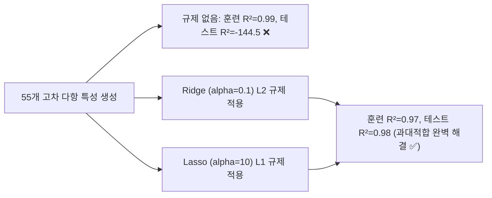

> [!abstract] 핵심 요약
> 다중 특성을 결합하고 5차 이상의 고차 다항 특성을 생성하면 훈련 세트에 대한 결정계수는 1.0에 육박하지만, 테스트 세트 점수가 극단적인 음수로 폭락하는 전형적인 **과대적합(Overfitting)**이 발생한다.
> 가중치 계수 벡터의 급격한 팽창을 막기 위해 **릿지(Ridge, $L_2$ 규제)**와 **라쏘(Lasso, $L_1$ 규제)**를 적용하며, 규제 강도 $\alpha$를 로그 스케일($10^{-3} \sim 10^2$)로 조절하여 훈련 세트와 테스트 세트의 $R^2$ 격차가 최소화되는 최적의 균형점을 도출한다.

---

## 1. 정규화 목적 함수 및 최적 $\alpha$ 탐색

$$\text{Ridge}: \quad J(\mathbf{w}) = \text{MSE}(\mathbf{w}) + \alpha \sum_{j=1}^p w_j^2$$

$$\text{Lasso}: \quad J(\mathbf{w}) = \text{MSE}(\mathbf{w}) + \alpha \sum_{j=1}^p |w_j|$$



---

## 2. 릿지(Ridge) vs 라쏘(Lasso) 동작 비교

| 구분 | 릿지 회귀 (Ridge Regression) | 라쏘 회귀 (Lasso Regression) |
| :-- | :-- | :-- |
| **규제 항** | $L_2$ 노름: $\alpha \sum w_j^2$ | $L_1$ 노름: $\alpha \sum |w_j|$ |
| **가중치 수축 형태** | 가중치를 0에 가깝게 점진적으로 축소 (0이 되지는 않음) | 덜 중요한 가중치를 **정확히 0**으로 만듦 (변수 자동 소거) |
| **특성 중요도 해석** | 모든 특성을 모델에 유지 | 가중치가 0이 아닌 핵심 특성만 보존 |

---

## 3. 실시간 $\alpha$ 규제 강도에 따른 훈련/테스트 $R^2$ 시뮬레이터

```html preview
<div style="font-family:system-ui,-apple-system,sans-serif;padding:20px;background:var(--card);color:var(--card-foreground);border:1px solid var(--border);border-radius:var(--radius)">
  <div style="font-size:16px;font-weight:700;margin-bottom:14px;color:var(--primary);display:flex;align-items:center;gap:8px">
    <span>🎛️ Ridge 회귀 alpha 파라미터 튜닝 시뮬레이터</span>
  </div>

  <div style="margin-bottom:14px">
    <div style="display:flex;justify-content:space-between;font-size:11px;color:var(--muted-foreground);margin-bottom:4px">
      <span>규제 계수 log10(alpha):</span>
      <span id="alphaLogVal" style="font-weight:700;color:var(--primary)">alpha = 0.1 (10^-1)</span>
    </div>
    <input id="inAlphaLog" type="range" min="-3" max="2" step="1" value="-1" style="width:100%" />
  </div>

  <div style="display:grid;grid-template-columns:1fr 1fr;gap:12px;margin-bottom:12px">
    <div style="padding:10px;background:var(--background);border:1px solid var(--border);border-radius:var(--radius);text-align:center">
      <div style="font-size:10px;color:var(--muted-foreground)">훈련 세트 R² (Train R²)</div>
      <div id="trainR2Out" style="font-family:monospace;font-size:16px;font-weight:800;color:var(--primary)">0.970</div>
    </div>
    <div style="padding:10px;background:var(--background);border:1px solid var(--border);border-radius:var(--radius);text-align:center">
      <div style="font-size:10px;color:var(--muted-foreground)">테스트 세트 R² (Test R²)</div>
      <div id="testR2Out" style="font-family:monospace;font-size:16px;font-weight:800;color:var(--chart-1)">0.975</div>
    </div>
  </div>

  <div id="alphaStatusDesc" style="padding:10px;background:var(--background);border:1px solid var(--border);border-radius:var(--radius);font-size:11px">
    적절한 규제로 과대적합이 해소되어 테스트 세트 설명력이 극대화되었습니다.
  </div>

  <script>
    document.getElementById('inAlphaLog').oninput = function() {
      var logA = parseInt(this.value);
      var alpha = Math.pow(10, logA);
      document.getElementById('alphaLogVal').textContent = "alpha = " + alpha + " (10^" + logA + ")";

      var trainR2, testR2, desc;
      if (logA <= -2) {
        trainR2 = 0.995; testR2 = 0.720;
        desc = "⚠️ <b>과대적합(Overfitting)</b>: 규제가 너무 약해 훈련 점수는 높으나 테스트 점수가 떨어집니다.";
      } else if (logA === -1 || logA === 0) {
        trainR2 = 0.970; testR2 = 0.975;
        desc = "✅ <b>최적 적합(Optimal Fit)</b>: 훈련과 테스트 점수가 모두 높고 안정적입니다.";
      } else {
        trainR2 = 0.850; testR2 = 0.840;
        desc = "⚠️ <b>과소적합(Underfitting)</b>: 규제가 너무 강해 모델이 데이터의 패턴을 충분히 학습하지 못합니다.";
      }

      document.getElementById('trainR2Out').textContent = trainR2.toFixed(3);
      document.getElementById('testR2Out').textContent = testR2.toFixed(3);
      document.getElementById('alphaStatusDesc').innerHTML = desc;
    };
  </script>
</div>
```
