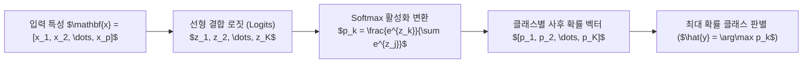

> [!abstract] 핵심 요약
> **로지스틱 회귀(Logistic Regression)**는 이름과 달리 본질적으로 강력한 **확률 기반 분류(Classification) 모델**이다.
> 입력 특성의 선형 결합 $z = \mathbf{w}^T \mathbf{x} + b$를 계산한 뒤, 이진 분류에서는 **시그모이드(Sigmoid)** 함수를 통과시켜 $0 \sim 1$ 사이의 성공 확률 $\hat{p}$을 추정하고, 3개 이상의 다중 클래스 분류에서는 **소프트맥스(Softmax)** 함수를 적용하여 각 클래스별 확률의 총합이 1이 되도록 정규화한다.

---

## 1. 시그모이드(Sigmoid)와 소프트맥스(Softmax) 수식

### 1.1 시그모이드 함수 (이진 분류)

$$\sigma(z) = \frac{1}{1 + e^{-z}} = \frac{e^z}{1 + e^z}$$

### 1.2 소프트맥스 함수 (다중 클래스 $K$개 분류)

$$P(Y = k \mid \mathbf{x}) = \frac{e^{z_k}}{\sum_{j=1}^K e^{z_j}} \quad (k = 1, \dots, K)$$



---

## 2. 이진 교차 엔트로피(BCE) 손실 함수

$$\mathcal{L}_{\text{BCE}}(\mathbf{w}) = -\frac{1}{N} \sum_{i=1}^N \left[ y_i \log(\hat{p}_i) + (1 - y_i) \log(1 - \hat{p}_i) \right]$$

- 실제 레이블 $y=1$일 때 $\hat{p} \to 0$이면 손실은 무한대($\infty$)로 발산하여 모델에 강력한 페널티를 부여한다.

---

## 3. 실시간 로짓 $z$에 따른 시그모이드 확률 계산기

```html preview
<div style="font-family:system-ui,-apple-system,sans-serif;padding:20px;background:var(--card);color:var(--card-foreground);border:1px solid var(--border);border-radius:var(--radius)">
  <div style="font-size:16px;font-weight:700;margin-bottom:14px;color:var(--primary);display:flex;align-items:center;gap:8px">
    <span>📉 로지스틱 시그모이드(Sigmoid) 확률 변환기</span>
  </div>

  <div style="margin-bottom:14px">
    <div style="display:flex;justify-content:space-between;font-size:11px;color:var(--muted-foreground);margin-bottom:4px">
      <span>선형 결합 로짓 (z = w*x + b):</span>
      <span id="logitVal" style="font-weight:700;color:var(--primary)">z = 0.00</span>
    </div>
    <input id="inLogitZ" type="range" min="-6.0" max="6.0" step="0.5" value="0.0" style="width:100%" />
  </div>

  <div style="display:grid;grid-template-columns:1fr 1fr;gap:12px;margin-bottom:12px">
    <div style="padding:10px;background:var(--background);border:1px solid var(--border);border-radius:var(--radius);text-align:center">
      <div style="font-size:10px;color:var(--muted-foreground)">출력 확률 P(y=1)</div>
      <div id="sigProbOut" style="font-family:monospace;font-size:18px;font-weight:800;color:var(--primary);margin-top:2px">50.0 %</div>
    </div>
    <div style="padding:10px;background:var(--background);border:1px solid var(--border);border-radius:var(--radius);text-align:center">
      <div style="font-size:10px;color:var(--muted-foreground)">이진 분류 결과 (기준 0.5)</div>
      <div id="sigClassOut" style="font-size:13px;font-weight:800;color:var(--primary);margin-top:4px">클래스 1 (임계 경계)</div>
    </div>
  </div>

  <script>
    document.getElementById('inLogitZ').oninput = function() {
      var z = parseFloat(this.value);
      document.getElementById('logitVal').textContent = "z = " + z.toFixed(2);

      var p = 1.0 / (1.0 + Math.exp(-z));
      document.getElementById('sigProbOut').textContent = (p * 100).toFixed(1) + " %";

      var cls = document.getElementById('sigClassOut');
      if (p >= 0.5) {
        cls.innerHTML = "<span style='color:var(--primary)'>클래스 1 (양성)</span>";
      } else {
        cls.innerHTML = "<span style='color:var(--chart-1)'>클래스 0 (음성)</span>";
      }
    };
  </script>
</div>
```
