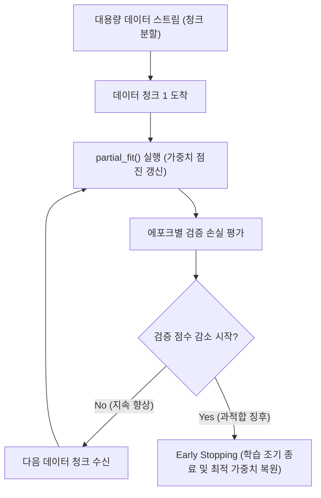

> [!abstract] 핵심 요약
> 새로운 데이터가 실시간으로 지속 유입되거나 전체 데이터가 메모리(RAM) 크기를 초과할 경우, 기존 모델을 버리고 매번 처음부터 다시 훈련하는 배치 학습은 불가능하다.
> **점진적 학습(Incremental Learning)**은 `partial_fit()` 메서드를 통해 기존 모델의 가중치를 보존하면서 추가 데이터 샘플에 대해서만 **확률적 경사하강법(SGD)**으로 매개변수를 점진 갱신하며, 검증 점수가 떨어지기 시작하는 최적의 에포크 시점에서 학습을 중단(**조기 종료, Early Stopping**)한다.

---

## 1. 확률적 경사하강법(SGD) 가중치 갱신 수식

$$\mathbf{w}_{t+1} = \mathbf{w}_t - \eta \nabla L_i(\mathbf{w}_t)$$

- $\eta$: 학습률 (Learning Rate).
- $\nabla L_i(\mathbf{w}_t)$: 전체 데이터가 아닌 단 $1$개의 무작위 샘플 (또는 소규모 미니배치)에 대한 손실 함수의 그래디언트.



---

## 2. 배치 vs 확률적(SGD) vs 미니배치 비교

| 학습 방식 | 1회 갱신에 사용하는 데이터 수 | 궤적 특성 | 메모리 효율성 |
| :-- | :-- | :-- | :-- |
| **배치 경사하강법 (Batch GD)** | 전체 훈련 세트 $N$개 전체 | 매우 부드럽고 안정적으로 수렴 | 데이터가 크면 메모리(OOM) 초과 발생 |
| **확률적 경사하강법 (Pure SGD)** | 단 $1$개의 무작위 샘플 | 요동이 매우 심하며 국소 최적 탈출 용이 | 극도로 적은 메모리 ($O(1)$) |
| **미니배치 SGD (Mini-batch)** | $32 \sim 256$개의 미니배치 | 안정성과 빠른 속도의 최적 절충 (GPU 병렬화) | 고효율 병렬 벡터 연산 가능 |

---

## 3. 실시간 에포크 진행에 따른 과대/과소적합 시뮬레이터

```html preview
<div style="font-family:system-ui,-apple-system,sans-serif;padding:20px;background:var(--card);color:var(--card-foreground);border:1px solid var(--border);border-radius:var(--radius)">
  <div style="font-size:16px;font-weight:700;margin-bottom:14px;color:var(--primary);display:flex;align-items:center;gap:8px">
    <span>📈 SGD 점진적 학습 에포크(Epoch) 시뮬레이터</span>
  </div>

  <div style="margin-bottom:14px">
    <div style="display:flex;justify-content:space-between;font-size:11px;color:var(--muted-foreground);margin-bottom:4px">
      <span>학습 에포크 수 (Epoch):</span>
      <span id="epochVal" style="font-weight:700;color:var(--primary)">50 Epochs</span>
    </div>
    <input id="inEpoch" type="range" min="5" max="150" step="5" value="50" style="width:100%" />
  </div>

  <div style="display:grid;grid-template-columns:1fr 1fr;gap:12px;margin-bottom:12px">
    <div style="padding:10px;background:var(--background);border:1px solid var(--border);border-radius:var(--radius);text-align:center">
      <div style="font-size:10px;color:var(--muted-foreground)">훈련 정확도 (Train Acc)</div>
      <div id="trainAccOut" style="font-family:monospace;font-size:16px;font-weight:800;color:var(--primary)">92.0 %</div>
    </div>
    <div style="padding:10px;background:var(--background);border:1px solid var(--border);border-radius:var(--radius);text-align:center">
      <div style="font-size:10px;color:var(--muted-foreground)">테스트 정확도 (Test Acc)</div>
      <div id="testAccOut" style="font-family:monospace;font-size:16px;font-weight:800;color:var(--chart-1)">91.5 %</div>
    </div>
  </div>

  <div id="epochDesc" style="padding:10px;background:var(--background);border:1px solid var(--border);border-radius:var(--radius);font-size:11px">
    에포크 50: 훈련 및 테스트 정확도가 조화롭게 수렴하여 최적 적합 상태입니다.
  </div>

  <script>
    document.getElementById('inEpoch').oninput = function() {
      var ep = parseInt(this.value);
      document.getElementById('epochVal').textContent = ep + " Epochs";

      var trainAcc, testAcc, desc;
      if (ep < 30) {
        trainAcc = 60 + ep * 0.9;
        testAcc = 58 + ep * 0.9;
        desc = "⚠️ <b>과소적합(Underfitting)</b>: 아직 에포크 수가 부족하여 가중치가 충분히 최적점에 도달하지 못했습니다.";
      } else if (ep <= 80) {
        trainAcc = 87 + (ep - 30) * 0.16;
        testAcc = 86 + (ep - 30) * 0.14;
        desc = "✅ <b>최적 적합(Optimal Convergence)</b>: 테스트 정확도가 최고점에 도달했습니다 (Early Stopping 추천).";
      } else {
        trainAcc = 95 + (ep - 80) * 0.07;
        testAcc = 93 - (ep - 80) * 0.15;
        desc = "⚠️ <b>과대적합(Overfitting)</b>: 에포크가 과도하여 훈련 점수는 오르나 테스트 점수가 하락하고 있습니다.";
      }

      document.getElementById('trainAccOut').textContent = trainAcc.toFixed(1) + " %";
      document.getElementById('testAccOut').textContent = testAcc.toFixed(1) + " %";
      document.getElementById('epochDesc').innerHTML = desc;
    };
  </script>
</div>
```
