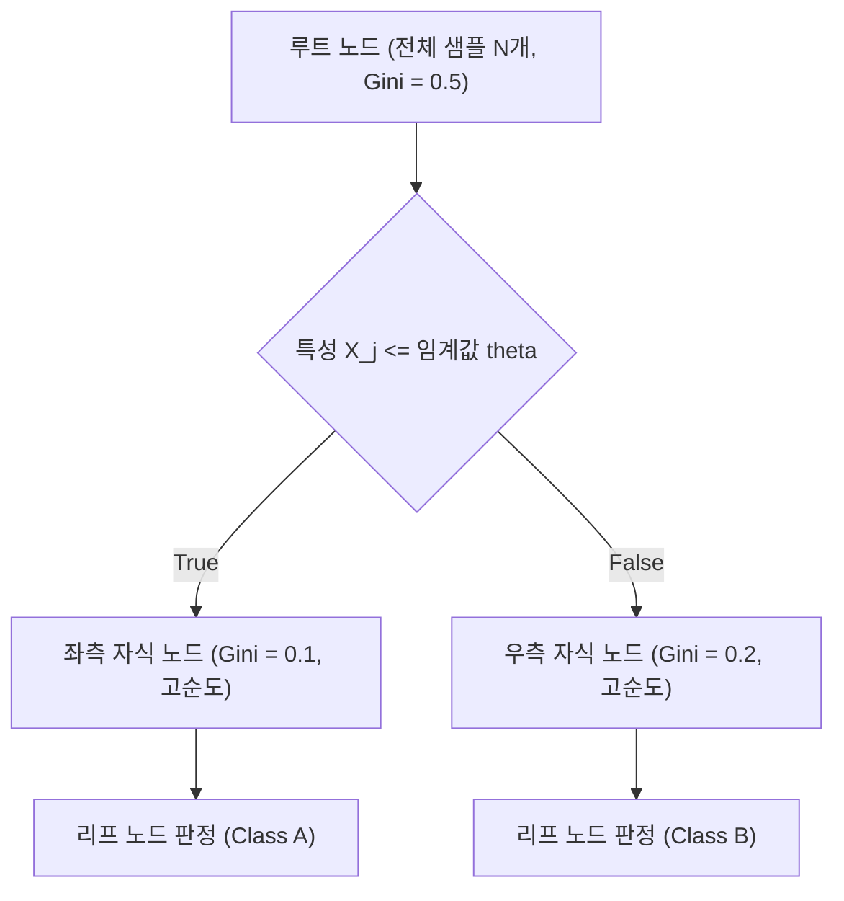

> [!abstract] 핵심 요약
> **의사결정나무(Decision Tree)**는 $if-else$ 조건 분기를 기반으로 직관적인 해석과 시각화(White-box)가 가능한 비모수 모델이며, 특성의 스케일에 영향을 받지 않는 고유한 장점이 있다.
> 각 분할 노드에서는 자식 노드들의 가중 평균 불순도를 최소화하는 최적의 분할 기준을 탐색하며, 트리가 무한정 깊어지는 것을 막기 위해 **최대 깊이(`max_depth`)** 제한 등의 **사전 가지치기(Pre-pruning)**를 적용해야 한다.

---

## 1. 지니 불순도(Gini Impurity)와 정보 이득 수식

### 1.1 지니 불순도 공식

$$I_G(p) = 1 - \sum_{i=1}^C p_i^2$$

- 노드 내 샘플이 모두 단일 클래스로만 이루어진 경우: $I_G = 1 - (1^2) = 0$ (순수 노드, Pure Node).
- 2개 클래스가 정확히 50:50으로 섞인 경우: $I_G = 1 - (0.5^2 + 0.5^2) = 0.5$ (최대 불순도).

### 1.2 정보 이득 (Information Gain / 불순도 감소량)

$$\Delta I = I_{\text{parent}} - \left( \frac{N_{\text{left}}}{N} I_{\text{left}} + \frac{N_{\text{right}}}{N} I_{\text{right}} \right)$$



---

## 2. 의사결정나무의 장단점 및 앙상블 확장

| 장점 (Pros) | 단점 (Cons) | 앙상블(Ensemble) 극복 |
| :-- | :-- | :-- |
| • 결과 해석과 시각화가 극도로 직관적<br/>• **특성 스케일링(Z-score/Min-Max) 불필요**<br/>• 비선형 상호작용 자동 포착 | • 계층적 분할로 인해 **과대적합**에 매우 취약<br/>• 데이터의 미세한 변화에 트리 구조가 크게 흔들림 (고분산) | • **랜덤 포레스트 (Bagging)**: 다수의 트리 투표로 분산 감소<br/>• **XGBoost / LightGBM (Boosting)**: 오차를 점진 보정 |

---

## 3. 실시간 2클래스 지니 불순도(Gini Impurity) 계산기

```html preview
<div style="font-family:system-ui,-apple-system,sans-serif;padding:20px;background:var(--card);color:var(--card-foreground);border:1px solid var(--border);border-radius:var(--radius)">
  <div style="font-size:16px;font-weight:700;margin-bottom:14px;color:var(--primary);display:flex;align-items:center;gap:8px">
    <span>🌳 의사결정나무 지니 불순도(Gini Impurity) 계산기</span>
  </div>

  <div style="display:grid;grid-template-columns:1fr 1fr;gap:12px;margin-bottom:14px">
    <div>
      <label style="font-size:11px;color:var(--muted-foreground)">클래스 A 샘플 수:</label>
      <input id="inCountA" type="number" value="70" min="0" style="width:100%;padding:4px;background:var(--background);color:var(--foreground);border:1px solid var(--border);border-radius:var(--radius);font-weight:700" />
    </div>
    <div>
      <label style="font-size:11px;color:var(--muted-foreground)">클래스 B 샘플 수:</label>
      <input id="inCountB" type="number" value="30" min="0" style="width:100%;padding:4px;background:var(--background);color:var(--foreground);border:1px solid var(--border);border-radius:var(--radius);font-weight:700" />
    </div>
  </div>

  <div style="display:grid;grid-template-columns:repeat(3, 1fr);gap:10px;margin-bottom:12px">
    <div style="padding:10px;background:var(--background);border:1px solid var(--border);border-radius:var(--radius);text-align:center">
      <div style="font-size:10px;color:var(--muted-foreground)">A 클래스 비율 (p1)</div>
      <div id="p1Out" style="font-family:monospace;font-size:14px;font-weight:800">0.700</div>
    </div>
    <div style="padding:10px;background:var(--background);border:1px solid var(--border);border-radius:var(--radius);text-align:center">
      <div style="font-size:10px;color:var(--muted-foreground)">B 클래스 비율 (p2)</div>
      <div id="p2Out" style="font-family:monospace;font-size:14px;font-weight:800">0.300</div>
    </div>
    <div style="padding:10px;background:var(--background);border:1px solid var(--border);border-radius:var(--radius);text-align:center">
      <div style="font-size:10px;color:var(--muted-foreground)">지니 불순도 (Gini)</div>
      <div id="giniOut" style="font-family:monospace;font-size:14px;font-weight:800;color:var(--primary)">0.420</div>
    </div>
  </div>

  <script>
    function updateGini() {
      var a = parseFloat(document.getElementById('inCountA').value) || 0;
      var b = parseFloat(document.getElementById('inCountB').value) || 0;
      var tot = a + b;

      if (tot === 0) {
        document.getElementById('p1Out').textContent = "0.000";
        document.getElementById('p2Out').textContent = "0.000";
        document.getElementById('giniOut').textContent = "0.000";
        return;
      }

      var p1 = a / tot;
      var p2 = b / tot;
      var gini = 1.0 - (p1 * p1 + p2 * p2);

      document.getElementById('p1Out').textContent = p1.toFixed(3);
      document.getElementById('p2Out').textContent = p2.toFixed(3);
      document.getElementById('giniOut').textContent = gini.toFixed(3);
    }

    ['inCountA', 'inCountB'].forEach(function(id) {
      document.getElementById(id).addEventListener('input', updateGini);
    });
    updateGini();
  </script>
</div>
```
