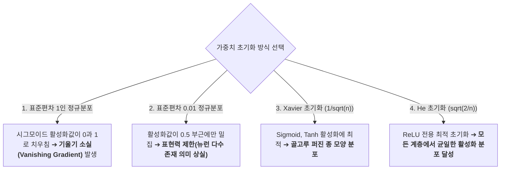

> [!abstract] 핵심 요약
> 심층 신경망을 빠르고 안정적으로 학습시키기 위해서는 **최적화 옵티마이저**, **가중치 초기화**, **정규화 기법**의 3박자가 유기적으로 결합해야 한다.
> 기울기가 완만한 방향과 가파른 방향의 불균형을 해소하는 **Adam 옵티마이저**, 활성화 함수에 맞춰 분산을 제어하는 **He 초기화($\sigma = \sqrt{2/n}$)**, 계층 간 데이터 분포를 매 미니배치마다 정규화하는 **배치 정규화(BatchNorm)**를 통해 심층망의 학습 속도와 일반화 성능을 극대화할 수 있다.

---

## 1. 가중치 초기값과 활성화값 분포의 관계



---

## 2. 4대 매개변수 갱신 알고리즘 수식 비교

### 1) AdaGrad (과거 기울기 제곱 누적 $h$)
$$\mathbf{h} \leftarrow \mathbf{h} + \frac{\partial L}{\partial \mathbf{W}} \odot \frac{\partial L}{\partial \mathbf{W}}, \quad \mathbf{W} \leftarrow \mathbf{W} - \eta \frac{1}{\sqrt{\mathbf{h}} + \epsilon} \frac{\partial L}{\partial \mathbf{W}}$$

### 2) Adam (1차 모멘트 $\mathbf{m}$ + 2차 모멘트 $\mathbf{v}$)
$$\mathbf{m} \leftarrow \beta_1 \mathbf{m} + (1-\beta_1)\mathbf{g}, \quad \mathbf{v} \leftarrow \beta_2 \mathbf{v} + (1-\beta_2)\mathbf{g}^2, \quad \mathbf{W} \leftarrow \mathbf{W} - \frac{\eta}{\sqrt{\hat{\mathbf{v}}} + \epsilon} \hat{\mathbf{m}}$$

---

## 3. 실시간 가중치 초기화(Xavier vs He) 활성화 분포 시뮬레이터

```html preview
<div style="font-family:system-ui,-apple-system,sans-serif;padding:20px;background:var(--card);color:var(--card-foreground);border:1px solid var(--border);border-radius:var(--radius)">
  <div style="font-size:16px;font-weight:700;margin-bottom:14px;color:var(--primary);display:flex;align-items:center;gap:8px">
    <span>⚙️ 가중치 초기화(Weight Initialization)와 활성화 함수 적합도 검사기</span>
  </div>

  <div style="display:grid;grid-template-columns:1fr 1fr;gap:12px;margin-bottom:14px">
    <div>
      <label style="font-size:11px;color:var(--muted-foreground)">활성화 함수:</label>
      <select id="inActForInit" style="width:100%;padding:4px 8px;background:var(--background);color:var(--foreground);border:1px solid var(--border);border-radius:var(--radius);font-weight:700">
        <option value="relu">ReLU Function</option>
        <option value="sigmoid">Sigmoid Function</option>
      </select>
    </div>
    <div>
      <label style="font-size:11px;color:var(--muted-foreground)">초기화 방식:</label>
      <select id="inInitType" style="width:100%;padding:4px 8px;background:var(--background);color:var(--foreground);border:1px solid var(--border);border-radius:var(--radius);font-weight:700">
        <option value="he">He 초기화 (std = sqrt(2/n))</option>
        <option value="xavier">Xavier 초기화 (std = 1/sqrt(n))</option>
        <option value="small">작은 정규분포 (std = 0.01)</option>
      </select>
    </div>
  </div>

  <div style="display:grid;grid-template-columns:1fr 1fr;gap:12px;margin-bottom:12px">
    <div style="padding:10px;background:var(--background);border:1px solid var(--border);border-radius:var(--radius);text-align:center">
      <div style="font-size:10px;color:var(--muted-foreground)">가중치 표준편차 std (n=100)</div>
      <div id="initStdOut" style="font-family:monospace;font-size:16px;font-weight:800;color:var(--chart-1);margin-top:2px">0.1414</div>
    </div>
    <div style="padding:10px;background:var(--background);border:1px solid var(--border);border-radius:var(--radius);text-align:center">
      <div style="font-size:10px;color:var(--muted-foreground)">학습 적합성 판별</div>
      <div id="initStatusOut" style="font-size:12px;font-weight:800;color:var(--primary);margin-top:4px">✅ 최적의 궁합 (기울기 보존)</div>
    </div>
  </div>

  <div id="initDescText" style="padding:10px;background:var(--background);border:1px solid var(--border);border-radius:var(--radius);font-size:11px">
    ReLU 활성화 함수에 He 초기화를 적용하여 모든 심층 은닉층에서 활성화값 분포가 균일하게 유지됩니다.
  </div>

  <script>
    function updateInitSim() {
      var act = document.getElementById('inActForInit').value;
      var init = document.getElementById('inInitType').value;
      var std = 0;
      var status = "";
      var desc = "";

      if (init === 'he') {
        std = Math.sqrt(2.0 / 100);
        if (act === 'relu') {
          status = "✅ 최적의 궁합 (He + ReLU)";
          desc = "ReLU가 음수를 0으로 차단하는 특성을 분산 2배(2/n)로 완벽히 보상하여 심층 학습이 가장 안정적입니다.";
        } else {
          status = "⚠️ 다소 넓은 분포";
          desc = "Sigmoid에서는 양 끝으로 활성화값이 약간 쏠릴 수 있습니다.";
        }
      } else if (init === 'xavier') {
        std = 1.0 / Math.sqrt(100);
        if (act === 'sigmoid') {
          status = "✅ 최적의 궁합 (Xavier + Sigmoid)";
          desc = "S자형 대칭 활성화 함수에서 입력/출력 분산을 일정하게 유지합니다.";
        } else {
          status = "⚠️ 계층 깊어질수록 0 편향";
          desc = "ReLU에서 층이 깊어질수록 활성화값이 점차 0으로 치우치는 경향이 있습니다.";
        }
      } else {
        std = 0.01;
        status = "❌ 표현력 극심한 저하";
        desc = "모든 뉴런의 활성화값이 거의 동일하게 출력되어 신경망을 깊게 쌓은 의미가 사라집니다.";
      }

      document.getElementById('initStdOut').textContent = std.toFixed(4);
      document.getElementById('initStatusOut').textContent = status;
      document.getElementById('initDescText').textContent = desc;
    }

    ['inActForInit', 'inInitType'].forEach(function(id) {
      document.getElementById(id).addEventListener('input', updateInitSim);
    });
    updateInitSim();
  </script>
</div>
```
