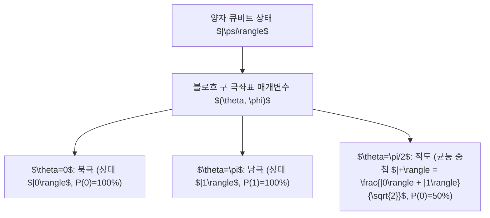

> [!abstract] 핵심 요약
> **양자 컴퓨팅(Quantum Computing)**은 0과 1의 이진 상태뿐만 아니라 두 기저 상태의 선형 결합인 **중첩(Superposition)** 상태를 동시에 가질 수 있는 **큐비트(Qubit)**를 기본 정보 단위로 사용한다.
> 단일 큐비트 상태는 복소수 확률 진폭 $\alpha, \beta$로 표현되는 2차원 힐베르트 공간의 단위 벡터이며, 극각 $\theta$와 방위각 $\phi$를 매개변수로 갖는 **블로흐 구(Bloch Sphere)** 상의 한 점으로 완벽히 기하학적으로 사상된다.

---

## 1. 큐비트 상태 벡터와 블로흐 구(Bloch Sphere) 공식

### 1.1 양자 상태와 정규화 조건

$$|\psi\rangle = \alpha |0\rangle + \beta |1\rangle = \begin{bmatrix} \alpha \\ \beta \end{bmatrix}, \quad |\alpha|^2 + |\beta|^2 = 1$$

- 기저 상태(Computational Basis): $|0\rangle = \begin{bmatrix} 1 \\ 0 \end{bmatrix}, \quad |1\rangle = \begin{bmatrix} 0 \\ 1 \end{bmatrix}$
- 측정 시 $|0\rangle$이 관측될 확률: $P(0) = |\alpha|^2$, $|1\rangle$이 관측될 확률: $P(1) = |\beta|^2$.

### 1.2 블로흐 구 매개변수 표현

$$|\psi\rangle = \cos\left(\frac{\theta}{2}\right) |0\rangle + e^{i\phi} \sin\left(\frac{\theta}{2}\right) |1\rangle \quad (0 \le \theta \le \pi, \ 0 \le \phi < 2\pi)$$



---

## 2. 텐서곱(Tensor Product)을 통한 다중 큐비트 확장

2개 이상의 큐비트 상태는 크로네커 곱(Kronecker Product, $\otimes$)으로 결합되어 $2^n$차원 상태 공간을 형성한다:

$$|00\rangle = |0\rangle \otimes |0\rangle = \begin{bmatrix} 1 \\ 0 \end{bmatrix} \otimes \begin{bmatrix} 1 \\ 0 \end{bmatrix} = \begin{bmatrix} 1 \\ 0 \\ 0 \\ 0 \end{bmatrix}$$

---

## 3. 실시간 블로흐 구 각도 $\theta$에 따른 관측 확률 계산기

```html preview
<div style="font-family:system-ui,-apple-system,sans-serif;padding:20px;background:var(--card);color:var(--card-foreground);border:1px solid var(--border);border-radius:var(--radius)">
  <div style="font-size:16px;font-weight:700;margin-bottom:14px;color:var(--primary);display:flex;align-items:center;gap:8px">
    <span>🌐 블로흐 구(Bloch Sphere) 극각 theta에 따른 양자 측정 확률</span>
  </div>

  <div style="margin-bottom:14px">
    <div style="display:flex;justify-content:space-between;font-size:11px;color:var(--muted-foreground);margin-bottom:4px">
      <span>극각 theta (0: |0>, pi/2: |+>, pi: |1>):</span>
      <span id="thetaVal" style="font-weight:700;color:var(--primary)">theta = 0.50 pi (90 deg)</span>
    </div>
    <input id="inTheta" type="range" min="0.0" max="1.0" step="0.05" value="0.5" style="width:100%" />
  </div>

  <div style="display:grid;grid-template-columns:1fr 1fr;gap:12px;margin-bottom:12px">
    <div style="padding:10px;background:var(--background);border:1px solid var(--border);border-radius:var(--radius);text-align:center">
      <div style="font-size:10px;color:var(--muted-foreground)">|0> 상태 관측 확률 P(0) = cos²(theta/2)</div>
      <div id="p0Out" style="font-family:monospace;font-size:18px;font-weight:800;color:var(--primary);margin-top:2px">50.0 %</div>
    </div>
    <div style="padding:10px;background:var(--background);border:1px solid var(--border);border-radius:var(--radius);text-align:center">
      <div style="font-size:10px;color:var(--muted-foreground)">|1> 상태 관측 확률 P(1) = sin²(theta/2)</div>
      <div id="p1Out" style="font-family:monospace;font-size:18px;font-weight:800;color:var(--chart-1);margin-top:2px">50.0 %</div>
    </div>
  </div>

  <script>
    document.getElementById('inTheta').oninput = function() {
      var tRatio = parseFloat(this.value);
      var deg = tRatio * 180;
      document.getElementById('thetaVal').textContent = "theta = " + tRatio.toFixed(2) + " pi (" + deg.toFixed(0) + " deg)";

      var halfTheta = (tRatio * Math.PI) / 2.0;
      var p0 = Math.cos(halfTheta) * Math.cos(halfTheta);
      var p1 = Math.sin(halfTheta) * Math.sin(halfTheta);

      document.getElementById('p0Out').textContent = (p0 * 100).toFixed(1) + " %";
      document.getElementById('p1Out').textContent = (p1 * 100).toFixed(1) + " %";
    };
  </script>
</div>
```
