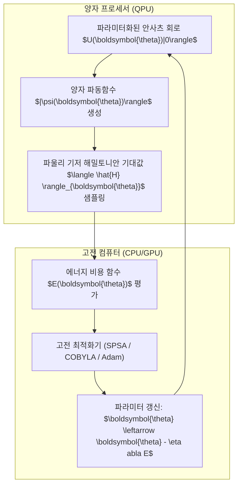

> [!abstract] 핵심 요약
> 오류 정정이 불가능한 현재의 **NISQ(잡음이 있는 중규모 양자) 하드웨어**에서는 얕은 깊이(Shallow Depth)의 회로만을 실행할 수 있다.
> **VQE(변분 양자 고유값 계산기)**는 양자 하드웨어가 파라미터화된 파동함수 $|\psi(\boldsymbol{\theta})\rangle$의 해밀토니안 기대값 $\langle H \rangle$만을 빠르게 측정하고, 고전 컴퓨터가 경사하강법으로 파라미터 $\boldsymbol{\theta}$를 갱신하는 **고전-양자 하이브리드(Hybrid)** 아키텍처를 통해 분자의 바닥 상태 에너지를 정확히 계산한다.

---

## 1. VQE 하이브리드 루프 아키텍처

$$\min_{\boldsymbol{\theta}} E(\boldsymbol{\theta}) = \min_{\boldsymbol{\theta}} \langle \psi(\boldsymbol{\theta}) | \hat{H} | \psi(\boldsymbol{\theta}) \rangle \ge E_0$$



---

## 2. 변분 양자 화학(VQE) 주요 단계

| 단계 | 수행 작업 | 핵심 기술 |
| :-- | :-- | :-- |
| **1. 분자 해밀토니안 변환** | 전자 구조 해밀토니안을 파울리 텐서 연산자 합으로 변환 | **조던-위그너 (Jordan-Wigner)** 변환 |
| **2. 안사츠(Ansatz) 설계** | 하드웨어 친화적(Hardware-efficient) 또는 UCCSD 회로 구성 | 파라미터화된 단일 회전($Ry, Rz$) + CNOT |
| **3. 기대값 측정** | 각 파울리 항($Z_i, X_i X_j$)에 대한 샷(Shot) 기반 측정 | 확률 분포 기반 에너지 추정 |
| **4. 파라미터 수렴** | 기대값이 기저 에너지 $E_0$에 도달할 때까지 최적화 반복 | 그래디언트 소실(Barren Plateaus) 회피 |

---

## 3. 실시간 수소 분자($H_2$) 결합 거리에 따른 VQE 에너지 곡선 시뮬레이터

```html preview
<div style="font-family:system-ui,-apple-system,sans-serif;padding:20px;background:var(--card);color:var(--card-foreground);border:1px solid var(--border);border-radius:var(--radius)">
  <div style="font-size:16px;font-weight:700;margin-bottom:14px;color:var(--primary);display:flex;align-items:center;gap:8px">
    <span>⚛️ VQE 수소 분자(H2) 원자간 거리(R)별 기저 에너지 시뮬레이터</span>
  </div>

  <div style="margin-bottom:14px">
    <div style="display:flex;justify-content:space-between;font-size:11px;color:var(--muted-foreground);margin-bottom:4px">
      <span>원자간 거리 R (Angstrom, 0.2 ~ 2.5):</span>
      <span id="bondRVal" style="font-weight:700;color:var(--primary)">R = 0.74 A (평형 결합 길이)</span>
    </div>
    <input id="inBondR" type="range" min="0.2" max="2.5" step="0.05" value="0.74" style="width:100%" />
  </div>

  <div style="display:grid;grid-template-columns:1fr 1fr;gap:12px;margin-bottom:12px">
    <div style="padding:10px;background:var(--background);border:1px solid var(--border);border-radius:var(--radius);text-align:center">
      <div style="font-size:10px;color:var(--muted-foreground)">계산된 기저 상태 에너지 E(R)</div>
      <div id="vqeEnergyOut" style="font-family:monospace;font-size:18px;font-weight:800;color:var(--primary);margin-top:2px">-1.137 Hartree</div>
    </div>
    <div style="padding:10px;background:var(--background);border:1px solid var(--border);border-radius:var(--radius);text-align:center">
      <div style="font-size:10px;color:var(--muted-foreground)">분자 상태 판별</div>
      <div id="bondStatusOut" style="font-size:12px;font-weight:800;color:var(--primary);margin-top:4px">✨ 안정적인 화학 결합 (최저 에너지점)</div>
    </div>
  </div>

  <script>
    document.getElementById('inBondR').oninput = function() {
      var r = parseFloat(this.value);
      document.getElementById('bondRVal').textContent = "R = " + r.toFixed(2) + " A";

      // Morse potential style curve for H2
      var dE = 0.174;
      var a = 1.94;
      var re = 0.74;
      var eInf = -1.0;
      var morse = dE * Math.pow(1 - Math.exp(-a * (r - re)), 2) - dE + eInf;

      document.getElementById('vqeEnergyOut').textContent = morse.toFixed(4) + " Hartree";

      var status = document.getElementById('bondStatusOut');
      if (Math.abs(r - 0.74) < 0.1) {
        status.innerHTML = "✨ <span style='color:var(--primary)'>최적 평형 결합 (안정 상태)</span>";
      } else if (r < 0.6) {
        status.innerHTML = "⚠️ <span style='color:var(--destructive,#ef4444)'>핵간 반발력 우세 (불안정)</span>";
      } else {
        status.innerHTML = "💨 <span style='color:var(--chart-1)'>분자 해리 상태 (결합 약화)</span>";
      }
    };
  </script>
</div>
```
