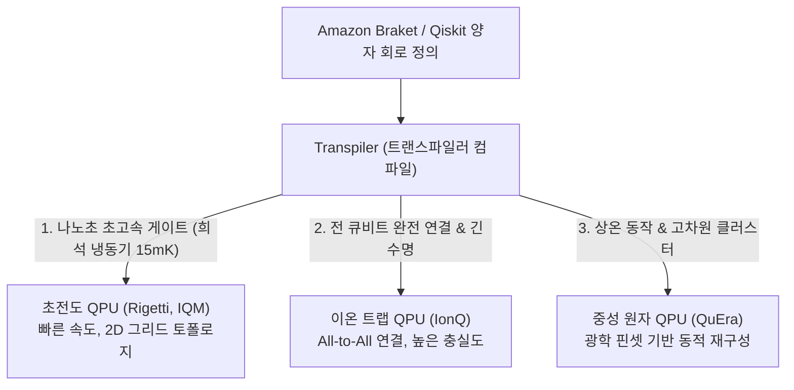

> [!abstract] 핵심 요약
> 이론적인 양자 회로를 실세계에서 실행하려면 물리적 하드웨어의 특성과 제약을 고려해야 한다.
> **초전도(Superconducting)** 큐비트는 빠른 나노초($\text{ns}$) 단위 게이트 속도를 가지나 결맞음 시간($T_1, T_2$)이 짧고 인접 큐비트 간 연결성(Coupling Map)이 제한적이며, **이온 트랩(Ion Trap)**은 게이트 속도는 느리지만 긴 결맞음 시간과 모든 큐비트 간 완전 연결(All-to-All)을 지원한다. **Amazon Braket**은 다양한 QPU 백엔드를 통합 SDK로 추상화하여 실행을 관리한다.

---

## 1. 양자 하드웨어 3대 플랫폼 비교



---

## 2. 결맞음 시간 ($T_1$ vs $T_2$)

| 지표 | 물리적 의미 | 중요성 |
| :-- | :-- | :-- |
| **$T_1$ (에너지 이완 시간)** | 여기 상태 $|1\rangle$이 기저 상태 $|0\rangle$으로 자발적 붕괴하는 데 걸리는 시간 | 큐비트가 정보(에너지)를 유지할 수 있는 물리적 상한선 |
| **$T_2$ (위상 결맞음 상실 시간)** | 중첩 상태의 복소 위상 정보($\phi$)가 환경 노이즈로 인해 깨지는 시간 | 양자 간섭과 유니터리 알고리즘을 유지할 수 있는 유효 시간 ($T_2 \le 2T_1$) |

---

## 3. 실시간 양자 하드웨어 큐비트 오류 누적 시뮬레이터

```html preview
<div style="font-family:system-ui,-apple-system,sans-serif;padding:20px;background:var(--card);color:var(--card-foreground);border:1px solid var(--border);border-radius:var(--radius)">
  <div style="font-size:16px;font-weight:700;margin-bottom:14px;color:var(--primary);display:flex;align-items:center;gap:8px">
    <span>📟 양자 하드웨어 회로 깊이별 회로 신뢰도(Circuit Fidelity) 계산기</span>
  </div>

  <div style="display:grid;grid-template-columns:1fr 1fr;gap:12px;margin-bottom:14px">
    <div>
      <label style="font-size:11px;color:var(--muted-foreground)">2큐비트 CNOT 게이트 충실도 (%):</label>
      <input id="inGateFid" type="number" value="99.2" step="0.1" min="90" max="99.9" style="width:100%;padding:4px;background:var(--background);color:var(--foreground);border:1px solid var(--border);border-radius:var(--radius);font-weight:700" />
    </div>
    <div>
      <label style="font-size:11px;color:var(--muted-foreground)">회로 내 CNOT 게이트 개수 (Depth):</label>
      <input id="inGateCount" type="number" value="20" step="5" min="1" max="200" style="width:100%;padding:4px;background:var(--background);color:var(--foreground);border:1px solid var(--border);border-radius:var(--radius);font-weight:700" />
    </div>
  </div>

  <div style="display:grid;grid-template-columns:1fr 1fr;gap:12px;margin-bottom:12px">
    <div style="padding:10px;background:var(--background);border:1px solid var(--border);border-radius:var(--radius);text-align:center">
      <div style="font-size:10px;color:var(--muted-foreground)">전체 회로 최종 성공 확률 (F^N)</div>
      <div id="circuitFidOut" style="font-family:monospace;font-size:18px;font-weight:800;color:var(--primary);margin-top:2px">85.1 %</div>
    </div>
    <div style="padding:10px;background:var(--background);border:1px solid var(--border);border-radius:var(--radius);text-align:center">
      <div style="font-size:10px;color:var(--muted-foreground)">NISQ 오류 완화(Error Mitigation) 필요성</div>
      <div id="qErrStatusOut" style="font-size:12px;font-weight:800;color:var(--primary);margin-top:4px">✅ 신뢰 가능한 결과 (F &gt; 80%)</div>
    </div>
  </div>

  <script>
    function updateFid() {
      var f = (parseFloat(document.getElementById('inGateFid').value) || 99) / 100.0;
      var n = parseInt(document.getElementById('inGateCount').value) || 1;

      var totalF = Math.pow(f, n);
      document.getElementById('circuitFidOut').textContent = (totalF * 100).toFixed(1) + " %";

      var status = document.getElementById('qErrStatusOut');
      if (totalF >= 0.8) {
        status.innerHTML = "✅ <span style='color:var(--primary)'>신뢰 가능한 결과 (F &ge; 80%)</span>";
      } else if (totalF >= 0.5) {
        status.innerHTML = "⚠️ <span style='color:var(--chart-1)'>오류 완화(ZNE 등) 적용 권장</span>";
      } else {
        status.innerHTML = "❌ <span style='color:var(--destructive,#ef4444)'>노이즈 지배 (양자 상태 소실)</span>";
      }
    }

    ['inGateFid', 'inGateCount'].forEach(function(id) {
      document.getElementById(id).addEventListener('input', updateFid);
    });
    updateFid();
  </script>
</div>
```
