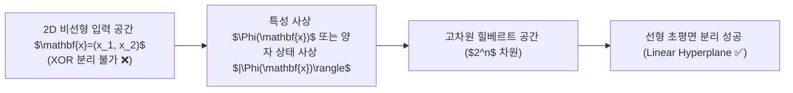

> [!abstract] 핵심 요약
> 고전 선형 모델은 2차원 평면의 **XOR 문제**조차 직선 하나로 분리할 수 없다. 고전 머신러닝은 수동적인 **특성 공학(Feature Engineering)**이나 다차원 커널 트릭($\Phi(\mathbf{x}) = [x_1^2, \sqrt{2}x_1 x_2, x_2^2]^T$)을 도입하여 이를 해결하지만, 차원이 증가할수록 메모리와 계산 복잡도가 기하급수적으로 폭발하는 **차원의 저주**에 직면한다.
> **양자 컴퓨팅**은 $n$개의 큐비트만으로 $2^n$차원의 복소 힐베르트 공간을 자연스럽게 형성하므로, 고전적으로 계산 불가능한 초대규모 특성 공간에서의 효율적인 데이터 분리를 가능하게 한다.

---

## 1. XOR 문제와 2차 다항 매핑 $\Phi(\mathbf{x})$

$$\mathbf{x} = \begin{bmatrix} x_1 \\ x_2 \end{bmatrix} \quad \xrightarrow{\Phi} \quad \Phi(\mathbf{x}) = \begin{bmatrix} x_1^2 \\ \sqrt{2} x_1 x_2 \\ x_2^2 \end{bmatrix}$$

- 2차원 공간에서는 $(0, 0), (1, 1) \to 0$, $(1, 0), (0, 1) \to 1$로 비선형 분리 불가.
- 3차원 변환 후 초평면 $w_1 x_1^2 + w_2 \sqrt{2} x_1 x_2 + w_3 x_2^2 + b = 0$에 의해 완벽한 선형 분리가 가능해진다.



---

## 2. 고전 특성 공학 vs 양자 특성 매핑 비교

| 구분 | 고전 특성 공학 / 커널 머신 | 양자 머신러닝 (QML) |
| :-- | :-- | :-- |
| **특성 공간 차원** | $d$차원 다항 공간 ($O(d^k)$로 메모리 급증) | **$n$ 큐비트로 $2^n$차원 복소 힐베르트 공간 형성** |
| **커널 행렬 계산** | 샘플 수 $N$에 대해 $O(N^2 \cdot d)$ 연산 | 중첩과 간섭을 이용한 $O(1)$ 양자 내적 샘플링 |
| **차원의 저주 극복** | 차원 축소(PCA, t-SNE) 또는 희소화 필수 | 지수적 상태 공간을 단 $n$개 물리 큐비트에 압축 표현 |

---

## 3. 실시간 2D XOR ➔ 3D 특성 사상 시뮬레이터

```html preview
<div style="font-family:system-ui,-apple-system,sans-serif;padding:20px;background:var(--card);color:var(--card-foreground);border:1px solid var(--border);border-radius:var(--radius)">
  <div style="font-size:16px;font-weight:700;margin-bottom:14px;color:var(--primary);display:flex;align-items:center;gap:8px">
    <span>📐 XOR 특성 공학 3D 변환 (x1*x2 교차항) 분리 계산기</span>
  </div>

  <div style="display:grid;grid-template-columns:1fr 1fr;gap:12px;margin-bottom:14px">
    <div>
      <label style="font-size:11px;color:var(--muted-foreground)">입력 x1 (0 또는 1):</label>
      <select id="inX1" style="width:100%;padding:4px;background:var(--background);color:var(--foreground);border:1px solid var(--border);border-radius:var(--radius);font-weight:700">
        <option value="0">0</option>
        <option value="1">1</option>
      </select>
    </div>
    <div>
      <label style="font-size:11px;color:var(--muted-foreground)">입력 x2 (0 또는 1):</label>
      <select id="inX2" style="width:100%;padding:4px;background:var(--background);color:var(--foreground);border:1px solid var(--border);border-radius:var(--radius);font-weight:700">
        <option value="0">0</option>
        <option value="1">1</option>
      </select>
    </div>
  </div>

  <div style="display:grid;grid-template-columns:1fr 1fr;gap:12px;margin-bottom:12px">
    <div style="padding:10px;background:var(--background);border:1px solid var(--border);border-radius:var(--radius);text-align:center">
      <div style="font-size:10px;color:var(--muted-foreground)">3D 사상 벡터 [x1², √2·x1·x2, x2²]</div>
      <div id="phiOut" style="font-family:monospace;font-size:14px;font-weight:800;color:var(--primary);margin-top:4px">[0, 0.00, 0]</div>
    </div>
    <div style="padding:10px;background:var(--background);border:1px solid var(--border);border-radius:var(--radius);text-align:center">
      <div style="font-size:10px;color:var(--muted-foreground)">XOR 정답 레이블 (x1 ⊕ x2)</div>
      <div id="xorLabelOut" style="font-size:14px;font-weight:800;color:var(--chart-1);margin-top:4px">클래스 0</div>
    </div>
  </div>

  <script>
    function updateXor() {
      var x1 = parseInt(document.getElementById('inX1').value);
      var x2 = parseInt(document.getElementById('inX2').value);

      var p1 = x1 * x1;
      var p2 = (Math.SQRT2 * x1 * x2).toFixed(2);
      var p3 = x2 * x2;
      var xor = x1 ^ x2;

      document.getElementById('phiOut').textContent = "[" + p1 + ", " + p2 + ", " + p3 + "]";
      document.getElementById('xorLabelOut').innerHTML = xor === 1 ? "<span style='color:var(--primary)'>클래스 1 (양성)</span>" : "<span style='color:var(--chart-1)'>클래스 0 (음성)</span>";
    }

    document.getElementById('inX1').onchange = updateXor;
    document.getElementById('inX2').onchange = updateXor;
    updateXor();
  </script>
</div>
```
