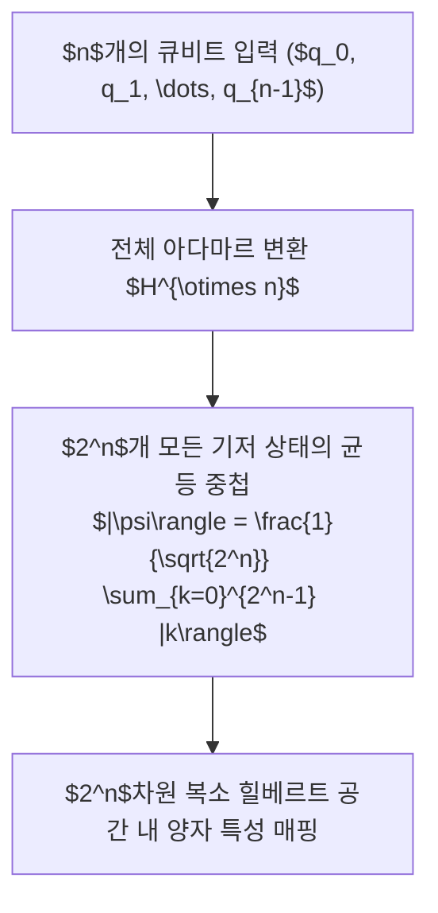

> [!abstract] 핵심 요약
> 고전 컴퓨터의 $n$비트 레지스터는 특정 시점에 $2^n$개의 가능한 상태 중 단 하나만을 저장할 수 있다.
> 반면 **$n$개의 큐비트 양자 레지스터**는 $2^n$개의 복소 기저 상태를 동시에 중첩하여 $|\psi\rangle = \sum_{k=0}^{2^n-1} c_k |k\rangle$로 유지한다. 단 50개의 큐비트만으로도 약 $10^{15}$($1$페타) 차원의 상태 공간을 다룰 수 있어, 고차원 비선형 데이터 표현의 지평을 근본적으로 확장한다.

---

## 1. $n$ 큐비트 양자 레지스터 상태 벡터

$$|\psi\rangle = \sum_{x \in \{0, 1\}^n} c_x |x\rangle, \quad \sum_{x \in \{0, 1\}^n} |c_x|^2 = 1$$

$$c_x \in \mathbb{C} \quad (2^n \text{개의 복소수 확률 진폭 동시에 보존})$$



---

## 2. 큐비트 수($n$)에 따른 상태 공간 차원 수

| 큐비트 수 ($n$) | 상태 공간 차원 ($2^n$) | 표현 가능한 복소수 진폭 수 | 저장에 필요한 고전 메모리 크기 |
| :-- | :-- | :-- | :-- |
| **10 큐비트** | $1,024$ 차원 | $1,024$ 개 | 약 $16\text{ KB}$ |
| **20 큐비트** | $1,048,576$ 차원 (약 100만) | 약 100만 개 | 약 $16\text{ MB}$ |
| **30 큐비트** | $1,073,741,824$ 차원 (약 10억) | 약 10억 개 | 약 $16\text{ GB}$ (고성능 워크스테이션 한계) |
| **50 큐비트** | **$1.125 \times 10^{15}$ 차원** | **약 $1.125$경 개** | **약 $16\text{ PB}$ (세계 최고 슈퍼컴퓨터 한계)** |

---

## 3. 실시간 큐비트 수에 따른 힐베르트 차원 수 계산기

```html preview
<div style="font-family:system-ui,-apple-system,sans-serif;padding:20px;background:var(--card);color:var(--card-foreground);border:1px solid var(--border);border-radius:var(--radius)">
  <div style="font-size:16px;font-weight:700;margin-bottom:14px;color:var(--primary);display:flex;align-items:center;gap:8px">
    <span>📈 큐비트 수(n)에 따른 양자 특성 공간 차원(2^n) 계산기</span>
  </div>

  <div style="margin-bottom:14px">
    <div style="display:flex;justify-content:space-between;font-size:11px;color:var(--muted-foreground);margin-bottom:4px">
      <span>물리적 큐비트 수 (n):</span>
      <span id="nQubitVal" style="font-weight:700;color:var(--primary)">n = 16 큐비트</span>
    </div>
    <input id="inNQubit" type="range" min="1" max="40" value="16" style="width:100%" />
  </div>

  <div style="display:grid;grid-template-columns:1fr 1fr;gap:12px;margin-bottom:12px">
    <div style="padding:10px;background:var(--background);border:1px solid var(--border);border-radius:var(--radius);text-align:center">
      <div style="font-size:10px;color:var(--muted-foreground)">힐베르트 공간 차원 수 (2^n)</div>
      <div id="dimOut" style="font-family:monospace;font-size:16px;font-weight:800;color:var(--primary);margin-top:2px">65,536 차원</div>
    </div>
    <div style="padding:10px;background:var(--background);border:1px solid var(--border);border-radius:var(--radius);text-align:center">
      <div style="font-size:10px;color:var(--muted-foreground)">고전 시뮬레이션 필요 RAM</div>
      <div id="ramOut" style="font-family:monospace;font-size:16px;font-weight:800;color:var(--chart-1);margin-top:2px">1.0 MB</div>
    </div>
  </div>

  <script>
    document.getElementById('inNQubit').oninput = function() {
      var n = parseInt(this.value);
      document.getElementById('nQubitVal').textContent = "n = " + n + " 큐비트";

      var dim = Math.pow(2, n);
      var bytes = dim * 16; // 16 bytes per complex128
      var ramStr;
      if (bytes < 1024 * 1024) ramStr = (bytes / 1024).toFixed(1) + " KB";
      else if (bytes < 1024 * 1024 * 1024) ramStr = (bytes / (1024 * 1024)).toFixed(1) + " MB";
      else if (bytes < 1024 * 1024 * 1024 * 1024) ramStr = (bytes / (1024 * 1024 * 1024)).toFixed(1) + " GB";
      else ramStr = (bytes / (1024 * 1024 * 1024 * 1024)).toFixed(1) + " TB";

      document.getElementById('dimOut').textContent = dim.toLocaleString() + " 차원";
      document.getElementById('ramOut').textContent = ramStr;
    };
  </script>
</div>
```
