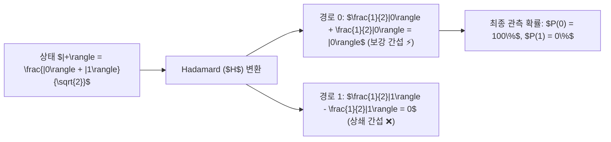

> [!abstract] 핵심 요약
> 고전 확률론에서 확률은 항상 $0 \le P \le 1$인 양수이므로 서로 더해지기만 한다.
> 반면 양자역학의 **확률 진폭(Probability Amplitude)**은 음수나 복소수 값을 가질 수 있어, 서로 반대 위상을 가진 두 경로가 만나면 **상쇄 간섭(Destructive Interference: $c_1 + c_2 = 0$)**을 일으켜 확률이 0으로 사라진다. 양자 알고리즘은 오답 경로를 상쇄시키고 정답 경로를 **보강 간섭(Constructive Interference)**으로 증폭시키는 간섭 공학이다.

---

## 1. 아다마르 연산자의 상태 전이와 위상 상쇄

$$H |0\rangle = \frac{|0\rangle + |1\rangle}{\sqrt{2}} = |+\rangle$$

$$H |1\rangle = \frac{|0\rangle - |1\rangle}{\sqrt{2}} = |-\rangle$$

$$H |+\rangle = H \left( \frac{|0\rangle + |1\rangle}{\sqrt{2}} \right) = \frac{1}{\sqrt{2}} \left( \frac{|0\rangle + |1\rangle}{\sqrt{2}} + \frac{|0\rangle - |1\rangle}{\sqrt{2}} \right) = \frac{2|0\rangle}{2} = |0\rangle$$



---

## 2. 고전 확률 vs 양자 간섭 확률 비교

| 구분 | 고전 확률 (Classical Probability) | 양자 확률 진폭 (Quantum Amplitude) |
| :-- | :-- | :-- |
| **기본 변수** | 실수 확률 $P_1, P_2 \ge 0$ | 복소수 진폭 $\alpha, \beta \in \mathbb{C}$ |
| **경로 결합 법칙** | $P_{\text{total}} = P_1 + P_2$ (단순 덧셈) | $|\alpha + \beta|^2 = |\alpha|^2 + |\beta|^2 + 2\text{Re}(\alpha^* \beta)$ |
| **간섭 항 (Cross Term)** | 존재하지 않음 ($2\text{Re} = 0$) | **위상차에 따라 $+2|\alpha||\beta|$ (보강) 또는 $-2|\alpha||\beta|$ (상쇄)** |

---

## 3. 실시간 위상차 $\Delta \phi$에 따른 간섭 확률 시뮬레이터

```html preview
<div style="font-family:system-ui,-apple-system,sans-serif;padding:20px;background:var(--card);color:var(--card-foreground);border:1px solid var(--border);border-radius:var(--radius)">
  <div style="font-size:16px;font-weight:700;margin-bottom:14px;color:var(--primary);display:flex;align-items:center;gap:8px">
    <span>🌊 두 양자 경로 간 위상차(Delta phi) 간섭 계산기</span>
  </div>

  <div style="margin-bottom:14px">
    <div style="display:flex;justify-content:space-between;font-size:11px;color:var(--muted-foreground);margin-bottom:4px">
      <span>두 경로의 위상차 Delta phi (0 ~ 2*pi):</span>
      <span id="phiDiffVal" style="font-weight:700;color:var(--primary)">Delta phi = 0.00 pi (0 deg)</span>
    </div>
    <input id="inPhiDiff" type="range" min="0.0" max="2.0" step="0.05" value="0.0" style="width:100%" />
  </div>

  <div style="display:grid;grid-template-columns:1fr 1fr;gap:12px;margin-bottom:12px">
    <div style="padding:10px;background:var(--background);border:1px solid var(--border);border-radius:var(--radius);text-align:center">
      <div style="font-size:10px;color:var(--muted-foreground)">합성 측정 확률 P = cos²(Delta phi / 2)</div>
      <div id="interfProbOut" style="font-family:monospace;font-size:18px;font-weight:800;color:var(--primary);margin-top:2px">100.0 %</div>
    </div>
    <div style="padding:10px;background:var(--background);border:1px solid var(--border);border-radius:var(--radius);text-align:center">
      <div style="font-size:10px;color:var(--muted-foreground)">간섭 형태 판정</div>
      <div id="interfTypeOut" style="font-size:13px;font-weight:800;color:var(--primary);margin-top:4px">⚡ 완전 보강 간섭 (Constructive)</div>
    </div>
  </div>

  <script>
    document.getElementById('inPhiDiff').oninput = function() {
      var pRatio = parseFloat(this.value);
      var deg = pRatio * 180;
      document.getElementById('phiDiffVal').textContent = "Delta phi = " + pRatio.toFixed(2) + " pi (" + deg.toFixed(0) + " deg)";

      var rad = pRatio * Math.PI;
      var p = Math.cos(rad / 2.0) * Math.cos(rad / 2.0);
      document.getElementById('interfProbOut').textContent = (p * 100).toFixed(1) + " %";

      var typeOut = document.getElementById('interfTypeOut');
      if (p >= 0.9) {
        typeOut.innerHTML = "⚡ <span style='color:var(--primary)'>완전 보강 간섭 (Constructive)</span>";
      } else if (p <= 0.1) {
        typeOut.innerHTML = "❌ <span style='color:var(--destructive,#ef4444)'>완전 상쇄 간섭 (Destructive)</span>";
      } else {
        typeOut.innerHTML = "〰️ <span style='color:var(--chart-1)'>부분 간섭 상태</span>";
      }
    };
  </script>
</div>
```
