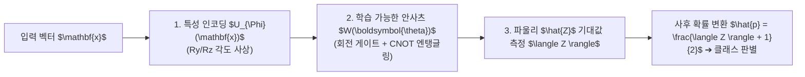

> [!abstract] 핵심 요약
> **변분 양자 분류기(VQC)**는 고전 딥러닝 신경망의 레이어를 **파라미터화된 양자 회로(PQC)**로 대체한 모델이다.
> 입력 특성 $\mathbf{x}$를 인코딩한 후 회전 게이트와 CNOT **엔탱글러(Entangler)**로 구성된 안사츠 $W(\boldsymbol{\theta})$를 통과시켜 최종 큐비트의 파울리 $\hat{Z}$ 기대값 $\langle Z \rangle \in [-1, 1]$을 측정하며, 이를 고전 손실 함수와 결합하여 하이브리드 경사하강법으로 훈련한다.

---

## 1. VQC 3단계 아키텍처

$$\hat{y} = f(\mathbf{x}; \boldsymbol{\theta}) = \langle 0 | U_{\Phi}^\dagger(\mathbf{x}) W^\dagger(\boldsymbol{\theta}) \hat{Z}_0 W(\boldsymbol{\theta}) U_{\Phi}(\mathbf{x}) | 0 \rangle$$



---

## 2. 바렌 고원(Barren Plateaus) 현상과 완화 방안

| 구분 | 발생 원인 | 영향 | 완화 전략 |
| :-- | :-- | :-- | :-- |
| **바렌 고원 (Barren Plateaus)** | 큐비트 수 $n$ 증가 시 무작위 Haar 상태 공간에서 그래디언트 분산이 지수적으로 $O(2^{-n})$으로 소실 | 경사하강법 학습이 완전히 멈춤 (극소점 탐색 불가) | • 얕은 국소 안사츠 (Local Cost Function)<br/>• 항등 행렬 초기화 (Identity Initialization)<br/>• 레이어별 점진 학습 (Layerwise Training) |

---

## 3. 실시간 VQC 기대값 $\langle Z \rangle$ 기반 분류기 시뮬레이터

```html preview
<div style="font-family:system-ui,-apple-system,sans-serif;padding:20px;background:var(--card);color:var(--card-foreground);border:1px solid var(--border);border-radius:var(--radius)">
  <div style="font-size:16px;font-weight:700;margin-bottom:14px;color:var(--primary);display:flex;align-items:center;gap:8px">
    <span>🎯 VQC 측정 기대값 <Z> 에 따른 분류 확률 계산기</span>
  </div>

  <div style="margin-bottom:14px">
    <div style="display:flex;justify-content:space-between;font-size:11px;color:var(--muted-foreground);margin-bottom:4px">
      <span>측정된 파울리 Z 기대값 <Z> (-1.0 ~ +1.0):</span>
      <span id="expZVal" style="font-weight:700;color:var(--primary)"><Z> = +0.60</span>
    </div>
    <input id="inExpZ" type="range" min="-1.0" max="1.0" step="0.05" value="0.6" style="width:100%" />
  </div>

  <div style="display:grid;grid-template-columns:1fr 1fr;gap:12px;margin-bottom:12px">
    <div style="padding:10px;background:var(--background);border:1px solid var(--border);border-radius:var(--radius);text-align:center">
      <div style="font-size:10px;color:var(--muted-foreground)">양성 클래스 예측 확률 P(Y=1)</div>
      <div id="vqcProbOut" style="font-family:monospace;font-size:18px;font-weight:800;color:var(--primary);margin-top:2px">80.0 %</div>
    </div>
    <div style="padding:10px;background:var(--background);border:1px solid var(--border);border-radius:var(--radius);text-align:center">
      <div style="font-size:10px;color:var(--muted-foreground)">최종 분류 예측</div>
      <div id="vqcClassOut" style="font-size:13px;font-weight:800;color:var(--primary);margin-top:4px">클래스 1 (양성)</div>
    </div>
  </div>

  <script>
    document.getElementById('inExpZ').oninput = function() {
      var z = parseFloat(this.value);
      document.getElementById('expZVal').textContent = "<Z> = " + (z >= 0 ? "+" : "") + z.toFixed(2);

      var p = (z + 1.0) / 2.0;
      document.getElementById('vqcProbOut').textContent = (p * 100).toFixed(1) + " %";

      var cls = document.getElementById('vqcClassOut');
      if (p >= 0.5) {
        cls.innerHTML = "<span style='color:var(--primary)'>클래스 1 (양성)</span>";
      } else {
        cls.innerHTML = "<span style='color:var(--chart-1)'>클래스 0 (음성)</span>";
      }
    };
  </script>
</div>
```
