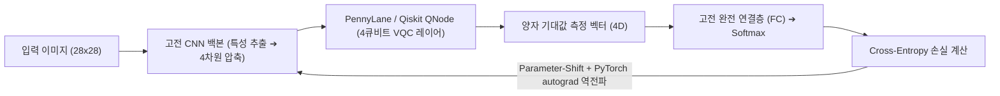

> [!abstract] 핵심 요약
> 실전 양자 머신러닝 개발은 순수한 양자 회로만으로 동작하지 않고, **PennyLane이나 Qiskit TorchConnector**를 통해 고전 신경망 백본(CNN, Transformer)과 양자 회로 레이어를 긴밀히 결합하는 **하이브리드 파이프라인**으로 구축된다.
> 양자 하드웨어 측정 시 발생하는 **샷 노이즈(Shot Noise, 표준오차 $\sigma = 1/\sqrt{N_{\text{shots}}}$)**와 게이트 노이즈를 제어하기 위해 샷 수를 최적화하고 **영잡음 외삽(ZNE)** 기법을 적용해야 한다.

---

## 1. 하이브리드 QML PyTorch 통합 파이프라인



---

## 2. 샷 수($N_{\text{shots}}$)에 따른 통계적 표준 오차

$$\sigma_{\text{shot}} = \frac{1}{\sqrt{N_{\text{shots}}}}$$

| 샷 수 ($N_{\text{shots}}$) | 표준 오차 ($\sigma$) | 용도 및 권장 환경 |
| :-- | :-- | :-- |
| **100 샷** | $\pm 10.0\%$ | 빠른 프로토타입 디버깅 (노이즈 큼) |
| **1,024 샷** | $\pm 3.1\%$ | 표준 하이브리드 QML 훈련 기본값 |
| **8,192 샷** | $\pm 1.1\%$ | 최종 검증 및 논문 벤치마크 평가 |

---

## 3. 실시간 양자 측정 샷(Shots) 수에 따른 오차 시뮬레이터

```html preview
<div style="font-family:system-ui,-apple-system,sans-serif;padding:20px;background:var(--card);color:var(--card-foreground);border:1px solid var(--border);border-radius:var(--radius)">
  <div style="font-size:16px;font-weight:700;margin-bottom:14px;color:var(--primary);display:flex;align-items:center;gap:8px">
    <span>🎲 양자 측정 샷 수(Shots)에 따른 통계적 표준 오차(Shot Noise) 계산기</span>
  </div>

  <div style="margin-bottom:14px">
    <div style="display:flex;justify-content:space-between;font-size:11px;color:var(--muted-foreground);margin-bottom:4px">
      <span>측정 샷 수 (N_shots):</span>
      <span id="shotsVal" style="font-weight:700;color:var(--primary)">1,024 Shots</span>
    </div>
    <input id="inShots" type="range" min="100" max="10000" step="100" value="1024" style="width:100%" />
  </div>

  <div style="display:grid;grid-template-columns:1fr 1fr;gap:12px;margin-bottom:12px">
    <div style="padding:10px;background:var(--background);border:1px solid var(--border);border-radius:var(--radius);text-align:center">
      <div style="font-size:10px;color:var(--muted-foreground)">기대값 표준 오차 (1 / sqrt(N))</div>
      <div id="shotErrOut" style="font-family:monospace;font-size:18px;font-weight:800;color:var(--primary);margin-top:2px">+/- 3.12 %</div>
    </div>
    <div style="padding:10px;background:var(--background);border:1px solid var(--border);border-radius:var(--radius);text-align:center">
      <div style="font-size:10px;color:var(--muted-foreground)">QML 학습 적합성 판정</div>
      <div id="shotStatusOut" style="font-size:12px;font-weight:800;color:var(--primary);margin-top:4px">✅ QML 하이브리드 학습 권장 수준</div>
    </div>
  </div>

  <script>
    document.getElementById('inShots').oninput = function() {
      var n = parseInt(this.value);
      document.getElementById('shotsVal').textContent = n.toLocaleString() + " Shots";

      var err = (1.0 / Math.sqrt(n)) * 100;
      document.getElementById('shotErrOut').textContent = "+/- " + err.toFixed(2) + " %";

      var status = document.getElementById('shotStatusOut');
      if (n >= 1000) {
        status.innerHTML = "✅ <span style='color:var(--primary)'>QML 하이브리드 학습 권장 수준</span>";
      } else {
        status.innerHTML = "⚠️ <span style='color:var(--chart-1)'>노이즈가 커 그래디언트 불안정 위험</span>";
      }
    };
  </script>
</div>
```
