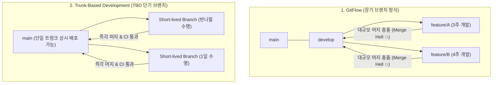

> [!abstract] 핵심 요약
> **GitFlow**는 복잡한 브랜치 전략으로 인해 기능 통합 시 대규모 충돌(Merge Hell)을 야기하고 지속적 배포(CD)를 가로막는다.
> **트렁크 기반 개발(TBD)**은 엔지니어가 수명 1~2일 미만의 단기 브랜치(Short-lived Branch)를 메인 트렁크에 즉시 머지하는 방식이다. 배포(Deployment)와 릴리스(Release)를 분리하는 **피처 플래그(Feature Flags)**를 결합하여 코드는 상시 배포하되 기능 노출은 런타임에 동적으로 제어한다.

---

## 1. GitFlow vs 트렁크 기반 개발(TBD) 비교



---

## 2. 피처 플래그(Feature Flag) 4대 생명주기 및 카테고리

| 플래그 카테고리 | 유지 수명 | 동적 변경성 | 주요 목적 및 사용 시나리오 |
| :-- | :-- | :-- | :-- |
| **릴리스 토글 (Release Toggle)** | 수일 ~ 수주일 (임시) | 런타임 제어 | TBD 환경에서 미완성 신기능을 숨긴 채 프로덕션 배포 |
| **실험 토글 (Experiment Toggle)** | 수주일 ~ 수개월 (임시) | 사용자 단위 할당 | A/B 테스팅 및 가설 검증 통계 수집 |
| **운영 토글 (Ops Toggle)** | 장기 (영구적) | 즉각 수동 제어 | 시스템 과부하 시 비필수 기능(추천 엔진 등) 즉시 차단(Circuit Breaker) |
| **권한 토글 (Permission Toggle)** | 장기 (영구적) | 유저 권한 기반 | 프리미엄 고객 또는 베타 테스터 전용 기능 노출 |

---

## 3. 실시간 피처 플래그 런타임 토글링 및 릴리스 제어 시뮬레이터

```html preview
<div style="font-family:system-ui,-apple-system,sans-serif;padding:20px;background:var(--card);color:var(--card-foreground);border:1px solid var(--border);border-radius:var(--radius)">
  <div style="font-size:16px;font-weight:700;margin-bottom:14px;color:var(--primary);display:flex;align-items:center;gap:8px">
    <span>🚩 런타임 피처 플래그(Feature Flag) 동적 릴리스 제어기</span>
  </div>

  <div style="display:flex;align-items:center;justify-content:space-between;padding:10px;background:var(--background);border:1px solid var(--border);border-radius:var(--radius);margin-bottom:12px">
    <div>
      <div style="font-size:13px;font-weight:700">신규 결제 UI v2 (Flag: ENABLE_NEW_CHECKOUT)</div>
      <div style="font-size:11px;color:var(--muted-foreground)">프로덕션 코드에 이미 배포 완료됨 (무중단 릴리스 제어)</div>
    </div>
    <input id="chkFeatureFlag" type="checkbox" style="width:20px;height:20px;cursor:pointer" />
  </div>

  <div style="padding:12px;background:var(--secondary);border-radius:var(--radius)">
    <div style="font-size:11px;font-weight:700;color:var(--muted-foreground);margin-bottom:4px">사용자 화면 렌더링 상태:</div>
    <div id="featureUiOut" style="font-size:14px;font-weight:800;color:var(--foreground)">
      🔒 기존 결제 UI v1 활성화 상태 (안정 모드)
    </div>
  </div>

  <script>
    document.getElementById('chkFeatureFlag').onchange = function() {
      var enabled = this.checked;
      var out = document.getElementById('featureUiOut');
      if (enabled) {
        out.innerHTML = "🚀 <span style='color:var(--primary)'>신규 결제 UI v2 활성화!</span> (서버 재배포 없이 런타임 즉각 적용 완료)";
      } else {
        out.innerHTML = "🔒 <span>기존 결제 UI v1 활성화 상태 (안정 모드)</span>";
      }
    };
  </script>
</div>
```
