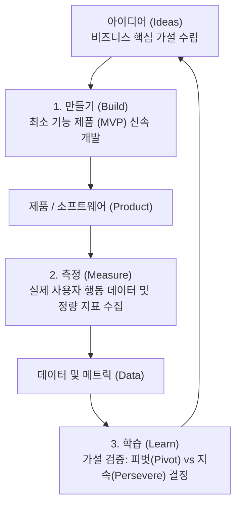

> [!abstract] 핵심 요약
> **린 엔지니어링**의 궁극적 목표는 불필요한 기능 개발과 비부가가치 대기 시간을 제거하여 고객 가치를 가장 빠른 속도로 창출하는 것이다.
> **만들기-측정-학습** 루프를 극대화하기 위해 핵심 가설만을 검증하는 **MVP**를 출시하며, **밸류 스트림 매핑(VSM)**을 통해 코드 작성 시간 대비 대기(Wait) 시간을 분석하여 흐름 효율(Flow Efficiency)을 개선한다. 또한 기업 내부 사일로를 타파하기 위해 오픈소스 방식의 PR/리뷰 문화를 도입하는 **이너소스(InnerSource)**를 구축한다.

---

## 1. 린 스타트업 Build-Measure-Learn 피드백 루프



---

## 2. 밸류 스트림 매핑(VSM) 흐름 효율 공식 및 낭비 요소

$$\text{Flow Efficiency (\%)} = \frac{\text{실제 작업 시간 (Process Time)}}{\text{총 소요 시간 (Lead Time)}} \times 100\%$$

| 소프트웨어 7대 낭비 | 발생 원인 | 해결 방안 |
| :-- | :-- | :-- |
| **미완성 작업 (Work in Progress)** | 지나치게 많은 작업을 동시 진행 | WIP 제한(WIP Limit), 단기 스프린트 |
| **추가 기능 (Extra Features)** | 요구되지 않은 오버스펙 개발 | 철저한 MVP 기반 가설 검증 |
| **대기 시간 (Waiting)** | 코드 리뷰 지연, QA 대기, 승인 병목 | GitHub Actions 자동화, PR 크기 최소화 |
| **결함 (Defects)** | 수동 테스트 의존, 불충분한 단위 테스트 | Shift-Left 테스팅, TDD 도입 |

---

## 3. 실시간 밸류 스트림 맵핑(VSM) 흐름 효율(Flow Efficiency) 계산기

```html preview
<div style="font-family:system-ui,-apple-system,sans-serif;padding:20px;background:var(--card);color:var(--card-foreground);border:1px solid var(--border);border-radius:var(--radius)">
  <div style="font-size:16px;font-weight:700;margin-bottom:14px;color:var(--primary);display:flex;align-items:center;gap:8px">
    <span>⏱️ 소프트웨어 딜리버리 Flow Efficiency (흐름 효율) 계산기</span>
  </div>

  <div style="display:grid;grid-template-columns:1fr 1fr;gap:12px;margin-bottom:14px">
    <div>
      <label style="font-size:11px;color:var(--muted-foreground)">실제 개발/작업 시간 (시간):</label>
      <input id="inProcessTime" type="number" value="10" min="1" max="100" style="width:100%;padding:4px;background:var(--background);color:var(--foreground);border:1px solid var(--border);border-radius:var(--radius);font-weight:700" />
    </div>
    <div>
      <label style="font-size:11px;color:var(--muted-foreground)">대기/지연 시간 (코드리뷰, QA대기 등 시간):</label>
      <input id="inWaitTime" type="number" value="40" min="0" max="500" style="width:100%;padding:4px;background:var(--background);color:var(--foreground);border:1px solid var(--border);border-radius:var(--radius);font-weight:700" />
    </div>
  </div>

  <div style="display:grid;grid-template-columns:1fr 1fr;gap:12px;margin-bottom:12px">
    <div style="padding:10px;background:var(--background);border:1px solid var(--border);border-radius:var(--radius);text-align:center">
      <div style="font-size:10px;color:var(--muted-foreground)">전체 리드 타임 (Lead Time)</div>
      <div id="leadTimeOut" style="font-family:monospace;font-size:18px;font-weight:800;color:var(--primary);margin-top:2px">50 시간</div>
    </div>
    <div style="padding:10px;background:var(--background);border:1px solid var(--border);border-radius:var(--radius);text-align:center">
      <div style="font-size:10px;color:var(--muted-foreground)">흐름 효율 (Flow Efficiency)</div>
      <div id="efficiencyOut" style="font-family:monospace;font-size:18px;font-weight:800;color:var(--chart-1);margin-top:2px">20.0 %</div>
    </div>
  </div>

  <script>
    function updateVsm() {
      var pt = parseFloat(document.getElementById('inProcessTime').value) || 1;
      var wt = parseFloat(document.getElementById('inWaitTime').value) || 0;
      var lt = pt + wt;
      var eff = (pt / lt) * 100;

      document.getElementById('leadTimeOut').textContent = lt + " 시간";
      document.getElementById('efficiencyOut').textContent = eff.toFixed(1) + " %";
    }

    document.getElementById('inProcessTime').addEventListener('input', updateVsm);
    document.getElementById('inWaitTime').addEventListener('input', updateVsm);
    updateVsm();
  </script>
</div>
```
