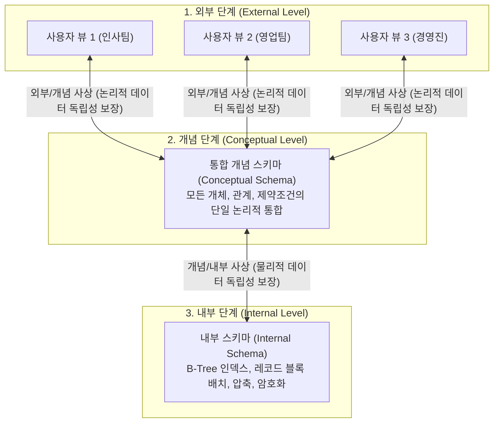

> [!abstract] 핵심 요약
> 초기 파일 시스템은 응용 프로그램이 파일의 물리적 저장 구조에 종속되어 파일 구조가 변경되면 프로그램 전체를 수정해야 하는 심각한 유지보수 병목을 유발했다.
> **ANSI/SPARC 3단계 아키텍처**는 데이터베이스를 **외부 단계(사용자 뷰)**, **개념 단계(전체 논리 구조)**, **내부 단계(물리적 저장 구조)**로 3분할하고 계층 간 사상(Mapping)을 제공함으로써, 내부 저장 장치나 개념 스키마가 변경되어도 상위 응용 프로그램에 영향을 주지 않는 **데이터 독립성(Data Independence)**을 보장한다.

---

## 1. ANSI/SPARC 3단계 스키마 구조와 사상(Mapping)



---

## 2. 2대 데이터 독립성(Data Independence) 비교

| 데이터 독립성 | 사상(Mapping) 위치 | 변경 대상 | 보장되는 효과 |
| :-- | :-- | :-- | :-- |
| **논리적 데이터 독립성** | 외부/개념 사상 | 개념 스키마 (새로운 속성 추가, 테이블 분할/병합) | 기존 외부 뷰를 사용하는 응용 프로그램을 변경하지 않고도 논리 구조 확장 가능 |
| **물리적 데이터 독립성** | 개념/내부 사상 | 내부 스키마 (B+Tree 인덱스 추가, SSD 파티셔닝, 파일 재구성) | 데이터 저장 방식이나 하드웨어가 바뀌어도 개념 스키마와 응용 프로그램 코드 불변 |

---

## 3. 실시간 3단계 스키마 사상 및 독립성 시뮬레이터

```html preview
<div style="font-family:system-ui,-apple-system,sans-serif;padding:20px;background:var(--card);color:var(--card-foreground);border:1px solid var(--border);border-radius:var(--radius)">
  <div style="font-size:16px;font-weight:700;margin-bottom:14px;color:var(--primary);display:flex;align-items:center;gap:8px">
    <span>🗄️ ANSI/SPARC 3단계 데이터베이스 스키마 변경 시뮬레이터</span>
  </div>

  <div style="margin-bottom:14px">
    <label style="font-size:11px;color:var(--muted-foreground)">시뮬레이션할 변경 시나리오 선택:</label>
    <select id="selDbChange" style="width:100%;padding:6px;background:var(--background);color:var(--foreground);border:1px solid var(--border);border-radius:var(--radius);font-weight:700">
      <option value="internal">1. 물리 계층 변경 (HDD -> NVMe SSD 인덱스 구조 최적화)</option>
      <option value="conceptual">2. 논리 계층 변경 (고객 테이블에 포인트 'bonus_pts' 컬럼 추가)</option>
      <option value="external">3. 외부 뷰 변경 (마케팅팀 전용 View 생성)</option>
    </select>
  </div>

  <div style="padding:12px;background:var(--background);border:1px solid var(--border);border-radius:var(--radius)">
    <div style="font-size:11px;font-weight:700;color:var(--muted-foreground);margin-bottom:4px">사상(Mapping) 계층 갱신 및 독립성 영향 분석</div>
    <div id="dbImpactOut" style="font-size:13px;line-height:1.6;color:var(--foreground)">
      <strong>물리적 데이터 독립성 작동:</strong> 개념/내부 사상(Mapping)만 갱신됩니다. 개념 스키마 및 외부 사용자 응용 프로그램은 코드를 단 한 줄도 수정할 필요가 없습니다.
    </div>
  </div>

  <script>
    document.getElementById('selDbChange').onchange = function() {
      var val = this.value;
      var out = document.getElementById('dbImpactOut');
      if (val === 'internal') {
        out.innerHTML = "<strong style='color:var(--primary)'>⚡ 물리적 데이터 독립성 (Physical Data Independence):</strong><br/>내부 스키마와 개념/내부 사상만 갱신됩니다. 상위 개념 스키마와 응용 프로그램(외부 뷰)은 100% 무수정 유지됩니다.";
      } else if (val === 'conceptual') {
        out.innerHTML = "<strong style='color:var(--primary)'>⚡ 논리적 데이터 독립성 (Logical Data Independence):</strong><br/>개념 스키마와 외부/개념 사상이 갱신됩니다. 'bonus_pts'를 사용하지 않는 기존 인사/회계 뷰 응용 프로그램은 수정 없이 정상 작동합니다.";
      } else {
        out.innerHTML = "<strong style='color:var(--primary)'>⚡ 외부 단계 뷰 생성:</strong><br/>마케팅팀 외부 뷰와 외부/개념 사상만 신규 등록됩니다. 기저 개념 스키마와 물리 저장소에는 어떠한 부작용도 없습니다.";
      }
    };
  </script>
</div>
```
