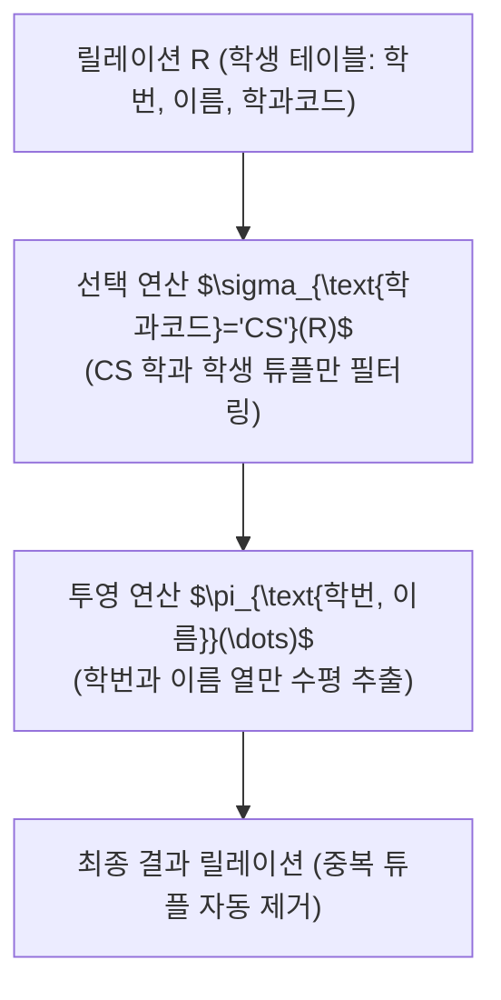

> [!abstract] 핵심 요약
> **관계 데이터 모델**은 데이터를 튜플의 집합인 2차원 테이블(릴레이션)로 표현하고, 수학적 집합론과 1차 술어 논리를 기반으로 연산을 정의한다.
> 릴레이션의 데이터 일관성을 수호하는 핵심 규칙인 **개체 무결성(기본키는 NOT NULL & UNIQUE)**과 **참조 무결성(외래키는 참조 대상의 유효한 PK이거나 NULL)**을 엄격히 강제하며, **관계 대수(Relational Algebra)**는 $\sigma(\text{행 필터링}), \pi(\text{열 추출}), \bowtie(\text{조건 결합})$ 등의 절차적 연산자로 질의 최적화 엔진의 기초를 제공한다.

---

## 1. 관계 대수 핵심 순수 연산자 수학적 정의

$$\sigma_{P}(R) = \{ t \mid t \in R \land P(t) = \text{True} \} \quad (\text{Select: 조건 } P \text{를 만족하는 튜플 선택})$$

$$\pi_{A_1, \dots, A_k}(R) = \{ t[A_1, \dots, A_k] \mid t \in R \} \quad (\text{Project: 지정된 속성 열만 추출})$$

$$R \bowtie_{R.A = S.B} S = \sigma_{R.A = S.B}(R \times S) \quad (\text{Theta / Equi Join: 카테시안 곱 후 조인 조건 필터})$$



---

## 2. 릴레이션 무결성 제약조건(Integrity Constraints)

| 제약조건 | 정의 및 규칙 | 위반 시 DBMS 조치 |
| :-- | :-- | :-- |
| **개체 무결성 (Entity Integrity)** | 기본키(PK)를 구성하는 어떤 속성도 `NULL` 값을 가질 수 없으며 중복 불가 | INSERT/UPDATE 거부 (`ORA-00001 / Cannot be NULL`) |
| **참조 무결성 (Referential Integrity)** | 외래키(FK) 값은 참조하는 부모 릴레이션의 기본키 값과 정확히 일치하거나 `NULL`이어야 함 | • `ON DELETE RESTRICT`: 삭제 차단<br/>• `ON DELETE CASCADE`: 자식 튜플 연쇄 삭제<br/>• `ON DELETE SET NULL`: 외래키를 NULL로 변경 |
| **도메인 무결성 (Domain Integrity)** | 특정 속성 값은 그 속성에 정의된 데이터 타입, 길이, 허용 범위(`CHECK`) 내에 속해야 함 | 타입 불일치 오류 (`CHECK Constraint Violation`) |

---

## 3. 실시간 관계 대수(Select & Project & Join) 시뮬레이터

```html preview
<div style="font-family:system-ui,-apple-system,sans-serif;padding:20px;background:var(--card);color:var(--card-foreground);border:1px solid var(--border);border-radius:var(--radius)">
  <div style="font-size:16px;font-weight:700;margin-bottom:14px;color:var(--primary);display:flex;align-items:center;gap:8px">
    <span>📐 관계 대수(Relational Algebra) 연산자 결과 시뮬레이터</span>
  </div>

  <div style="display:grid;grid-template-columns:1fr 1fr;gap:12px;margin-bottom:14px">
    <div>
      <label style="font-size:11px;color:var(--muted-foreground)">적용할 관계 대수 연산식:</label>
      <select id="selAlgOp" style="width:100%;padding:5px;background:var(--background);color:var(--foreground);border:1px solid var(--border);border-radius:var(--radius);font-weight:700">
        <option value="sigma">1. sigma(점수 >= 80)(학생)</option>
        <option value="pi">2. pi(학번, 이름)(학생)</option>
        <option value="join">3. 학생 bowtie(학과코드) 학과</option>
      </select>
    </div>
    <div>
      <label style="font-size:11px;color:var(--muted-foreground)">연산 특성 및 연산자 기호:</label>
      <input id="algSymbolOut" type="text" value="선택 (Select, sigma) - 행 필터링" readonly style="width:100%;padding:5px;background:var(--background);color:var(--primary);border:1px solid var(--border);border-radius:var(--radius);font-weight:700" />
    </div>
  </div>

  <div style="padding:10px;background:var(--background);border:1px solid var(--border);border-radius:var(--radius)">
    <div style="font-size:10px;color:var(--muted-foreground)">대응되는 ANSI SQL 구문</div>
    <div id="sqlEquivOut" style="font-family:monospace;font-size:13px;font-weight:700;color:var(--primary);margin-top:2px">
      SELECT * FROM 학생 WHERE 점수 >= 80;
    </div>
  </div>

  <script>
    document.getElementById('selAlgOp').onchange = function() {
      var val = this.value;
      var sym = document.getElementById('algSymbolOut');
      var sql = document.getElementById('sqlEquivOut');

      if (val === 'sigma') {
        sym.value = "선택 (Select, sigma) - 행 필터링";
        sql.textContent = "SELECT * FROM 학생 WHERE 점수 >= 80;";
      } else if (val === 'pi') {
        sym.value = "투영 (Project, pi) - 열 추출 및 중복 제거";
        sql.textContent = "SELECT DISTINCT 학번, 이름 FROM 학생;";
      } else {
        sym.value = "자연 조인 (Natural Join, bowtie) - 동등 결합";
        sql.textContent = "SELECT * FROM 학생 NATURAL JOIN 학과;";
      }
    };
  </script>
</div>
```
