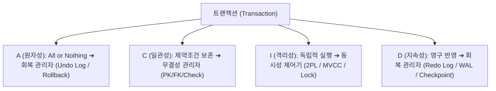

> [!abstract] 핵심 요약
> **트랜잭션**은 여러 질의를 하나의 불가분한 작업 단위로 묶어 DB 무결성을 유지하는 **ACID** 체계를 따른다.
> 다중 사용자가 동시에 DB에 접근할 때 상호 간섭을 제어하기 위해 전통적으로는 **2단계 로킹(2PL)**을 통해 직렬 가능성을 보장했으나, 현대 RDBMS(PostgreSQL, MySQL InnoDB, Oracle)는 읽기 작업이 쓰기 작업을 블로킹하지 않는 **MVCC(Multi-Version Concurrency Control)** 스냅샷 기법을 채택하여 높은 처리량(Throughput)과 격리성을 동시에 달성한다.

---

## 1. ACID 원칙과 DBMS 지원 서브시스템



---

## 2. ANSI SQL 4대 트랜잭션 격리 수준(Isolation Level) 및 이상 현상 매트릭스

| 격리 수준 (Isolation Level) | 오독 (Dirty Read) | 비반복 읽기 (Non-repeatable) | 유령 읽기 (Phantom Read) | 구현 기법 및 동시 처리 성능 |
| :-- | :--: | :--: | :--: | :-- |
| **Read Uncommitted** | 발생 ❌ | 발생 ❌ | 발생 ❌ | Lock 없는 읽기 (최고 성능, 일관성 최악) |
| **Read Committed** | **방지 ✅** | 발생 ❌ | 발생 ❌ | **대다수 RDBMS 기본값 (PostgreSQL, Oracle)** / MVCC 문장 레벨 스냅샷 |
| **Repeatable Read** | **방지 ✅** | **방지 ✅** | 발생 ❌ (MySQL은 방지) | **MySQL InnoDB 기본값** / 트랜잭션 시작 시점 MVCC 스냅샷 |
| **Serializable** | **방지 ✅** | **방지 ✅** | **방지 ✅** | 공유 잠금(S-Lock) 및 넥스트 키 락(Next-Key Lock) 강제 (성능 최저) |

---

## 3. 실시간 트랜잭션 격리 수준별 이상 현상 방지 시뮬레이터

```html preview
<div style="font-family:system-ui,-apple-system,sans-serif;padding:20px;background:var(--card);color:var(--card-foreground);border:1px solid var(--border);border-radius:var(--radius)">
  <div style="font-size:16px;font-weight:700;margin-bottom:14px;color:var(--primary);display:flex;align-items:center;gap:8px">
    <span>🔒 트랜잭션 격리 수준(Isolation Level)별 데이터 무결성 검증기</span>
  </div>

  <div style="margin-bottom:14px">
    <label style="font-size:11px;color:var(--muted-foreground)">설정할 트랜잭션 격리 수준:</label>
    <select id="selIsoLevel" style="width:100%;padding:6px;background:var(--background);color:var(--foreground);border:1px solid var(--border);border-radius:var(--radius);font-weight:700">
      <option value="RU">1. READ UNCOMMITTED (커밋되지 않은 읽기 허용)</option>
      <option value="RC" selected>2. READ COMMITTED (커밋된 읽기 - PostgreSQL 기본)</option>
      <option value="RR">3. REPEATABLE READ (반복 읽기 - MySQL InnoDB 기본)</option>
      <option value="SR">4. SERIALIZABLE (완전 직렬화)</option>
    </select>
  </div>

  <div style="display:grid;grid-template-columns:1fr 1fr 1fr;gap:8px;margin-bottom:12px">
    <div style="padding:8px;background:var(--background);border:1px solid var(--border);border-radius:var(--radius);text-align:center">
      <div style="font-size:10px;color:var(--muted-foreground)">Dirty Read (오독)</div>
      <div id="drStatus" style="font-weight:800;color:var(--primary);font-size:12px;margin-top:2px">방지됨 ✅</div>
    </div>
    <div style="padding:8px;background:var(--background);border:1px solid var(--border);border-radius:var(--radius);text-align:center">
      <div style="font-size:10px;color:var(--muted-foreground)">Non-repeatable Read</div>
      <div id="nrStatus" style="font-weight:800;color:var(--destructive,#ef4444);font-size:12px;margin-top:2px">발생 가능 ❌</div>
    </div>
    <div style="padding:8px;background:var(--background);border:1px solid var(--border);border-radius:var(--radius);text-align:center">
      <div style="font-size:10px;color:var(--muted-foreground)">Phantom Read (유령)</div>
      <div id="prStatus" style="font-weight:800;color:var(--destructive,#ef4444);font-size:12px;margin-top:2px">발생 가능 ❌</div>
    </div>
  </div>

  <script>
    document.getElementById('selIsoLevel').onchange = function() {
      var level = this.value;
      var dr = document.getElementById('drStatus');
      var nr = document.getElementById('nrStatus');
      var pr = document.getElementById('prStatus');

      if (level === 'RU') {
        dr.innerHTML = "<span style='color:var(--destructive,#ef4444)'>발생 가능 ❌</span>";
        nr.innerHTML = "<span style='color:var(--destructive,#ef4444)'>발생 가능 ❌</span>";
        pr.innerHTML = "<span style='color:var(--destructive,#ef4444)'>발생 가능 ❌</span>";
      } else if (level === 'RC') {
        dr.innerHTML = "<span style='color:var(--primary)'>방지됨 ✅</span>";
        nr.innerHTML = "<span style='color:var(--destructive,#ef4444)'>발생 가능 ❌</span>";
        pr.innerHTML = "<span style='color:var(--destructive,#ef4444)'>발생 가능 ❌</span>";
      } else if (level === 'RR') {
        dr.innerHTML = "<span style='color:var(--primary)'>방지됨 ✅</span>";
        nr.innerHTML = "<span style='color:var(--primary)'>방지됨 ✅</span>";
        pr.innerHTML = "<span style='color:var(--chart-1)'>일반 RDBMS 발생 / InnoDB 방지</span>";
      } else {
        dr.innerHTML = "<span style='color:var(--primary)'>방지됨 ✅</span>";
        nr.innerHTML = "<span style='color:var(--primary)'>방지됨 ✅</span>";
        pr.innerHTML = "<span style='color:var(--primary)'>완벽 방지 ✅</span>";
      }
    };
  </script>
</div>
```
