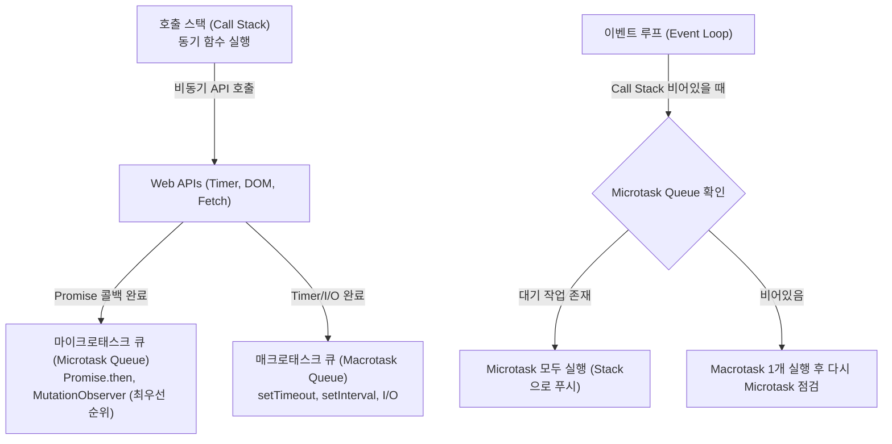

> [!abstract] 핵심 요약
> **자바스크립트 동시성 모델**은 단일 호출 스택을 유지하면서 Web API와 **이벤트 루프(Event Loop)**를 통해 비동기 논블로킹 I/O를 수행한다. 이벤트 루프는 호출 스택이 비었을 때 **마이크로태스크 큐(Promise)**를 매크로태스크 큐(setTimeout)보다 최우선으로 모두 비워낸다.
> 브라우저 이벤트는 루트에서 타깃으로 내려가는 **캡처링(Capturing)**과 타깃에서 루트로 올라오는 **버블링(Bubbling)** 단계를 거치며, 이를 활용한 **이벤트 위임(Event Delegation)**은 다수의 자식 요소에 리스너를 개별 등록하지 않고 부모 단일 리스너로 메모리와 성능을 획기적으로 절약한다.

---

## 1. 자바스크립트 이벤트 루프 아키텍처와 태스크 우선순위



---

## 2. 3단계 이벤트 흐름(Event Flow) 및 제어 메서드

| 이벤트 흐름 단계 | 전파 방향 | 감지 설정 | 제어 메서드 |
| :-- | :-- | :-- | :-- |
| **1. 캡처링 (Capturing)** | `window` $\to$ `document` $\to$ 부모 $\to$ 자식 | `addEventListener('click', fn, true)` | `e.stopPropagation()` (전파 즉시 차단) |
| **2. 타깃 (Target)** | 실제 클릭이 발생한 대상 노드 | `e.target` | `e.preventDefault()` (브라우저 기본 동작 방지) |
| **3. 버블링 (Bubbling)** | 자식 $\to$ 부모 $\to$ `document` $\to$ `window` | `addEventListener('click', fn, false)` (기본값) | 부모 요소에서 `e.target` 검사로 **이벤트 위임** 구현 |

---

## 3. 실시간 이벤트 버블링 vs 이벤트 위임(Delegation) 시뮬레이터

```html preview
<div style="font-family:system-ui,-apple-system,sans-serif;padding:20px;background:var(--card);color:var(--card-foreground);border:1px solid var(--border);border-radius:var(--radius)">
  <div style="font-size:16px;font-weight:700;margin-bottom:14px;color:var(--primary);display:flex;align-items:center;gap:8px">
    <span>🎯 이벤트 버블링(Bubbling) 및 이벤트 위임 시뮬레이터</span>
  </div>

  <div id="parentBox" style="padding:16px;background:var(--secondary);border:2px dashed var(--primary);border-radius:var(--radius);margin-bottom:12px;cursor:pointer">
    <div style="font-size:11px;font-weight:700;color:var(--muted-foreground);margin-bottom:8px">부모 컨테이너 (#parentBox - 단일 이벤트 리스너 등록)</div>
    <div style="display:flex;gap:8px">
      <button class="child-btn" data-name="버튼 A" style="padding:6px 12px;background:var(--primary);color:#fff;border:none;border-radius:var(--radius);font-weight:700;cursor:pointer">자식 버튼 A</button>
      <button class="child-btn" data-name="버튼 B" style="padding:6px 12px;background:var(--chart-1);color:#fff;border:none;border-radius:var(--radius);font-weight:700;cursor:pointer">자식 버튼 B</button>
      <button class="child-btn" data-name="버튼 C" style="padding:6px 12px;background:var(--chart-2);color:#fff;border:none;border-radius:var(--radius);font-weight:700;cursor:pointer">자식 버튼 C</button>
    </div>
  </div>

  <div style="padding:10px;background:var(--background);border:1px solid var(--border);border-radius:var(--radius)">
    <div style="font-size:11px;color:var(--muted-foreground)">이벤트 감지 로그:</div>
    <div id="eventLogOut" style="font-family:monospace;font-size:13px;font-weight:800;color:var(--primary);margin-top:2px">
      버튼 중 하나를 클릭해 보세요.
    </div>
  </div>

  <script>
    document.getElementById('parentBox').addEventListener('click', function(e) {
      var log = document.getElementById('eventLogOut');
      if (e.target && e.target.classList.contains('child-btn')) {
        var btnName = e.target.getAttribute('data-name');
        log.textContent = "⚡ [이벤트 위임 감지] e.target = " + btnName + " | e.currentTarget = #parentBox (버블링 수신)";
        log.style.color = "var(--primary)";
      } else {
        log.textContent = "⚡ 부모 컨테이너 빈 영역 클릭 감지 (e.target = #parentBox)";
        log.style.color = "var(--muted-foreground)";
      }
    });
  </script>
</div>
```
