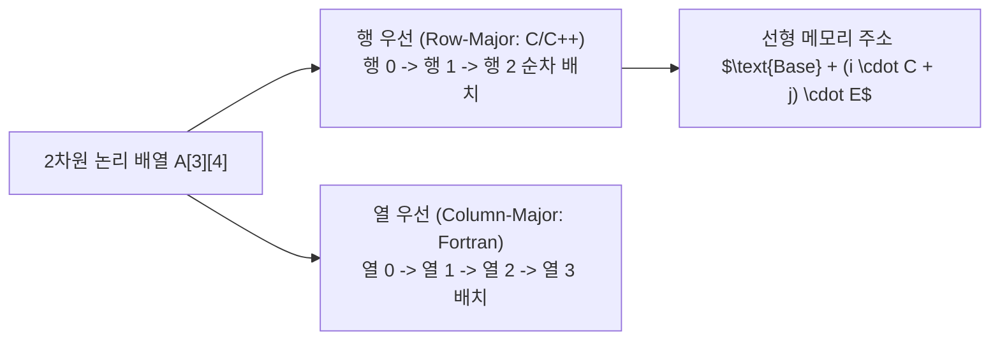

> [!abstract] 핵심 요약
> **타입 시스템(Type System)**은 연산이 적용될 수 있는 값의 집합과 허용되는 연산의 집합을 규정하여 런타임 오류를 방지한다.
> 다차원 배열은 1차원 선형 메모리에 **행 우선(Row-major)** 또는 **열 우선(Column-major)** 사상 함수를 통해 저장되며, 포인터와 동적 메모리 제어 시 발생하는 **댕글링 포인터(Dangling Pointer)** 문제는 스마트 포인터, GC, 또는 톰스톤/락-앤-키 등의 런타임 안전 메커니즘을 통해 방지된다.

---

## 1. 2차원 배열 $A[i][j]$ 물리 주소 사상 공식

배열의 시작 주소를 $\text{Base}$, 각 원소의 크기를 $E$, 인덱스 범위를 $i \in [0, R-1], j \in [0, C-1]$라 할 때:

### 1.1 행 우선 순서 (Row-Major Order - C, C++, Java)

$$\text{Address}(A[i][j]) = \text{Base} + (i \times C + j) \times E$$

### 1.2 열 우선 순서 (Column-Major Order - Fortran, MATLAB, R)

$$\text{Address}(A[i][j]) = \text{Base} + (j \times R + i) \times E$$



---

## 2. 타입 동치성(Type Equivalence) 2대 모델

| 동치성 모델 | 판별 기준 | 언어 대표 예시 | 장단점 |
| :-- | :-- | :-- | :-- |
| **이름 동치성 (Name Equivalence)** | 두 변수의 타입 선언문에 사용된 **타입 이름이 완전히 동일**할 때만 동치로 인정 | Ada, Pascal, Java 클래스 | 엄격하고 안전하지만 구조가 같아도 새 타입명 선언 시 호환 불가 |
| **구조적 동치성 (Structural Equivalence)** | 타입 이름이 달라도 **내부 필드의 구성과 타입 구조가 동일**하면 동치로 인정 | C 구조체(일부), TypeScript | 유연하고 재사용성이 높지만 의도치 않은 타입 오인 발생 가능 |

---

## 3. 실시간 2D 배열 행 우선 물리 메모리 주소 계산기

```html preview
<div style="font-family:system-ui,-apple-system,sans-serif;padding:20px;background:var(--card);color:var(--card-foreground);border:1px solid var(--border);border-radius:var(--radius)">
  <div style="font-size:16px;font-weight:700;margin-bottom:14px;color:var(--primary);display:flex;align-items:center;gap:8px">
    <span>🔢 2차원 배열 Row-Major 물리 메모리 주소 사상 계산기</span>
  </div>

  <div style="display:grid;grid-template-columns:1fr 1fr;gap:12px;margin-bottom:14px">
    <div>
      <label style="font-size:11px;color:var(--muted-foreground)">배열 행 인덱스 i (0 ~ 9):</label>
      <input id="inArrI" type="number" value="2" min="0" max="9" style="width:100%;padding:4px;background:var(--background);color:var(--foreground);border:1px solid var(--border);border-radius:var(--radius);font-weight:700" />
    </div>
    <div>
      <label style="font-size:11px;color:var(--muted-foreground)">배열 열 인덱스 j (0 ~ 4, C=5열):</label>
      <input id="inArrJ" type="number" value="3" min="0" max="4" style="width:100%;padding:4px;background:var(--background);color:var(--foreground);border:1px solid var(--border);border-radius:var(--radius);font-weight:700" />
    </div>
  </div>

  <div style="display:grid;grid-template-columns:1fr 1fr;gap:12px;margin-bottom:12px">
    <div style="padding:10px;background:var(--background);border:1px solid var(--border);border-radius:var(--radius);text-align:center">
      <div style="font-size:10px;color:var(--muted-foreground)">1차원 오프셋 (i * C + j)</div>
      <div id="offsetOut" style="font-family:monospace;font-size:16px;font-weight:800;color:var(--primary);margin-top:2px">13 번째 원소</div>
    </div>
    <div style="padding:10px;background:var(--background);border:1px solid var(--border);border-radius:var(--radius);text-align:center">
      <div style="font-size:10px;color:var(--muted-foreground)">계산된 16진수 메모리 주소 (Base=0x1000, E=4)</div>
      <div id="addrOut" style="font-family:monospace;font-size:16px;font-weight:800;color:var(--chart-1);margin-top:2px">0x1034</div>
    </div>
  </div>

  <script>
    function updateArrAddr() {
      var i = parseInt(document.getElementById('inArrI').value) || 0;
      var j = parseInt(document.getElementById('inArrJ').value) || 0;
      var C = 5; // 5 columns
      var E = 4; // 4 bytes per int
      var base = 0x1000;

      var offset = i * C + j;
      var physicalAddr = base + (offset * E);

      document.getElementById('offsetOut').textContent = offset + " 번째 원소";
      document.getElementById('addrOut').textContent = "0x" + physicalAddr.toString(16).toUpperCase();
    }

    ['inArrI', 'inArrJ'].forEach(function(id) {
      document.getElementById(id).addEventListener('input', updateArrAddr);
    });
    updateArrAddr();
  </script>
</div>
```
