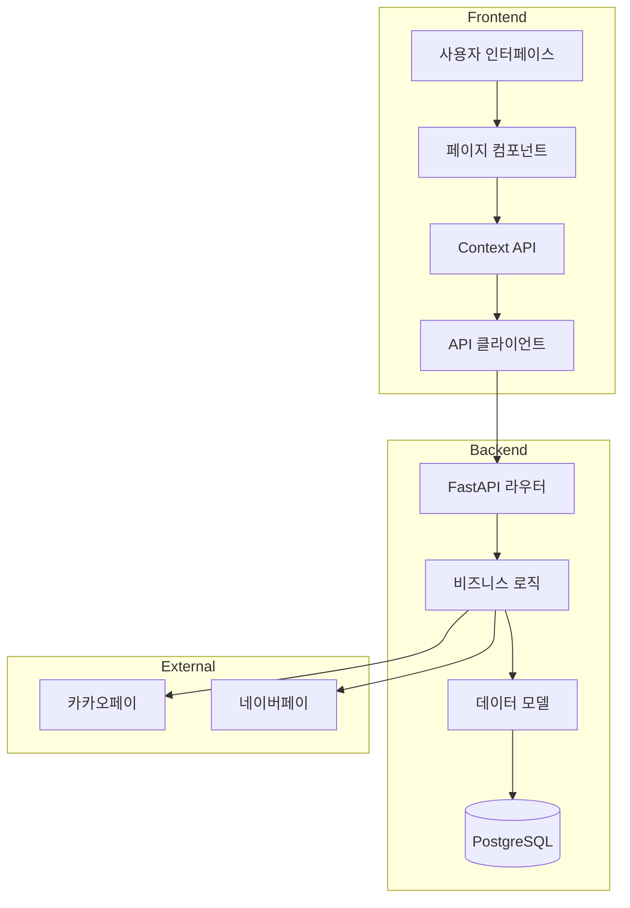
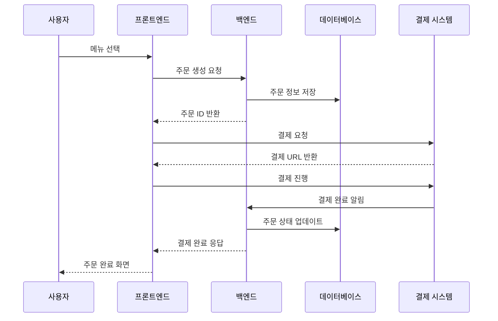
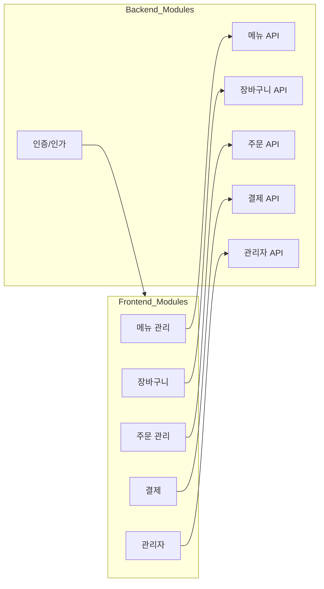
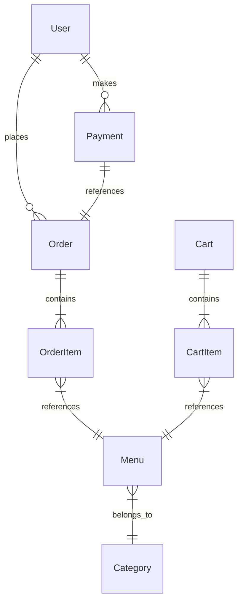
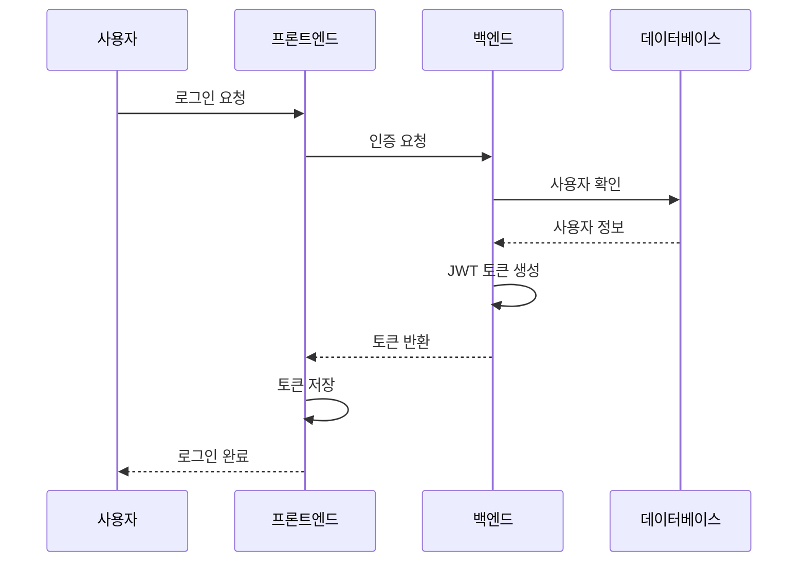

# 카페 추천 시스템 아키텍처 문서

---

### 1. 시스템 개요
안녕하세요, 오늘은 카페 추천 시스템의 아키텍처에 대해 설명드리겠습니다.
이 시스템은 사용자에게 AI 맞춤형 카페를 추천하고, 메뉴 주문 및 결제를 처리하는 웹 애플리케이션입니다.
프론트엔드는 Next.js를, 백엔드는 FastAPI를 사용하여 구현되었으며, 모던하고 확장 가능한 아키텍처를 채택했습니다.

### 2. 전체 시스템 구성도 설명

#### 구성도 상세 설명
1. **프론트엔드 계층**
   - 사용자 인터페이스(UI): 사용자와 직접 상호작용하는 컴포넌트들
   - 페이지 컴포넌트: 각 페이지별 주요 컴포넌트들
   - Context API: 전역 상태 관리
   - API 클라이언트: 백엔드와의 통신 담당

2. **백엔드 계층**
   - FastAPI 라우터: API 엔드포인트 정의
   - 비즈니스 로직: 핵심 기능 구현
   - 데이터 모델: 데이터베이스 스키마 정의
   - PostgreSQL: 데이터 저장소

3. **외부 서비스**
   - 카카오페이/네이버페이: 결제 처리

### 3. 데이터 흐름도 설명

#### 데이터 흐름 상세 설명
1. **주문 생성 단계**
   - 사용자가 메뉴를 선택하면 프론트엔드에서 주문 생성 요청
   - 백엔드는 주문 정보를 데이터베이스에 저장
   - 주문 ID를 프론트엔드에 반환

2. **결제 처리 단계**
   - 프론트엔드에서 결제 시스템으로 결제 요청
   - 결제 시스템은 결제 URL을 반환
   - 사용자가 결제를 완료하면 결제 시스템이 백엔드에 알림
   - 백엔드는 주문 상태를 업데이트하고 결과를 프론트엔드에 전달

### 4. 모듈별 기능 구조 설명

#### 모듈 구조 상세 설명
1. **프론트엔드 모듈**
   - 메뉴 관리: 메뉴 조회, 필터링, 검색
   - 장바구니: 상품 추가/삭제, 수량 조정
   - 주문 관리: 주문 생성, 조회, 취소
   - 결제: 결제 프로세스 처리
   - 관리자: 시스템 관리 기능

2. **백엔드 모듈**
   - 인증/인가: 사용자 인증 및 권한 관리
   - API 모듈들: 각 기능별 RESTful API 제공
   - 모든 API는 인증 모듈과 연동

### 5. 데이터베이스 스키마 설명

#### 스키마 상세 설명
1. **핵심 엔티티**
   - User: 사용자 정보 관리
   - Order: 주문 정보 저장
   - Menu: 메뉴 정보 관리
   - Cart: 장바구니 정보
   - Payment: 결제 정보

2. **관계 설명**
   - User-Order: 한 사용자가 여러 주문 가능
   - Order-OrderItem: 한 주문에 여러 상품 포함
   - Menu-Category: 메뉴는 하나의 카테고리에 속함
   - Payment-Order: 결제는 하나의 주문과 연결

### 6. 인증 및 권한 흐름 설명

#### 인증 흐름 상세 설명
1. **로그인 프로세스**
   - 사용자가 로그인 정보 입력
   - 프론트엔드에서 백엔드로 인증 요청
   - 백엔드에서 사용자 정보 확인
   - JWT 토큰 생성 및 반환
   - 프론트엔드에서 토큰 저장

2. **보안 특징**
   - JWT 기반 인증으로 무상태(Stateless) 구현
   - 토큰에 사용자 권한 정보 포함
   - 모든 API 요청에 토큰 검증

## 결론
이상으로 카페 추천 시스템의 아키텍처에 대한 설명을 마치겠습니다.
이 시스템은 모듈화된 구조와 명확한 책임 분리를 통해 확장성과 유지보수성을 확보했습니다.
추가 질문이 있으시다면 답변 드리도록 하겠습니다.

