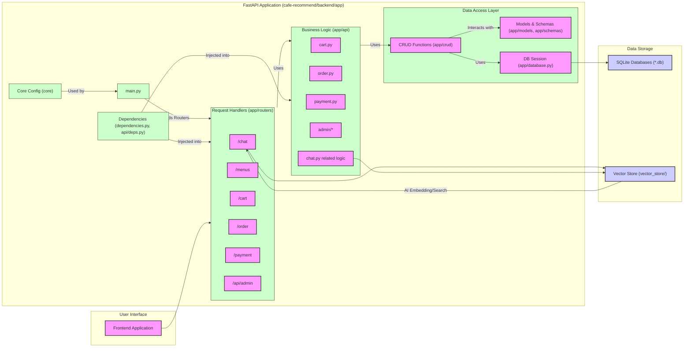

---

```mermaid
graph LR
    subgraph "User Interface"
        Client["Frontend Application"]
    end

    subgraph Backend ["FastAPI Application (cafe-recommend/backend/app)"]
        direction LR
        MainApp[main.py] -- Loads Routers --> Routers
        Routers -- Uses --> API_Logic
        API_Logic -- Uses --> CRUD_Operations
        CRUD_Operations -- Interacts with --> Models_Schemas
        CRUD_Operations -- Uses --> Database_Interface
        Dependencies["Dependencies (dependencies.py, api/deps.py)"] -- Injected into --> Routers
        Dependencies -- Injected into --> API_Logic
        Config["Core Config (core)"] -- Used by --> MainApp

        subgraph Routers ["Request Handlers (app/routers)"]
            direction TB
            ChatRouter["/chat"]
            MenuRouter["/menus"]
            CartRouter["/cart"]
            OrderRouter["/order"]
            PaymentRouter["/payment"]
            AdminRouter["/api/admin"]
             %% Hiding admin for clarity in main flow %%
        end

        subgraph API_Logic ["Business Logic (app/api)"]
            direction TB
            CartAPI["cart.py"]
            OrderAPI["order.py"]
            PaymentAPI["payment.py"]
            AdminAPI["admin/*"]:::hidden
             %% Hiding admin for clarity in main flow %%
            ChatLogic["chat.py related logic"]
        end

        subgraph Data_Access ["Data Access Layer"]
            direction TB
            CRUD_Operations["CRUD Functions (app/crud)"]
            Models_Schemas["Models & Schemas (app/models, app/schemas)"]
            Database_Interface["DB Session (app/database.py)"]
        end

    end

    subgraph "Data Storage"
        direction TB
        SQLite_DB["SQLite Databases (*.db)"]
        VectorDB["Vector Store (vector_store/)"]
    end

    Client --> Routers
    Database_Interface --> SQLite_DB
    ChatRouter --> VectorDB -- "AI Embedding/Search" --> ChatRouter
    ChatLogic --> VectorDB

    %% Styling (Optional)
    classDef default fill:#f9f,stroke:#333,stroke-width:2px;
    classDef storage fill:#ccf,stroke:#333,stroke-width:2px;
    classDef backendComponent fill:#cfc,stroke:#333,stroke-width:1px;

    class Client default;
    class SQLite_DB,VectorDB storage;
    class Routers,API_Logic,Data_Access,MainApp,Dependencies,Config backendComponent;

```