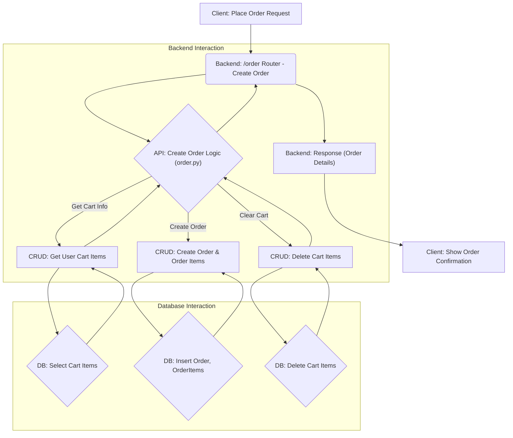

---

```mermaid
graph TD
    A["Client: Place Order Request"] --> B("Backend: /order Router - Create Order");
    B --> C{"API: Create Order Logic (order.py)"};
    C -- "Get Cart Info" --> D["CRUD: Get User Cart Items"];
    D --> E{"DB: Select Cart Items"};
    E --> D;
    D --> C;
    C -- "Create Order" --> F["CRUD: Create Order & Order Items"];
    F --> G{"DB: Insert Order, OrderItems"};
    G --> F;
    C -- "Clear Cart" --> H["CRUD: Delete Cart Items"];
    H --> I{"DB: Delete Cart Items"};
    I --> H;
    H --> C;
    C --> B;
    B --> J["Backend: Response (Order Details)"];
    J --> K["Client: Show Order Confirmation"];

    subgraph "Backend Interaction"
        B; C; D; F; H; J;
    end
    subgraph "Database Interaction"
        E; G; I;
    end
```