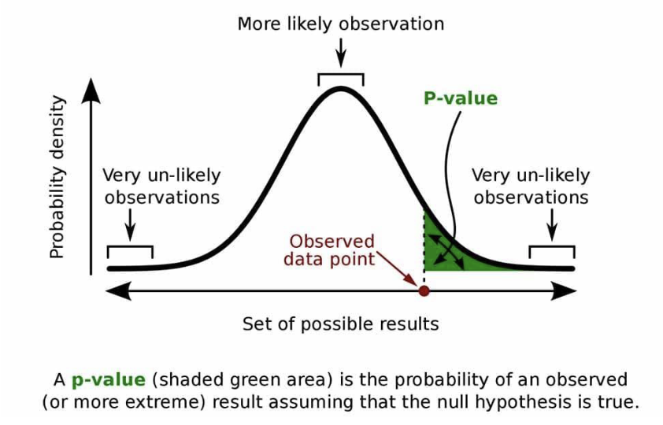

---

## 빅데이터의 주요 개념 정리

#### 1. 고차원 데이터 (High Dimensional Data)
- **정의**: 관측값(observations) 하나가 매우 많은 특성(features, 열/columns)으로 이루어진 데이터  
- **예시**: 유전자 데이터(수천~수만 개의 유전자), 이미지 데이터(픽셀 수만큼 특성)
- **특징**:  
  - 분석이 어렵고, 차원의 저주(Curse of Dimensionality) 문제가 발생할 수 있음
#### 2. 그래프(Graphs)
- **정의**: 데이터 간의 관계를 표현하는 구조
- **구성요소**:
  - **노드(Node)**: 하나의 데이터 포인트, 또는 여러 특성의 집합  
    - 예: 사람, 웹페이지, 상품 등
  - **엣지(Edge)**: 노드 간의 연결(관계, 상호작용)
    - 예: 친구 관계, 하이퍼링크, 구매 이력 등
- **활용**: 소셜 네트워크, 추천 시스템, 네트워크 분석 등
#### 3. 무한 데이터 (Infinite Data)
- **정의**: 데이터가 끝없이 생성되는 환경
- **예시**:  
  - **데이터 스트림(Data Stream)**: 실시간으로 계속 들어오는 데이터  
    - 예: 센서 데이터, 실시간 로그, 트위터 등
- **특징**:  
  - 데이터를 모두 저장하지 않고, 메모리 상에서 실시간으로 처리  
  - 저장 공간의 한계로 인해 일부만 저장하거나 요약해서 사용
#### 4. 라벨링된 데이터 (Labeled Data)
- **정의**: 각 데이터에 정답(라벨)이 붙어 있는 데이터
- **활용**:  
  - **분류(Classification)**: 입력 데이터가 어떤 카테고리에 속하는지 예측  
    - 예: 스팸 메일 분류, 이미지 속 객체 인식 등
- **비교**: 라벨이 없는 데이터는 비지도 학습(Clustering 등)에 사용

---
#### 5. 데이터 파이프라인 (Data Pipeline)
- **정의**: 데이터의 수집, 저장, 처리, 분석, 시각화 등 일련의 과정을 자동화·연결한 흐름 또는 시스템

- **주요 단계 및 흐름**:  
  - 데이터 파이프라인에서는 **인풋(입력)**과 **아웃풋(출력)**의 흐름을 데이터 처리 단계의 화살표(→)와 구분하여,  
    인풋/아웃풋은 보통 굵은 화살표(⇒) 또는 별도의 시각적 구분으로 표현합니다.  
    예시:  
    ```
    [Input 데이터] ⇒ [수집] → [저장] → [처리/정제] → [분석/모델링] → [Output 결과]
    ```
  1. **데이터 수집**  
     - 다양한 소스(센서, 로그, 웹, DB 등)에서 원천 데이터 획득  
     - 예: 크롤링, API, 실시간 스트리밍 등
  2. **데이터 저장**  
     - 수집된 데이터를 저장소에 적재  
     - 예: 데이터베이스, 데이터 웨어하우스, 데이터 레이크 등
  3. **데이터 처리 및 정제**  
     - 결측치 처리, 이상치 제거, 변환, 통합 등 데이터 품질 개선  
     - 배치 처리(일괄) 또는 스트림 처리(실시간)
  4. **특징 추출(Feature Extraction), 감성 분석(Sentiment Analysis) 등**  
     - **여러 가지 기법**이 존재하며, 데이터의 특성에 따라 다양한 방법(예: 통계적 기법, 머신러닝 기반, 딥러닝 기반 등)이 활용됨  
     - 예: 텍스트에서 키워드 추출, 이미지에서 특징점 추출, 감성 분석에서 사전 기반/딥러닝 기반 등
  5. **데이터 분석 및 모델링**  
     - 통계 분석, 머신러닝, 시각화 등 다양한 분석 기법 적용
  6. **결과 활용 및 시각화**  
     - 대시보드, 리포트, 알림 등으로 결과 전달 및 의사결정 지원

- **파이프라인의 특징**:  
  - 각 단계가 자동화되어 반복적이고 대용량 데이터 처리에 적합  
  - 확장성(Scale-out), 신뢰성(Reliability), 실시간성(Real-time) 등 요구  
  - 오픈소스 및 클라우드 기반 도구(예: Apache Airflow, Spark, Kafka, AWS Glue 등)로 구현 가능

> [!tip]  
> **데이터 파이프라인은 빅데이터 분석의 핵심 인프라**로, 데이터 흐름을 체계적으로 관리하고 분석 효율을 높여줍니다.  
> 인풋/아웃풋의 흐름과 데이터 처리 단계의 구분, 그리고 feature extraction, sentiment analysis 등 다양한 기법의 존재를 항상 염두에 두세요.

---
## 빅데이터 분석의 기초 개념 정리

### 1. 주요 용어 및 개념

### Bonferroni’s Principle (본페로니 교정)

> **여러 가설을 동시에 검정할 때, 우연히 틀린 결론(1종 오류)이 나올 확률이 높아지므로,  
> 각 검정의 기준(유의수준, $\alpha$)을 더 엄격하게 조정하는 통계적 방법**

> [!important]  
> **이 내용은 시험에 반드시 출제된다고 교수님이 강조하셨으니 꼭 숙지하세요!**

#### 🧩 본페로니 교정 예시로 쉽게 이해하기

| 상황 | 설명 |
|---|---|
| **문 개수** | 10개 |
| **비밀의 문** | 1개 |
| **각 문이 비밀의 문이 아닐 확률(오류 허용 수준, $\alpha$)** | 5% (0.05) |

- 각 문마다 "비밀의 문이 아니다"라고 잘못 판단할 확률이 5%  
- 10개 문을 각각 따로 검정하면  
  **최소 1개라도 잘못 비밀의 문으로 판정할 확률**  
  $$
  1 - (0.95)^{10} \approx 40\%
  $$
  (즉, 10번 중 한 번쯤은 우연히 틀릴 수 있다는 뜻)

#### 전체 오류 확률을 5%로 유지하려면?

- 각 문에 대한 검정 기준(유의수준, $\alpha$)을  
  $$
  \frac{0.05}{10} = 0.005
  $$
  (0.5%)로 낮춰야 함  
- 즉, 각 문마다 훨씬 더 엄격하게 "비밀의 문"이라고 판정해야  
  전체적으로 오류가 5%를 넘지 않게 됨

#### 본페로니 교정 공식 (라텍스 표기)

- 여러 번의 비교(가설 검정)를 할 때는,  
  $$
  \text{교정된 유의수준} = \frac{\alpha}{m}
  $$
  여기서 $m$은 비교(검정) 횟수입니다.

- 예시로, $\alpha = 0.05$, $m = 10$일 때:
  $$
  \frac{0.05}{10} = 0.005
  $$

- **정리:**  
  여러 가설을 동시에 검정할 때는 각 검정의 유의수준을 $\frac{\alpha}{m}$로 조정해야 전체 오류 확률을 통제할 수 있습니다.

---
### **Normalization (정규화, 예: TF-IDF)**  

  데이터의 크기나 단위가 다를 때, 비교가 가능하도록 일정한 범위로 변환하는 과정입니다.  
  - 예시: 텍스트 마이닝에서 **TF-IDF**는 단어의 빈도(TF)와 중요도(IDF)를 동시에 반영하여 정규화합니다.

#### 🧩 TF와 IDF 계산 방법 및 IDF에서 로그를 사용하는 이유

1. **불용어(stopwords) 제거**  [[1 빅데이터 분석이란 (Updated 2025).pdf#page=45|1 빅데이터 분석이란 (Updated 2025), p.45]]
   - 분석에 의미 없는 단어(예: a, the, is 등)를 먼저 제거합니다.

2. **TF(Term Frequency, 단어 빈도) 계산**  [[1 빅데이터 분석이란 (Updated 2025).pdf#page=46|1 빅데이터 분석이란 (Updated 2025), p.46]]
   - 한 문서에서 특정 단어가 얼마나 자주 등장하는지 나타내는 값입니다.
   - 공식:  
     $$
     tf(t, d) = \frac{f_{t,d}}{\sum_{t'} f_{t',d}}
     $$
     - $f_{t,d}$: 문서 $d$에서 단어 $t$의 등장 횟수
     - $\sum_{t'} f_{t',d}$: 문서 $d$에 등장한 모든 단어의 총 등장 횟수

   - 각 문서별로 단어 등장 횟수를 전체 단어 수로 나누어 **비율**로 변환합니다.

3. **IDF(Inverse Document Frequency, 역문서 빈도) 계산 및 로그 사용 이유**  [[1 빅데이터 분석이란 (Updated 2025).pdf#page=47|1 빅데이터 분석이란 (Updated 2025), p.47]]
   - 특정 단어가 전체 문서 집합에서 얼마나 희귀한지를 나타내는 값입니다.
   - 공식:  
     $$
     idf(t, D) = \log \frac{N}{n_t}
     $$
     - $N$: 전체 문서의 수
     - $n_t$: 단어 $t$가 등장한 문서의 수

   - **여기서 왜 로그를 사용할까?**
     - 만약 로그를 사용하지 않고 $\frac{N}{n_t}$만 쓴다면, 극단적으로 희귀한 단어(예: 5억 개 문서 중 1개 문서에만 등장하는 단어)는 IDF 값이 5억이 됨.  
     - 이렇게 되면 TF-IDF 값이 너무 커져서, 다른 단어들과의 중요도 차이가 지나치게 커지고, 계산상 불안정해짐.
     - **로그를 사용하면** 희귀한 단어의 중요도는 여전히 높게 평가되지만, 값이 완만하게 증가하여 전체적으로 균형 잡힌 스케일로 변환됨.
     - 예시:  
       - $N=500,000,000$, $n_t=1$일 때  
         - 로그 없이: $idf = 500,000,000$
         - 로그(밑 10) 사용: $idf = \log_{10} 500,000,000 \approx 8.7$
       - 즉, 로그를 쓰면 극단적인 값이 완화되어, 다양한 단어의 중요도를 비교할 때 훨씬 안정적이고 해석이 쉬워짐.

4. **TF-IDF 계산**  [[1 빅데이터 분석이란 (Updated 2025).pdf#page=48|1 빅데이터 분석이란 (Updated 2025), p.48]]
   - 각 단어의 TF와 IDF를 곱하여, 문서 내에서의 상대적 중요도를 산출합니다.
   - 공식:  
     $$
     \text{TF-IDF}(t, d, D) = tf(t, d) \times idf(t, D)
     $$

> [!tip]
> - **TF**는 "이 문서에서 얼마나 자주 등장하는가?"  
> - **IDF**는 "이 단어가 전체 문서에서 얼마나 희귀한가?"  
> - **TF-IDF**는 두 값을 곱해, 흔한 단어는 낮게, 특정 문서에만 자주 등장하는 단어는 높게 평가합니다.
> - **IDF에서 로그를 쓰는 이유:**  
>   - 극단적으로 희귀한 단어가 있을 때 값이 너무 커지는 것을 막고,  
>   - 단어별 중요도 차이를 완만하게 조정하여 비교와 해석이 쉽도록 해줍니다.

---

- **Power Laws (멱법칙)**  
  소수의 값이 전체에서 큰 비중을 차지하는 분포를 의미합니다.  
  - 예시: 인터넷 트래픽, 단어 빈도, 도시 인구 등에서 일부 값이 매우 크고, 나머지는 작게 분포합니다.

- **Hash functions (해시 함수)**  
  데이터를 고정된 크기의 값(해시값)으로 변환하는 함수로, 데이터 검색, 중복 제거, 분산 저장 등에 활용됩니다.

- **IO Bounded (입출력 병목, Secondary Storage)**  
  데이터 처리 속도가 저장장치(디스크 등)의 입출력 속도에 의해 제한되는 상황을 의미합니다.  
  - 대용량 데이터 분석에서 자주 발생하는 문제입니다.

- **Unstructured data (비정형 데이터)**  
  정해진 구조(테이블 등)가 없는 데이터로, 텍스트, 이미지, 동영상, 로그 등이 해당됩니다.

---

### 2. 가설 검정의 단계

- **귀무가설(Null Hypothesis, H0)**  
  "특별한 변화나 효과가 없다"는 기본 가정입니다.  
  - 예: 신약이 기존 약과 효과가 다르지 않다.

- **대립가설(Alternative Hypothesis, H1)**  
  "변화나 효과가 있다"는 주장입니다.  
  - 예: 신약이 기존 약보다 효과가 있다.

- **가설 검정 절차**  
  1. 현상이 특별하지 않고, 우연이나 기존 지식으로 설명 가능하면 귀무가설을 세웁니다.
  2. 데이터 분석 결과, 변화가 있다고 판단되면 대립가설을 채택할 수 있습니다.

---

### 3. p-value(유의확률)란?

- **정의**:  
  귀무가설이 참일 때, 실제 관측된 데이터(또는 그보다 극단적인 결과)가 나올 확률을 의미합니다.

- **해석**:  
  - p-value가 작을수록(일반적으로 0.05 미만) 귀무가설이 맞을 확률이 낮으므로, 귀무가설을 기각하고 대립가설을 채택합니다.
  - p-value가 크면 귀무가설을 기각할 근거가 부족하므로, 귀무가설을 유지합니다.

#### 시각적 이해

아래 그림은 p-value의 의미를 확률분포 곡선으로 설명합니다.



- 확률분포 곡선에서 **가운데 부분**은 평균에 가까운 값들, 즉 자주 일어나는 자연스러운 결과(일상적, 흔한 값)들이 위치합니다.
- **실제로 관찰된 데이터값(Observed data point)** 이 그림에서 오른쪽 꼬리 부분, 즉 확률적으로 드물게 일어나는 구간에 위치해 있습니다.
- **곡선 아래 초록색 영역**이 바로 p-value에 해당하며, 이는 "관측된 데이터 포인트보다 극단적인 결과가 나올 확률"을 의미합니다.
- 즉, p-value는 확률분포에서 양극단(꼬리 부분)에 해당하는 영역의 넓이로, 이런 극단적인 값이 우연히 나올 가능성을 수치로 보여줍니다.
- p-value가 작을수록(예: 0.05 미만) 이런 극단적인 결과가 우연히 발생할 가능성이 낮다는 뜻이므로, 귀무가설을 기각할 근거가 됩니다.
- 반대로 p-value가 크면, 관측된 결과가 평균 근처의 자연스러운 값일 가능성이 높으므로, 귀무가설을 유지하게 됩니다.

> **정리:**  
> p-value는 "귀무가설이 맞다고 가정할 때, 실제 관측값 이상으로 극단적인 결과가 나올 확률"을 의미합니다.  
> 그림에서 초록색 영역이 바로 이 확률에 해당하며, 이 값이 충분히 작으면 "이 현상은 우연이 아니라 실제로 의미 있는 변화가 있다"고 결론 내릴 수 있습니다.

---
---

### 4. Power Law(멱법칙)란?

- **정의:**  
  Power Law(멱법칙)는 "가장 많은 것부터 가장 적은 것까지 순서대로 정렬했을 때, 빈번하게 출몰되는 패턴"을 의미합니다.  
  즉, 어떤 현상에서 소수의 큰 값(드물게 발생)과 다수의 작은 값(자주 발생)이 동시에 나타나는 분포를 설명합니다.

- **대표 예시:**  
  - **인구밀도**: 소수의 대도시에 인구가 집중, 다수의 소도시는 인구가 적음
  - **웹페이지의 링크 수**: 소수의 인기 페이지에 많은 링크가 집중, 대부분의 페이지는 링크가 적음
  - **상품의 판매량**: 베스트셀러 소수, 대부분의 상품은 판매량이 적음
  - **단어의 출현 빈도**: 자주 쓰이는 단어는 소수, 대부분의 단어는 드물게 등장

- **수식:**  
  Power Law는 다음과 같은 수식으로 표현됩니다.
  $$
  y = C \cdot x^{-\alpha}
  $$
  - $y$: 빈도 또는 크기
  - $x$: 순위 또는 크기
  - $C$, $\alpha$: 상수

- **특징:**  
  - 인기(혹은 빈도) 기반의 통계에서 자주 등장
  - 큰 사건(값)은 드물고, 작은 사건(값)은 자주 발생
  - 자연, 사회, 인터넷 등 다양한 분야에서 관찰됨

---

#### 해시 함수(Hash Function)와 인덱스

해시 함수는 **임의 길이의 입력값(예: 문자열, 숫자 등)** 을 받아 **고정 길이의 출력값(해시값, Digest)** 을 반환하는 함수입니다.  
주로 데이터의 빠른 검색, 저장, 분류 등에 활용되며, 빅데이터 알고리즘에서 매우 중요한 역할을 합니다.

---

**1. 해시 함수의 기본 원리**

- 입력값의 각 문자에 대해 아스키 코드 값을 더한 뒤, 버킷(저장 공간)의 개수로 나눈 나머지를 해시값으로 사용합니다.

  $$
  h(\text{word}) = \left( \sum_{\text{char} \in \text{word}} \text{ascii(char)} \right) \% \#\text{buckets}
  $$

- 예시:  
  - "cat"이라는 단어의 각 문자('c', 'a', 't')의 아스키 값을 더한 후, 버킷 개수로 나눈 값을 인덱스로 사용

---

**2. 해시 함수의 특징**

- **Deterministic(결정적):** 동일한 입력 → 항상 동일한 출력
- **Uniformity(균등성):** 해시값이 가능한 한 고르게 분포 → 충돌 최소화
- **Efficiency(효율성):** 계산이 매우 빠름
- **Irreversibility(비가역성):** 해시값만으로 원래 입력을 복원 불가

---

**3. 해시 테이블과 빅데이터**

- 해시 테이블(예: 파이썬의 dict, set)은 해시 함수를 이용해 데이터를 저장/검색하므로,  
  **O(1) 시간 복잡도**로 매우 빠른 조회가 가능합니다.
- 대용량 데이터 처리에서 해시 기반 자료구조는 필수적입니다.

> **참고:**  
> 해시 테이블을 활용하는 자료구조(딕셔너리, 집합 등)는 빅데이터 알고리즘의 강력한 도구입니다.  
> 필요하다면 해시 테이블의 동작 원리와 구현 방법을 추가로 복습하세요.

---

#### 원-핫 인코딩(One-Hot Encoding)

**원-핫 인코딩**은 범주형(카테고리형) 데이터를 컴퓨터가 이해할 수 있도록 0과 1로 이루어진 벡터로 변환하는 대표적인 방법입니다.

- **정의:**  
  - 각 범주(category)를 고유한 정수로 매핑한 뒤, 해당 위치만 1이고 나머지는 모두 0인 벡터로 표현
- **예시:**  
  - 예를 들어, 색상 데이터가 ["red", "green", "blue"] 세 가지라면  
    - "red"   → [1, 0, 0]
    - "green" → [0, 1, 0]
    - "blue"  → [0, 0, 1]
- **특징:**  
  - 범주 간의 **서열(순서) 정보가 없음** (즉, "red"가 "green"보다 크거나 작지 않음)
  - 각 범주는 서로 완전히 독립적임을 표현
  - 머신러닝/딥러닝에서 범주형 데이터를 수치형으로 변환할 때 널리 사용

- **장점:**  
  - 범주형 데이터를 수치형으로 변환하여 모델에 바로 입력 가능
  - 범주 간 불필요한 순서/크기 정보를 주지 않음

- **단점:**  
  - 범주 개수가 많아질수록 벡터가 매우 커짐(차원의 저주)
  - 희소(sparse)한 데이터가 됨

~~~python
from sklearn.preprocessing import OneHotEncoder
import numpy as np
colors = np.array(["Red", "Green", "Blue", "Red"]).reshape(-1, 1)
encoder = OneHotEncoder(sparse=False)
one_hot = encoder.fit_transform(colors)
# fit: 데이터의 고유한 카테고리 추출
# transform: 카테고리를 one-hot 벡터로 변환
print("Categories:", encoder.categories_)
# 출력: Categories: [array(['Blue', 'Green', 'Red'], dtype=object)]
print("One-hot encoded:\n", one_hot)
# 출력:
# One-hot encoded:
# [[0. 0. 1.]
#  [0. 1. 0.]
#  [1. 0. 0.]
#  [0. 0. 1.]]
~~~

---
