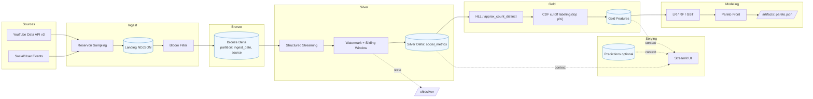

# 아키텍처 다이어그램

## 소셜 비디오 빅데이터 실시간 처리 플랫폼 아키텍처

## 다이어그램 설명

이 아키텍처는 다음과 같은 단계로 구성됩니다:

1. **Sources**: YouTube Data API v3와 소셜/사용자 이벤트 데이터 수집
2. **Ingest**: Reservoir Sampling과 Bloom Filter를 통한 데이터 수집 및 중복 제거
3. **Bronze**: 원시 데이터 저장 (Delta Lake, 파티션: ingest_date, source)
4. **Silver**: Structured Streaming과 Watermark를 통한 실시간 처리
5. **Gold**: HLL과 CDF를 통한 피처 엔지니어링 및 라벨링
6. **Modeling**: 다중 모델 학습 및 Pareto Front 최적화
7. **Serving**: Streamlit UI를 통한 결과 제공
