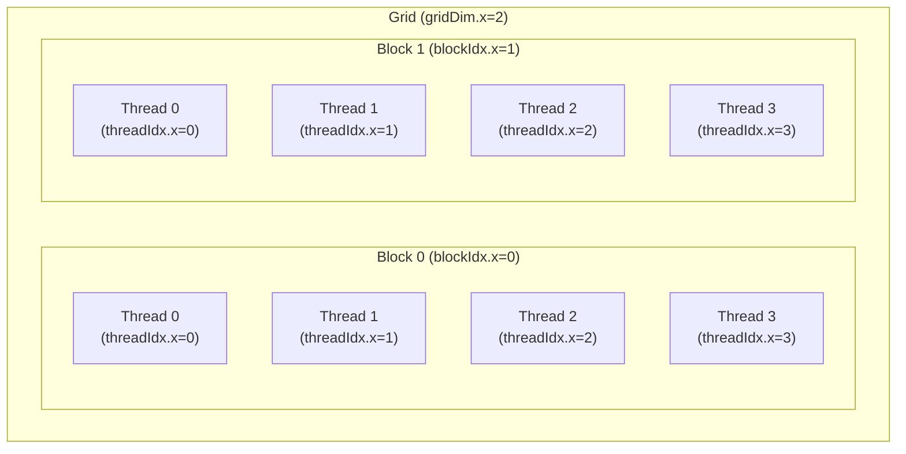

---
#### STMD 
>트랜지스터를 사용하여 단일 명령어 스트림을 가속하는 프로 세서 로직의 정교함을 높이는 대신. (예: out-of-order and speculative operations(추측연산)) 트랜지스터 수를 늘려 프로세서에 더 많은 코어를 추가.


`Idea #1:`
- 트랜지스터 증가 활용
- 단순화된 코어 설계
	>각 코어는 개별적으로 더 복잡한 작업을 처리하는 데 약간 느릴 수 있지만, 병렬 실행을 통해 전체 성능이 향상
- 병렬 프로그래밍의 중요성
	>프로세스가 병렬 실행을 지원하지 않으면 멀티코어 프로세서의 잠재적 이점을 충분히 활용할 수 있음

#### SIMD

`Idea #2:`
- 여러 ALU에서 명령어 스트림을 관리하는 데 드는 비용/복잡성 완화
- SIMD processing
	>이 방식은 **대량의 데이터셋**에서 **동일한 연산을 반복적**으로 수행해야 하는 작업에 매우 효과적 (예: 배열 연산, 그래픽 처리 등)
	- 모든 ALU에 동일한 명령어 브로드캐스팅 
	- 이 연산은 모든 ALU에서 병렬로 실행

#### Parallelism의 종류

- `ILP: 명령어 레벨 병렬화`
	- instruction들 끼리 독립적이다.
	- 하드웨어는 instruction window size 내에서 implicit하게 찾을 수 있다.
	- 컴파일러들은 window 내에 있는 명령어들이 독립할 수 있도록 찾아서 순서를 바꾼다. 독립적인 순서로 재배열 한 후 실행하는 방식이다.
- `TLP: 스레드 레벨 병렬화`
	- 컴파일러가 프로그램을 명시적으로 나뉜다.
- `DLP: 데이터 레벨 병렬화`
	- TLP의 variation 중 하나로, 같은 instruction을 실행하는 여러 개의 스레드가 다른 데이터에 대해 동작하는 방식이다.

>[!하드웨어가 병렬화하는 방법]
>![[02_기본아키텍츠_update.pdf#page=39&rect=34,71,888,475&color=red|02_기본아키텍츠_update, p.39]]

> [!PDF|yellow] [[02_기본아키텍츠_update.pdf#page=43&selection=0,0,7,1&color=yellow|02_기본아키텍츠_update, p.43]]
> > 조건부 실행은 어떻게 되나요?
> 
> ![[02_기본아키텍츠_update.pdf#page=43&rect=155,38,569,331&color=yellow|02_기본아키텍츠_update, p.43]]
> ![[02_기본아키텍츠_update.pdf#page=45&rect=0,15,740,455&color=yellow|02_기본아키텍츠_update, p.45]]

>[!important] 핵심 용어
>Memory bandwidth(메모리 대역폭)
>- 메모리 시스템이 프로세서에 데이터를 제공할 수 있는 속도

> [!PDF|red] [[03_multicore2-ispc_update.pdf#page=20&selection=8,0,14,2&color=red|03_multicore2-ispc_update, p.20]]
> > 메모리 대역폭에 의해 제한
> 
> ![[03_multicore2-ispc_update.pdf#page=20&rect=529,91,957,431&color=red|03_multicore2-ispc_update, p.20]]

> [!PDF|important] [[03_multicore2-ispc_update.pdf#page=24&selection=38,0,72,5&color=important|03_multicore2-ispc_update, p.24]]
> > 대역폭 한계를 극복하는 것은 최신 처리량 최적화 시스템 을 목표로 하 는 소프트웨어 개발자가 직면한 가장 중요한 과제입니다
> 
> ![[03_multicore2-ispc_update.pdf#page=25&rect=7,236,624,473&color=important|03_multicore2-ispc_update, p.25]]

> [!PDF|yellow] [[03_multicore2-ispc_update.pdf#page=29&selection=191,0,199,3&color=yellow|03_multicore2-ispc_update, p.29]]
> > 추상화 와 구현 의 차이점
> 
> ![[03_multicore2-ispc_update.pdf#page=29&rect=22,374,950,431&color=yellow|03_multicore2-ispc_update, p.29]]
> ![[03_multicore2-ispc_update.pdf#page=29&rect=13,68,855,348&color=yellow|03_multicore2-ispc_update, p.29]]
> ![[03_multicore2-ispc_update.pdf#page=30&rect=35,146,914,472&color=yellow|03_multicore2-ispc_update, p.30]]

> [!PDF|red] [[03_multicore2-ispc_update.pdf#page=34&selection=51,0,53,2&color=red|03_multicore2-ispc_update, p.34]]
> > 최적화 전략
> 
> ![[03_multicore2-ispc_update.pdf#page=34&rect=19,269,747,466&color=red|03_multicore2-ispc_update, p.34]]
> ![[03_multicore2-ispc_update.pdf#page=34&rect=20,157,746,268&color=red|03_multicore2-ispc_update, p.34]]
> ![[03_multicore2-ispc_update.pdf#page=35&rect=32,238,719,477&color=red|03_multicore2-ispc_update, p.35]]
> ![[03_multicore2-ispc_update.pdf#page=35&rect=70,56,908,160&color=red|03_multicore2-ispc_update, p.35]]

> [!PDF|important] [[03_multicore2-ispc_update.pdf#page=36&selection=0,1,2,4&color=important|03_multicore2-ispc_update, p.36]]
> >  ISPC 란 무엇인가
>>- ISPC (Intel SPMD Program Compiler) 는 Intel이 개발한 병렬 프로그래밍을 위한 컴파일 러. 
>>- SPMD (Single Program, Multiple Data) 모델을 기반으로 하며, CPU의 SIMD(Vector) 명령어 를 자동으로 활용할 수 있도록 설계됨 
>>- ISPC를 사용하면 CPU에서 벡터화(SIMD) 및 병렬 실행을 쉽게 활용할 수 있음. 즉, C/C++ 코드보다 더 높은 성능을 자동으로 달성할 수 있음. 
>>
> ![[03_multicore2-ispc_update.pdf#page=36&rect=54,37,638,260&color=important|03_multicore2-ispc_update, p.36]]

> [!PDF|yellow] [[03_multicore2-강의자료업데이트_0415.pdf#page=42&selection=0,0,0,12&color=yellow|03_multicore2-강의자료업데이트_0415, p.42]]
> > What is ISPC
> 
> - 벡터 코드 작성을 위한 컴파일러 및 언어 
> - C 기반 언어 
> - 사용이 간편하고 기존 코드에 통합 가능 
> - **It is not** a **Auto-Vectorizing** compiler 
> 	-  벡터는 타입 시스템에서 명시적으로 선언 
> 	-  개발자가 스칼라와 벡터를 명시적으로 선언

> [!PDF|red] [[03_multicore2-강의자료업데이트_0415.pdf#page=43&selection=0,1,6,4&color=red|03_multicore2-강의자료업데이트_0415, p.43]]
> > ISPC(SIMD) 의 기본 원리 이해하기
> 
> - SIMD의 핵심 아이디어는 단순. 
> - 하나의 명령어(**같은 명령어**)로 여러 개의 데이터를 동시에 처리하는 것. 
> - 이는 전통적인 스칼라 처리 방식과는 다름.
>```
>스칼라 vs SIMD 처리 비교: 
>• 스칼라 처리: (한 번에 하나의 연산)
>	A + B = C  
>• SIMD 처리: (한 번에 여러 연산)
>	[A1, A2, A3, A4] + [B1, B2, B3, B4] = [C1, C2, C3, C4] 
>```
>![[03_multicore2-강의자료업데이트_0415.pdf#page=44&rect=16,369,793,466&color=red|03_multicore2-강의자료업데이트_0415, p.44]]
>![[03_multicore2-강의자료업데이트_0415.pdf#page=44&rect=16,65,685,343&color=red|03_multicore2-강의자료업데이트_0415, p.44]]

> [!PDF|important] [[03_multicore2-강의자료업데이트_0415.pdf#page=45&selection=0,1,6,2&color=important|03_multicore2-강의자료업데이트_0415, p.45]]
> > C 언어에서의 ISPC(SIMD) 구현
> 
> ![[03_multicore2-강의자료업데이트_0415.pdf#page=45&rect=14,184,866,472&color=important|03_multicore2-강의자료업데이트_0415, p.45]]
> ![[03_multicore2-강의자료업데이트_0415.pdf#page=47&rect=3,257,780,483&color=important|03_multicore2-강의자료업데이트_0415, p.47]]
> ![[03_multicore2-강의자료업데이트_0415.pdf#page=47&rect=178,13,664,250&color=important|03_multicore2-강의자료업데이트_0415, p.47]]

> [!PDF|red] [[03_multicore2-강의자료업데이트_0415.pdf#page=58&selection=0,0,0,1&color=red|03_multicore2-강의자료업데이트_0415, p.58]]
> > SIMD 프로그래밍의 도전과 해결 전략
> 
> ![[03_multicore2-강의자료업데이트_0415.pdf#page=58&rect=16,377,498,487&color=red|03_multicore2-강의자료업데이트_0415, p.58]]
> ![[03_multicore2-강의자료업데이트_0415.pdf#page=59&rect=16,382,551,486&color=red|03_multicore2-강의자료업데이트_0415, p.59]]
> ![[03_multicore2-강의자료업데이트_0415.pdf#page=60&rect=14,289,539,485&color=red|03_multicore2-강의자료업데이트_0415, p.60]]
> ![[03_multicore2-ispc_update.pdf#page=62&rect=17,277,778,485|03_multicore2-ispc_update, p.62]]
> ![[03_multicore2-ispc_update.pdf#page=63&rect=16,276,640,491|03_multicore2-ispc_update, p.63]]

> [!PDF|yellow] [[03_multicore2-ispc_update.pdf#page=64&selection=0,0,6,2&color=yellow|03_multicore2-ispc_update, p.64]]
> >SIMD 프로그래밍의 미래와 발전 방향
> 
> 1. 더 넓은 SIMD 레지스터
> > SIMD 레지스터의 폭은 계속 넓어지고 있습니다.
> 
> 2. 더 유연한 SIMD 연산
> >최신 SIMD 명령어 세트는 더 복잡하고 유연한 연산을 지원합니다.
> 
> 3. AI 및 머신 러닝을 위한 특화된 SIMD 명령어
> >AI와 머신 러닝의 중요성이 커짐에 따라 이를 위한 특화된 SIMD 명령어들이 등장하고 있습니다
> 
> 4. 이기종 컴퓨팅과의 통합
> >SIMD는 CPU에서의 병렬 처리를 담당하지만, GPU, FPGA, 전용 AI 가속기 등 다양한 이기종 컴퓨팅 환경과의 통합이 중요해지고 있습니다.
> 
> 5. 자동 벡터화의 개선
> >컴파일러의 자동 벡터화 기능이 계속해서 개선되고 있습니다.
> 
> 6. 에너지 효율성 향상
> >에너지 효율성이 더욱 중요해지고 있습니다.


로드발런스 : 일을 균등하게 주는거

함수내에 선언된 변수는 각 인스턴스마다 분리되어 데이터 충돌을 방지

### CUDA에서 하드웨어와 논리의 매핑

CUDA는 NVIDIA의 GPU에서 대규모 병렬 처리를 지원하는 플랫폼입니다. 하드웨어와 논리 구조의 매핑은 다음과 같습니다.

#### 1. 하드웨어 구조
- **Device**: GPU 전체
- **SM(Streaming Multiprocessor)**: 여러 개의 CUDA Core(연산 유닛)를 포함하는 하드웨어 블록
- **CUDA Core**: 실제 연산을 수행하는 가장 작은 단위

#### 2. 논리 구조
- **Grid**: 하나의 커널 함수 실행 시 생성되는 전체 스레드 집합
- **Block**: Grid를 구성하는 작은 스레드 그룹. 각 Block은 독립적으로 실행됨
- **Thread**: Block을 구성하는 가장 작은 실행 단위

#### 3. 매핑 관계
- **Grid → Device**: Grid 전체가 GPU(Device)에서 실행됨
- **Block → SM**: 각 Block은 하나의 SM에 할당되어 실행됨. 여러 Block이 하나의 SM에서 순차적으로 실행될 수도 있음
- **Thread → CUDA Core**: Block 내의 Thread들은 SM 내의 CUDA Core에서 병렬로 실행됨. Block 내 Thread 수가 SM의 Core 수보다 많으면 여러 번에 나누어 실행됨(스케줄링)

#### 4. 예시
- 1개의 Grid에 100개의 Block, 각 Block에 256개의 Thread가 있다면:
    - 100개의 Block이 여러 SM에 분배됨
    - 각 Block의 256개 Thread가 SM 내 CUDA Core에서 병렬로 실행됨

#### 5. 정리
- 논리적 구조(Grid, Block, Thread)는 하드웨어 구조(Device, SM, Core)에 매핑되어 실행됨
- Block/Thread 수가 하드웨어 자원보다 많으면, 스케줄링을 통해 순차적으로 실행됨

### CUDA에서 커널 함수 호출 시 블록수와 스레드수를 지정하는 목적

CUDA에서 커널 함수를 호출할 때 `<<<블록수, 스레드수>>>`와 같이 블록과 스레드의 개수를 지정하는 이유는, 전체 데이터를 처리할 논리적 스레드와 실제 하드웨어 자원(SM, CUDA Core) 간의 **정확한 매핑**을 위해서입니다.

- 커널 함수가 호출되면, 지정한 블록수 × 스레드수 만큼의 스레드가 생성되어 병렬로 실행됩니다.
- 각 스레드는 자신의 고유 인덱스(`blockIdx.x`, `threadIdx.x` 등)를 사용해 자신이 처리할 데이터를 결정합니다.
- 예를 들어, 1000개의 데이터를 처리할 때 `<<<10, 100>>>`로 호출하면 10개의 Block, 각 Block에 100개의 Thread가 생성되어 총 1000개의 스레드가 각각 하나의 데이터를 담당하게 됩니다.
- 이렇게 하면 데이터와 스레드가 1:1로 정확히 매핑되어, 병렬 처리가 효율적으로 이루어집니다.
- 하드웨어 자원(SM, CUDA Core) 상황에 따라 스케줄링되어 실행되지만, 논리적으로는 각 데이터 조각에 정확히 하나의 스레드가 할당되는 구조입니다.

즉, 블록수와 스레드수를 지정하는 목적은 **전체 연산을 병렬로 나누고, 각 스레드가 정확히 하나의 데이터 조각을 처리하도록 논리적-물리적 매핑을 명확히 하기 위함**입니다.

### CUDA에서 인덱싱을 사용하는 이유

CUDA에서 각 스레드는 `blockIdx`, `threadIdx`와 같은 인덱스를 사용합니다. 그 이유는 **각 스레드가 자신이 맡은 일을 구분하여, 전체 작업을 효율적으로 나누어 처리하기 위해서**입니다.

- 인덱싱을 통해 각 스레드는 자신이 처리해야 할 데이터의 위치(예: 배열의 인덱스)를 계산할 수 있습니다.
- 이를 통해 중복 없이, 빠짐없이 모든 데이터에 대해 병렬 처리가 가능합니다.
- 즉, 인덱싱은 일을 구분해서 각 스레드에 정확히 할당해주는 역할을 합니다.

### CUDA의 gridDim, blockIdx, blockDim, threadIdx 시각적 구조

아래 다이어그램은 CUDA에서 gridDim, blockIdx, blockDim, threadIdx의 관계를 시각적으로 표현한 예시입니다.



- **Grid**: 전체 연산 공간 (여기서는 gridDim.x=2, 즉 Block이 2개)
- **Block**: 각 Block은 blockIdx.x로 구분 (0, 1)
- **BlockDim**: 각 Block 안에 포함된 Thread의 개수 (여기서는 blockDim.x=4)
- **Thread**: 각 Block 안에 threadIdx.x로 구분되는 Thread가 존재 (0~3)

이 구조를 통해 각 스레드가 자신의 인덱스를 이용해 일을 나누어 처리하게 됩니다.

### CUDA 프로그래밍의 함수 구조와 흐름

```cpp
#include <stdio.h>
__device__ void device_strcpy(char *dst, const char *src) {
    while (*dst++ = *src++);
}
__global__ void kernel(char *A) {
    device_strcpy(A, "Hello, World!");
}
int main() {
   char *d_hello;
   char hello[32];
   cudaMalloc((void**)&d_hello, 32);
   kernel<<<1,1>>>(d_hello);
   cudaMemcpy(hello, d_hello, 32, cudaMemcpyDeviceToHost);
   cudaFree(d_hello);
   puts(hello);
}
```

- CUDA 프로그래밍은 기본적으로 C처럼 **모듈(함수) 단위**로 작성된다.
- `main()`에서 변수 선언, 메모리 할당, 커널 함수 호출 등 전체 흐름을 제어한다.
- 커널 함수는 `__global__`로 선언하며, **호스트(Host, CPU)에서 호출**할 수 있고, GPU에서 병렬로 실행된다.
- 커널 함수가 호출되는 순간, 지정한 블록수와 스레드수만큼 논리적 스레드가 생성되어 각 코어에서 병렬로 실행된다.
- 커널 함수 내부에는 실제 연산(컨텍스트)이 들어가며, 이 안에서 디바이스 함수를 호출할 수 있다.
- 디바이스 함수는 `__device__`로 선언하며, **커널 함수나 다른 디바이스 함수에서만 호출**할 수 있다. 호스트 코드(main 등)에서는 직접 호출할 수 없다.
- 커널 함수와 디바이스 함수의 구분은 다음과 같다:
    - `__global__` : 커널 함수, Host에서 호출, Device에서 실행
    - `__device__` : 디바이스 함수, Device에서만 호출 및 실행

#### 실행 흐름 요약
1. **메인 함수(main)**
    - GPU 메모리 할당 (`cudaMalloc`)
    - 커널 함수 호출 (`kernel<<<1,1>>>(d_hello)`)
    - 결과 복사 (`cudaMemcpy`)
    - 메모리 해제 (`cudaFree`)
2. **커널 함수**
    - 실제 연산(여기서는 문자열 복사)을 수행
    - 필요시 디바이스 함수 호출

#### 컨텍스트(Context)
- 커널 함수 내부에서 실행되는 코드(연산 내용)가 바로 **컨텍스트**이다.
- 각 스레드는 자신만의 컨텍스트(실행 환경)에서 독립적으로 연산을 수행한다.

