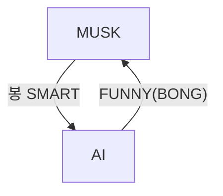
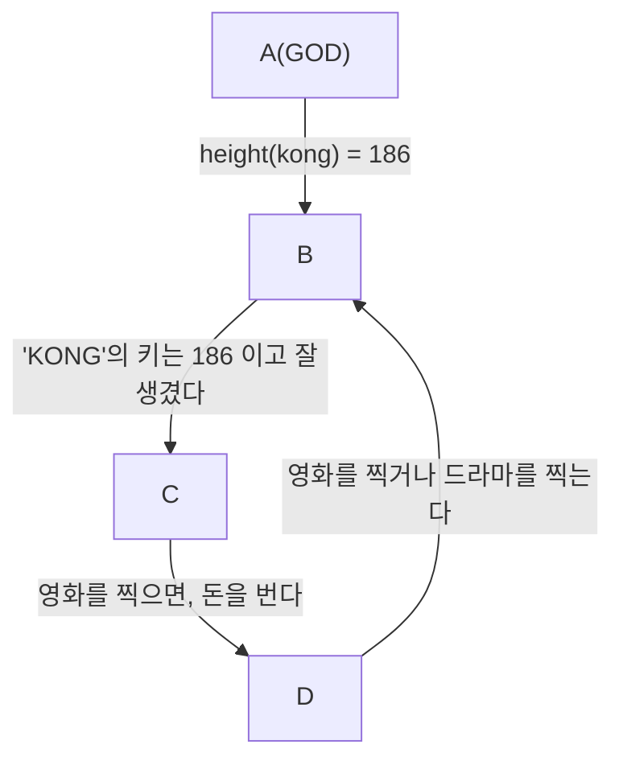
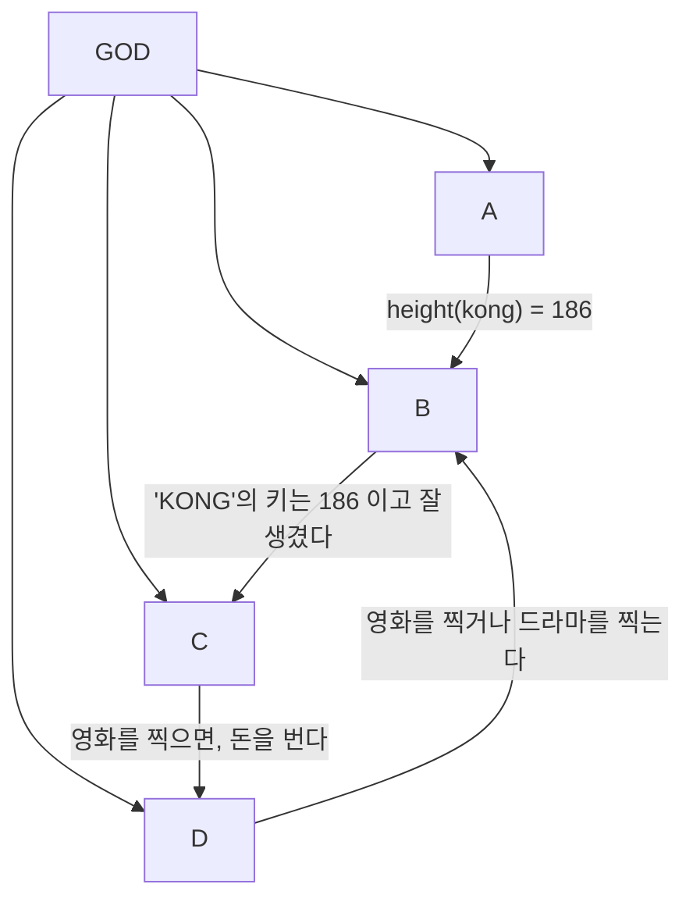

---
#### 지식 구현
: MJ의 키는 180이다.
1. 국어로 표현 : MJ의 키는 180이다.
2. 영어로 표현 : the height of MJ is 180
3. 함수사용 : Height(MJ) = 180
4. 관계 (relation) : Height(MJ, 180)

>[!3 더하기 4는 7이다.]
>Plus(3, 4, 7)

>[!정우성 친구는 이정재이다.]
> Friend(정우성, 이정재)

---
#### 지식의 복잡도
: MJ은 가수이다. → 지식의 크기는 1
: MJ은 가수이고, Prince도 가수이다. → 지식의 크기는 2
: MJ는 가수이거나, 이정재가 가수이다. → 지식의 크기는 2
: 동아대 컴공에는 대머리가 있다. → 지식의 크기는 컴공 학생 수

---
>[!연습문제 1]
>MJ의 아버지는 MJ senior이다.
>- **국어 표현**: MJ의 아버지는 MJ senior이다.
>- **영어 표현**: The father of MJ is MJ senior.
>- **함수 사용**: Father(MJ) = MJ_senior
>- **관계 표현**: Father(MJ, MJ_senior)
>- **지식의 크기**: 1

>[!연습문제 2]
>봉준호는 웃기면서 지적이다.
>- **국어 표현**: 봉준호는 웃기면서 지적이다.
>- **영어 표현**: Bong  is funny and intelligent.
>- **함수와 논리 기호로 표현**:
>    - Funny(Bong) ∧ Intelligent(Bong)
>    - (봉준호는 웃기다) ∧ (봉준호는 지적이다)
>- **지식의 크기** : 2

---
#### 복잡한 지식의 표현
: AND, OR, IMPLY, NOT 사용
- **AND** (논리곱) → ∧
- **OR** (논리합) → ∨
- **IMPLY** (함의) → ⇒
- **NOT** (부정) → ¬

**예시**
- 봉은 SMART하고 FUNNY하다.
	- SMART(BONG) ∧ FUNNY(BONG)
- N이 홀수이면, N X N은 홀수이다. 
	- ODD(N) ⇒ ODD(N X N)
- 봉은 SMART하지만, FUNNY는 아니다.
	- SMART(BONG) ∧ ¬ FUNNY(BONG)
- 봉은 SMART하거나, FUNNY하다
	- SMART(BONG) ∨ FUNNT(BONG)

```C
STARBUCKS:
	CASHIER
		COFFEE: // CASHIER에게 커피를 만들어 달라고 요구
		COFFEE ∧ CAPPUCCINO: // 커피 한 잔 카푸치노 한 잔
		COFFEE ∨ CAPPUCCINO: // TOO EASY
		
		// 조건문 (x) -> 교환문
		COFFEE ⇒ CAPPUCCINO: // 내가 커피를 주면, CASHIER는 카푸치노를 준다.
		¬ COFFEE: // 커피를 만들어 CASHIER에게 준다.
				  // 나는 CASHIER가 커피를 만드는 것을 막을 수 있다.
```

- 봉은 SMART하지만, FUNNY는 아니다.
	- SMART(BONG) ∧ ¬ FUNNY(BONG)


- AI는 MUSK가 FUNNY(BONG) 못하게 막을 수 있다.

- MJ의 키는 180이다.
	- 나는 MJ의 키를 180으로 만들 수 있다.
	- 나는 어떤 역경에도 MJ의 키를 180으로 만들 수 있다.

- ¬ FUNNY(BONG)
	- 나는 FUNNY(BONG)이 성립하는 것을 막을 수 있다.
	- 나는 어떤 역경에도 FUNNY(BONG)이 성립하는 것을 막을 수 있다.

- ¬ COFFEE:
	- 나는 CASHIER가 커피를 만드는 것을 막을 수 있다.

---
#### AGI: 일반인공지능

>AGI의 핵심개념: 승자, 패자

```c
Starbucks:
	cashier
	coffee: //성공
	customer
```

---
#### 지식 흐름도



---
### **개선된 지식 흐름도**



---
#### 논리적 귀결

```
A : 소크라테스는 사람이다.
	사람은 죽는다.
B : 소는 죽는다.
C : 소크라테스는 남자이다.

→ B는 A의 논리적 귀결이다.
→ C는 A의 논리적 귀결이 아니다.
```

>[!note] 논리적 귀결
>1. p and q ⇒ q (참)
>2. p ⇒ p and q (거짓)
>3. p ⇒ p or q (참)
>>[!example] p ⇒ p or q (참)
>>Benz, Porche or Matiz
>4. p or q ⇒ p (거짓)
>5. p ⇒ ~p (거짓)
>6. p ⇒ \~~p (참)
>7. p → q ⇒ q → p (거짓)
>8. p and (p → q) ⇒ q (참)
>9. True ⇒ p (거짓)
>10. False ⇒ p (참)
>11. p or ~p ⇒ q (거짓)
>>[!example] p or ~p ⇒ q (거짓)
>>True ⇒ p (거짓)
>12. p and ~p ⇒ q (참)
>>[!example] p and ~p ⇒ q (참)
>>False ⇒ p (참)

>[!example] 논리적 귀결 예제
>1. 이모에게 A는 B의 논리적 귀결이 무엇인지 설명하기 (최대한 쉬운 단어로 수학적 단어 사용 금지)
>>[!important] 풀이
>>논리적 귀결이란 어떤 말(주장)이 참이라면, 그 말에서 반드시 따라오는 또 다른 말도 `항상` 참이어야 한다는 뜻이에요.
>2. p → q ⇒ ~p or q 가 논리적 귀결인지 아닌지 설명하기
>>[!important] 풀이
>>
>>만약 `p일 때 q 이다. `
>>`~p일때 ~q도 q 여도 상관없음`
>>그래서 `~p 이거나 q이다 항상 참`이 됨 
>>
>>즉, 처음 한 말이 참이면, 두 번째 말도 항상 참이 되니까 **논리적 귀결이 맞아요!**

