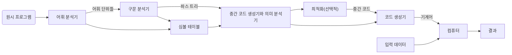

---
# 1. 프로그래밍 언어론 기본사항

> [!important] 핵심 개념
> - 프로그래밍 언어의 정의와 목적
> - 프로그래밍 언어의 분류
> - 프로그래밍 언어의 평가 기준
> - 프로그래밍 언어의 설계 원칙

## 1. 프로그래밍 언어의 정의
### 1.1 정의
- **프로그래밍 언어**: 컴퓨터와 인간 간의 의사소통을 위한 인공 언어
- **목적**: 
  - 알고리즘을 표현
  - 프로그램을 작성
  - 컴퓨터와의 상호작용

> [!note] 프로그래밍 언어의 중요성
> 프로그래밍 언어는 소프트웨어 개발의 기초이며, 문제 해결을 위한 도구입니다. 
> 인간의 사고방식을 컴퓨터가 이해할 수 있는 형태로 변환하는 매개체 역할을 합니다.

### 1.2 프로그래밍 언어의 필요성
1. **의사소통 도구**
   - 인간과 컴퓨터 간의 의사소통
     - 인간의 명령을 컴퓨터가 이해할 수 있는 형태로 변환
     - 컴퓨터의 결과를 인간이 이해할 수 있는 형태로 표현
   - 프로그래머 간의 의사소통
     - 코드를 통한 의도 전달
     - 협업을 위한 표준화된 의사소통 수단

2. **문제 해결 도구**
   - 알고리즘 표현
     - 복잡한 문제를 단계별로 분해
     - 논리적 순서로 명령을 구성
   - 프로그램 작성
     - 문제 해결을 위한 구체적인 구현
     - 재사용 가능한 코드 작성

2. **추상화 도구**
   - 복잡한 문제 단순화
     - 하드웨어의 복잡성을 추상화
     - 문제의 핵심에 집중할 수 있게 함
   - 개념적 모델링
     - 실제 세계의 문제를 프로그램으로 모델링
     - 객체와 관계를 표현

## 2. 프로그래밍 언어의 분류
### 2.1 명령형 언어(Imperative Languages)
- **특징**:
  - 순차적 실행
    - 명령어가 순서대로 실행됨
    - 프로그램의 흐름을 명시적으로 제어
  - 상태 변경
    - 변수의 값을 변경하여 상태 관리
    - 부작용(side effect) 발생 가능
  - 변수 사용
    - 데이터 저장을 위한 변수 활용
    - 메모리 관리의 필요성

- **대표 언어**:
  - FORTRAN: 과학 계산용
  - COBOL: 비즈니스 처리용
  - BASIC: 교육용
  - C: 시스템 프로그래밍
  - Pascal: 교육용
  - Ada: 임베디드 시스템

> [!example] 명령형 언어 예시
> ```c
> int sum = 0;
> for(int i = 0; i < 10; i++) {
>     sum += i;
> }
> ```
> 이 예시는 명령형 언어의 특징을 잘 보여줍니다:
> - 변수 사용 (sum, i)
> - 순차적 실행 (for 루프)
> - 상태 변경 (sum += i)

### 2.2 함수형 언어(Functional Languages)
- **특징**:
  - 수학적 함수 개념
    - 입력과 출력의 관계를 표현
    - 동일한 입력에 대해 항상 동일한 출력
  - 부작용 없음
    - 상태 변경이 없음
    - 함수의 순수성 보장
  - 재귀적 구조
    - 문제를 작은 단위로 분해
    - 자기 참조를 통한 문제 해결

- **대표 언어**:
  - LISP: 인공지능 분야
  - ML: 타입 추론
  - Haskell: 순수 함수형
  - Scheme: 교육용

> [!example] 함수형 언어 예시
> ```haskell
> sum [1..10]  -- 1부터 10까지의 합
> ```
> 이 예시는 함수형 언어의 특징을 보여줍니다:
> - 순수 함수 사용
> - 부작용 없음
> - 선언적 표현

### 2.3 논리형 언어(Logic Languages)
- **특징**:
  - 논리적 추론
    - 사실과 규칙을 기반으로 추론
    - 목표 지향적 프로그래밍
  - 선언적 프로그래밍
    - 어떻게(how)가 아닌 무엇을(what)에 집중
    - 문제의 선언적 표현
  - 패턴 매칭
    - 데이터 구조와 패턴 매칭
    - 규칙 기반 처리

- **대표 언어**:
  - Prolog: 인공지능, 전문가 시스템


> [!example] 논리형 언어 예시
> ```prolog
> member(X, [X|_]).  -- X는 리스트의 첫 번째 요소
> member(X, [_|T]) :- member(X, T).  -- X는 리스트의 나머지 요소 중 하나
> ```
> 이 예시는 논리형 언어의 특징을 보여줍니다:
> - 논리적 규칙 정의
> - 패턴 매칭
> - 재귀적 정의

### 2.4 객체지향 언어(Object-Oriented Languages)
- **특징**:
  - 캡슐화
    - 데이터와 메서드를 하나의 단위로 묶음
    - 정보 은닉
  - 상속
    - 기존 클래스의 특성을 재사용
    - 계층적 구조
  - 다형성
    - 하나의 인터페이스로 여러 구현
    - 유연한 확장성

- **대표 언어**:
  - Smalltalk: 순수 객체지향
  - C++: 다중 패러다임
  - Java: 플랫폼 독립성
  - Python: 간결한 문법

> [!example] 객체지향 언어 예시
> ```java
> class Person {
>     private String name;
>     public void setName(String name) {
>         this.name = name;
>     }
> }
> ```
> 이 예시는 객체지향 언어의 특징을 보여줍니다:
> - 캡슐화 (private 필드)
> - 메서드를 통한 상태 변경
> - 클래스 기반 구조

## 3. 프로그래밍 언어의 평가 기준
### 3.1 가독성(Readability)
- **요소**:
  - 단순성
    - 복잡한 개념의 단순화
    - 직관적인 문법
  - 직관성
    - 자연스러운 표현
    - 예측 가능한 동작
  - 일관성
    - 일관된 문법 규칙
    - 일관된 코딩 스타일
  - 주석과 문서화
    - 코드의 의도 설명
    - 사용 방법 안내

> [!tip] 가독성 향상 방법
> - 명확한 변수명 사용
> - 적절한 들여쓰기
> - 일관된 코딩 스타일
> - 충분한 주석 추가

### 3.2 작성 용이성(Writability)
- **요소**:
  - 추상화
    - 복잡한 개념의 단순화
    - 재사용 가능한 구성요소
  - 표현력
    - 다양한 프로그래밍 패턴 지원
    - 풍부한 라이브러리
  - 유연성
    - 다양한 해결 방법 제공
    - 확장 가능한 구조
  - 단순성
    - 직관적인 문법
    - 명확한 의미

### 3.3 신뢰성(Reliability)
- **요소**:
  - 타입 검사
    - 컴파일 시점 오류 검출
    - 런타임 오류 방지
  - 예외 처리
    - 오류 상황 대응
    - 안전한 프로그램 종료
  - 안전성
    - 메모리 안전성
    - 동시성 안전성
  - 정확성
    - 의도한 대로 동작
    - 예측 가능한 결과

> [!warning] 신뢰성 관련 주의사항
> - 타입 안전성 보장
> - 예외 상황 처리
> - 메모리 관리
> - 동시성 제어

### 3.4 비용(Cost)
- **요소**:
  - 학습 비용
    - 언어 학습 시간
    - 교육 자료 비용
  - 구현 비용
    - 컴파일러/인터프리터 개발
    - 도구 개발
  - 실행 비용
    - 컴파일 시간
    - 실행 시간
  - 유지보수 비용
    - 버그 수정
    - 기능 추가

## 4. 프로그래밍 언어의 설계 원칙
### 4.1 단순성(Simplicity)
- **원칙**:
  - 최소한의 개념
    - 핵심 기능에 집중
    - 불필요한 기능 제거
  - 일관된 규칙
    - 예측 가능한 문법
    - 일관된 의미
  - 직관적인 의미
    - 자연스러운 표현
    - 명확한 의도

### 4.2 직교성(Orthogonality)
- **원칙**:
  - 독립적인 기능
    - 기능 간의 의존성 최소화
    - 모듈화된 설계
  - 조합 가능성
    - 기능의 자유로운 조합
    - 확장 가능한 구조
  - 예측 가능성
    - 조합의 결과 예측
    - 안정적인 동작

> [!note] 직교성의 중요성
> 직교성은 언어의 기능들이 독립적으로 조합될 수 있게 하여 유연성을 높입니다.
> 이를 통해 프로그래머가 더 창의적이고 효율적인 해결책을 제시할 수 있습니다.

### 4.3 추상화(Abstraction)
- **원칙**:
  - 데이터 추상화
    - 복잡한 데이터 구조 단순화
    - 데이터 타입 정의
  - 제어 추상화
    - 복잡한 제어 구조 단순화
    - 제어 흐름 표현
  - 프로세스 추상화
    - 복잡한 프로세스 단순화
    - 프로세스 모듈화

### 4.4 일관성(Consistency)
- **원칙**:
  - 문법적 일관성
    - 일관된 문법 규칙
    - 예측 가능한 구조
  - 의미적 일관성
    - 일관된 의미
    - 명확한 의도
  - 사용 일관성
    - 일관된 사용 방법
    - 표준화된 패턴

## 5. 프로그래밍 언어의 구현
### 5.1 컴파일러(Compiler)

![[chap01 기본사항.pdf#page=19&rect=97,11,481,530|chap01 기본사항, p.19]]

- **특징**:
  - 전체 프로그램 번역
    - 소스 코드를 목적 코드로 변환
    - 최적화 수행
  - 실행 파일 생성
    - 독립적인 실행 파일
    - 플랫폼 특화 코드
  - 최적화 수행
    - 코드 최적화
    - 성능 향상

### 5.2 인터프리터(Interpreter)


- **특징**:
  - 한 줄씩 실행
    - 즉시 실행
    - 대화형 실행
  - 즉시 실행
    - 컴파일 없이 실행
    - 빠른 개발
  - 대화형 실행
    - 사용자 입력 처리
    - 즉각적인 피드백

> [!tip] 컴파일러와 인터프리터의 선택
> - 컴파일러: 실행 속도가 중요한 경우
> - 인터프리터: 개발 속도와 유연성이 중요한 경우

### 5.3 하이브리드 방식(Hybrid)


- **특징**:
  - 중간 코드 생성
    - 플랫폼 독립적 코드
    - 가상 머신 실행
  - 가상 머신 사용
    - 플랫폼 독립성
    - 안전한 실행
  - JIT 컴파일
    - 동적 컴파일
    - 성능 최적화

## 6. 프로그래밍 언어의 발전
### 6.1 역사적 발전
- **시대별 특징**:
  - 1세대: 기계어
    - 하드웨어 직접 제어
    - 0과 1로만 구성
  - 2세대: 어셈블리어
    - 기호화된 명령어
    - 하드웨어 지향
  - 3세대: 고급 언어
    - 인간 지향 문법
    - 추상화된 명령어
  - 4세대: 특수 목적 언어
    - 도메인 특화
    - 고수준 추상화
  - 5세대: 자연어 처리
    - 자연어 이해
    - 인공지능 지향

### 6.2 최신 트렌드
- **현재 동향**:
  - 스크립트 언어
    - 빠른 개발
    - 자동화 도구
  - 함수형 프로그래밍
    - 병렬 처리
    - 안전한 프로그래밍
  - 병렬 프로그래밍
    - 멀티코어 활용
    - 분산 시스템
  - 도메인 특화 언어
    - 특정 분야 최적화
    - 생산성 향상

> [!summary] 핵심 정리
> 1. 프로그래밍 언어의 정의와 목적 이해
> 2. 다양한 프로그래밍 패러다임의 특징 파악
> 3. 언어 평가 기준의 중요성 인식
> 4. 언어 설계 원칙의 적용
> 5. 언어 구현 방식의 차이점 이해 