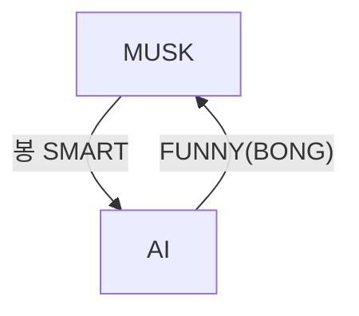

---
#### 지식 구현
: MJ의 키는 180이다.
1. 국어로 표현 : MJ의 키는 180이다.
2. 영어로 표현 : the height of MJ is 180
3. 함수사용 : Height(MJ) = 180
4. 관계 (relation) : Height(MJ, 180)

>[!3 더하기 4는 7이다.]
>Plus(3, 4, 7)

>[!정우성 친구는 이정재이다.]
> Friend(정우성, 이정재)

---
#### 지식의 복잡도
: MJ은 가수이다. → 지식의 크기는 1
: MJ은 가수이고, Prince도 가수이다. → 지식의 크기는 2
: MJ는 가수이거나, 이정재가 가수이다. → 지식의 크기는 2
: 동아대 컴공에는 대머리가 있다. → 지식의 크기는 컴공 학생 수

---
>[!연습문제 1]
>MJ의 아버지는 MJ senior이다.
>- **국어 표현**: MJ의 아버지는 MJ senior이다.
>- **영어 표현**: The father of MJ is MJ senior.
>- **함수 사용**: Father(MJ) = MJ_senior
>- **관계 표현**: Father(MJ, MJ_senior)
>- **지식의 크기**: 1

>[!연습문제 2]
>봉준호는 웃기면서 지적이다.
>- **국어 표현**: 봉준호는 웃기면서 지적이다.
>- **영어 표현**: Bong  is funny and intelligent.
>- **함수와 논리 기호로 표현**:
>    - Funny(Bong) ∧ Intelligent(Bong)
>    - (봉준호는 웃기다) ∧ (봉준호는 지적이다)
>- **지식의 크기** : 2

---
#### 복잡한 지식의 표현
: AND, OR, IMPLY, NOT 사용
- **AND** (논리곱) → ∧
- **OR** (논리합) → ∨
- **IMPLY** (함의) → ⇒
- **NOT** (부정) → ¬

**예시**
- 봉은 SMART하고 FUNNY하다.
	- SMART(BONG) ∧ FUNNY(BONG)
- N이 홀수이면, N X N은 홀수이다. 
	- ODD(N) ⇒ ODD(N X N)
- 봉은 SMART하지만, FUNNY는 아니다.
	- SMART(BONG) ∧ ¬ FUNNY(BONG)
- 봉은 SMART하거나, FUNNY하다
	- SMART(BONG) ∨ FUNNT(BONG)

```C
STARBUCKS:
	CASHIER
		COFFEE: // CASHIER에게 커피를 만들어 달라고 요구
		COFFEE ∧ CAPPUCCINO: // 커피 한 잔 카푸치노 한 잔
		COFFEE ∨ CAPPUCCINO: // TOO EASY
		
		// 조건문 (x) -> 교환문
		COFFEE ⇒ CAPPUCCINO: // 내가 커피를 주면, CASHIER는 카푸치노를 준다
		¬ COFFEE: // 커피를 만들어 CASHIER에게 준다
```

- 봉은 SMART하지만, FUNNY는 아니다.
	- SMART(BONG) ∧ ¬ FUNNY(BONG)

- MJ의 키는 180이다.
	- 나는 MJ의 키를 180으로 만들 수 있다.
	- 나는 어떤 역경에도 MJ의 키를 180으로 만들 수 있다.

- ¬ FUNNY(BONG)
	- 나는 FUNNY(BONG)이 성립하는 것을 막을 수 있다.
	- 나는 어떤 역경에도 FUNNY(BONG)이 성립하는 것을 막을 수 있다.

- ¬ COFFEE:
	- 나는 CASHIER가 커피는 만드는 것을 막을 수 있다.