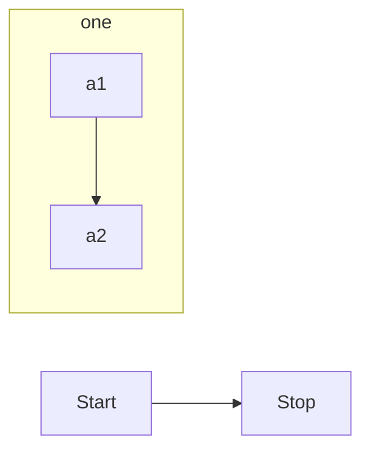
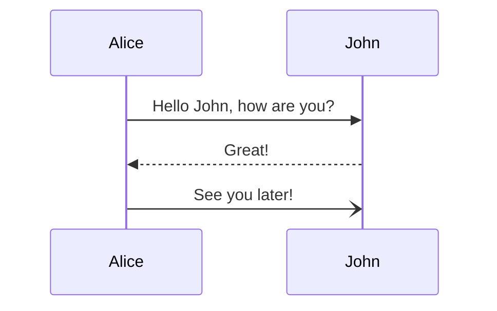
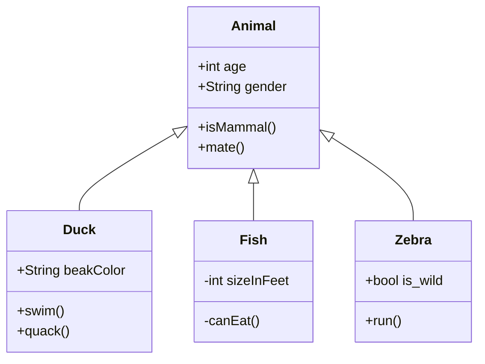
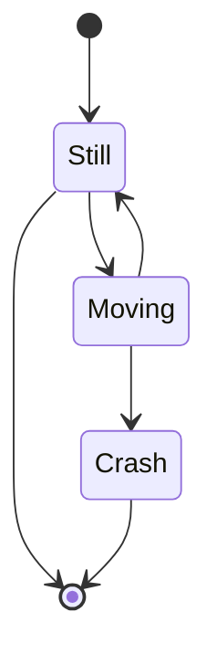
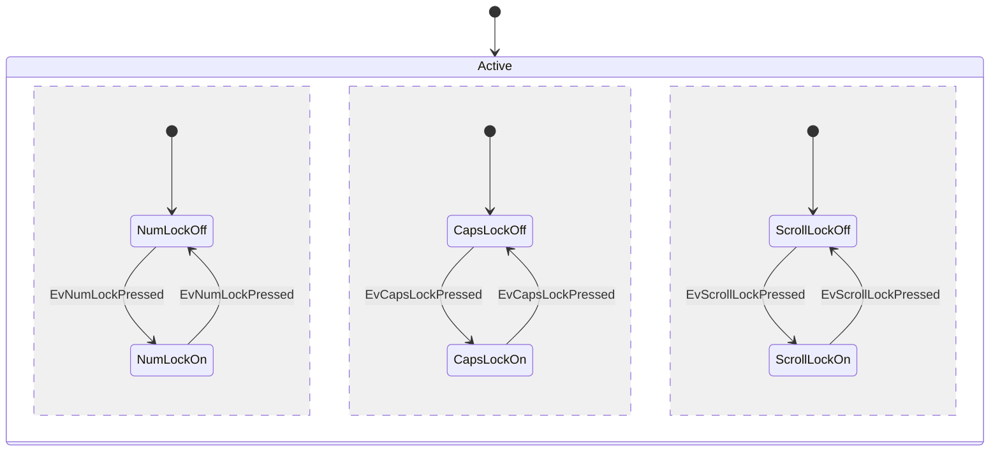

---

```mermaid
flowchart LR
Start --> Stop
subgraph one
a1-->a2
end
```

```mermaid
sequenceDiagram
Alice->>John: Hello John, how are you?
John-->>Alice: Great!
Alice-)John: See you later!
```

```mermaid
classDiagram
        Animal <|-- Duck
        Animal <|-- Fish
        Animal <|-- Zebra
        Animal : +int age
        Animal : +String gender
        Animal: +isMammal()
        Animal: +mate()
        class Duck{
            +String beakColor
            +swim()
            +quack()
        }
        class Fish{
            -int sizeInFeet
            -canEat()
        }
        class Zebra{
            +bool is_wild
            +run()
        }
```

```mermaid
stateDiagram-v2
    [*] --> Still
    Still --> [*]

    Still --> Moving
    Moving --> Still
    Moving --> Crash
    Crash --> [*]
```

```mermaid
stateDiagram-v2
        [*] --> Active
    
        state Active {
            [*] --> NumLockOff
            NumLockOff --> NumLockOn : EvNumLockPressed
            NumLockOn --> NumLockOff : EvNumLockPressed
            --
            [*] --> CapsLockOff
            CapsLockOff --> CapsLockOn : EvCapsLockPressed
            CapsLockOn --> CapsLockOff : EvCapsLockPressed
            --
            [*] --> ScrollLockOff
            ScrollLockOff --> ScrollLockOn : EvScrollLockPressed
            ScrollLockOn --> ScrollLockOff : EvScrollLockPressed
        }
```
